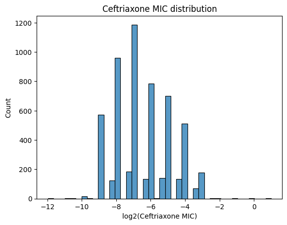

# Replication of results from "Prediction of ceftriaxone MIC in <i>Neisseria gonorrhoeae</i> using DNA microarray technology and regression analysis" in Python

&emsp;In the original paper "Prediction of ceftriaxone MIC in <i>Neisseria gonorrhoeae</i> using DNA microarray technology and regression analysis" (https://doi.org/10.1093/jac/dkab308) minimal inhibitory concentration (MIC) prediction is carried out in R. I set myself a goal to replicate the results using Python. The main objective of the work is to train a linear regression model that would be capable of prediciting MIC of ceftriaxone based on mutations present in N. gonorrhoeae genome.

## Data analysis and preprocessing


```python
import numpy as np
import pandas as pd
import matplotlib.pyplot as plt
import seaborn as sns
import missingno as mnso
```

&emsp;Loading the data with pandas:


```python
df = pd.read_excel("./Table_S1.xlsx", header=3, index_col=0)
df.head()
```


<div>
<style scoped>
    .dataframe tbody tr th:only-of-type {
        vertical-align: middle;
    }

    .dataframe tbody tr th {
        vertical-align: top;
    }

    .dataframe thead th {
        text-align: right;
    }
</style>
<table border="1" class="dataframe">
  <thead>
    <tr style="text-align: right;">
      <th></th>
      <th>penA allele</th>
      <th>Name</th>
      <th>Date</th>
      <th>Collection</th>
      <th>Country</th>
      <th>Ceftriaxone MIC, mg/L</th>
      <th>Ala311Val</th>
      <th>Ile312Met</th>
      <th>Val316Thr</th>
      <th>insAsp(345-346)</th>
      <th>...</th>
      <th>Gly120Lys</th>
      <th>Gly120Arg</th>
      <th>Ala121Gly</th>
      <th>Ala121Ser</th>
      <th>Ala121Asp</th>
      <th>Ala121Asn</th>
      <th>Ala121Val</th>
      <th>Ala121Arg</th>
      <th>Leu421Pro</th>
      <th>-35delA</th>
    </tr>
    <tr>
      <th>#</th>
      <th></th>
      <th></th>
      <th></th>
      <th></th>
      <th></th>
      <th></th>
      <th></th>
      <th></th>
      <th></th>
      <th></th>
      <th></th>
      <th></th>
      <th></th>
      <th></th>
      <th></th>
      <th></th>
      <th></th>
      <th></th>
      <th></th>
      <th></th>
      <th></th>
    </tr>
  </thead>
  <tbody>
    <tr>
      <th>1</th>
      <td>100.001</td>
      <td>SRR1661159</td>
      <td>2001</td>
      <td>demczuk2015</td>
      <td>Canada</td>
      <td>0.00025</td>
      <td>0</td>
      <td>0</td>
      <td>0</td>
      <td>0</td>
      <td>...</td>
      <td>0</td>
      <td>0</td>
      <td>1</td>
      <td>0</td>
      <td>0</td>
      <td>0</td>
      <td>0</td>
      <td>0</td>
      <td>0</td>
      <td>0</td>
    </tr>
    <tr>
      <th>2</th>
      <td>100.001</td>
      <td>SRR1661178</td>
      <td>2005</td>
      <td>demczuk2015</td>
      <td>Canada</td>
      <td>0.00050</td>
      <td>0</td>
      <td>0</td>
      <td>0</td>
      <td>0</td>
      <td>...</td>
      <td>0</td>
      <td>0</td>
      <td>1</td>
      <td>0</td>
      <td>0</td>
      <td>0</td>
      <td>0</td>
      <td>0</td>
      <td>0</td>
      <td>0</td>
    </tr>
    <tr>
      <th>3</th>
      <td>100.001</td>
      <td>SRR1661264</td>
      <td>2010</td>
      <td>demczuk2015</td>
      <td>Canada</td>
      <td>0.00050</td>
      <td>0</td>
      <td>0</td>
      <td>0</td>
      <td>0</td>
      <td>...</td>
      <td>0</td>
      <td>0</td>
      <td>1</td>
      <td>0</td>
      <td>0</td>
      <td>0</td>
      <td>0</td>
      <td>0</td>
      <td>0</td>
      <td>0</td>
    </tr>
    <tr>
      <th>4</th>
      <td>22.001</td>
      <td>SRR1661260</td>
      <td>2010</td>
      <td>demczuk2015</td>
      <td>Canada</td>
      <td>0.00050</td>
      <td>0</td>
      <td>0</td>
      <td>0</td>
      <td>1</td>
      <td>...</td>
      <td>0</td>
      <td>0</td>
      <td>0</td>
      <td>0</td>
      <td>0</td>
      <td>0</td>
      <td>0</td>
      <td>0</td>
      <td>0</td>
      <td>0</td>
    </tr>
    <tr>
      <th>5</th>
      <td>15.001</td>
      <td>ECDC_T2_ES012</td>
      <td>2013</td>
      <td>eurogasp2013</td>
      <td>Estonia</td>
      <td>0.00070</td>
      <td>0</td>
      <td>0</td>
      <td>0</td>
      <td>0</td>
      <td>...</td>
      <td>0</td>
      <td>0</td>
      <td>0</td>
      <td>0</td>
      <td>0</td>
      <td>0</td>
      <td>0</td>
      <td>0</td>
      <td>0</td>
      <td>0</td>
    </tr>
  </tbody>
</table>
<p>5 rows × 31 columns</p>
</div>


```python
df.info()
```

    <class 'pandas.core.frame.DataFrame'>
    Index: 5812 entries, 1 to 5812
    Data columns (total 31 columns):
     #   Column                 Non-Null Count  Dtype  
    ---  ------                 --------------  -----  
     0   penA allele            5812 non-null   float64
     1   Name                   5812 non-null   object 
     2   Date                   5812 non-null   object 
     3   Collection             5812 non-null   object 
     4   Country                5812 non-null   object 
     5   Ceftriaxone MIC, mg/L  5812 non-null   float64
     6   Ala311Val              5812 non-null   int64  
     7   Ile312Met              5812 non-null   int64  
     8   Val316Thr              5812 non-null   int64  
     9   insAsp(345-346)        5812 non-null   int64  
     10  Thr483Ser              5812 non-null   int64  
     11  Ala501Val              5812 non-null   int64  
     12  Ala501Thr              5812 non-null   int64  
     13  Ala501Pro              5812 non-null   int64  
     14  Asn512Tyr              5812 non-null   int64  
     15  Gly542Ser              5812 non-null   int64  
     16  Gly545Ser              5812 non-null   int64  
     17  Pro551Leu              5812 non-null   int64  
     18  Pro551Ser              5812 non-null   int64  
     19  Gly120Asn              5812 non-null   int64  
     20  Gly120Asp              5812 non-null   int64  
     21  Gly120Lys              5812 non-null   int64  
     22  Gly120Arg              5812 non-null   int64  
     23  Ala121Gly              5812 non-null   int64  
     24  Ala121Ser              5812 non-null   int64  
     25  Ala121Asp              5812 non-null   int64  
     26  Ala121Asn              5812 non-null   int64  
     27  Ala121Val              5812 non-null   int64  
     28  Ala121Arg              5812 non-null   int64  
     29  Leu421Pro              5812 non-null   int64  
     30  -35delA                5812 non-null   int64  
    dtypes: float64(2), int64(25), object(4)
    memory usage: 1.4+ MB
    

The DataFrame contained 5812 rows and 31 columns:<br>
- penA allele - type of penA allele designated by a number (categorical variable);<br>
- Name - SRA Run Id;<br>
- Date - the year when the data was uploaded;<br>
- Collection - name of the collection from which the data comes from;<br>
- Country - origin of the isolate;<br>
- Ceftriaxone MIC, mg/L - minimal inhibitory concentration of ceftriaxone in mg/L (float);<br>
- Ala311Val...-35delA - mutations in N. gonorrhoeae genome that are responsible for resistance (boolean).<br>


```python
# Delete duplicate rows
df = df.drop_duplicates()
```

Among 5812 rows there were 95 duplicates. These were definitely duplicates as they shared the same SRA Run Id. The remaining amount of rows is 5717.


```python
cm = 1 / 2.54  # cm to inches conversion
fig, ax = plt.subplots(1, 1, figsize=(16 * cm, 10 * cm))
mnso.matrix(df, ax=ax, fontsize=8, sparkline=False)
plt.title("Matrix of missing values")
```


    Text(0.5, 1.0, 'Matrix of missing values')


    

    


As we can see, the dataset contains no missing values.

To train a model we need features (columns: Ala311Val...-35delA) and a target variable (column: Ceftriaxone MIC, mg/L). The other columns were not used in the analysis in the paper.


```python
# Dropping columns that were not used in the analysis.
df = df.drop(axis=1, columns=df.columns[range(5)])

# Renaming target variable for the ease of use.
df = df.rename({"Ceftriaxone MIC, mg/L": "cft_mic"}, axis=1)
df.head()
```


<div>
<style scoped>
    .dataframe tbody tr th:only-of-type {
        vertical-align: middle;
    }

    .dataframe tbody tr th {
        vertical-align: top;
    }

    .dataframe thead th {
        text-align: right;
    }
</style>
<table border="1" class="dataframe">
  <thead>
    <tr style="text-align: right;">
      <th></th>
      <th>cft_mic</th>
      <th>Ala311Val</th>
      <th>Ile312Met</th>
      <th>Val316Thr</th>
      <th>insAsp(345-346)</th>
      <th>Thr483Ser</th>
      <th>Ala501Val</th>
      <th>Ala501Thr</th>
      <th>Ala501Pro</th>
      <th>Asn512Tyr</th>
      <th>...</th>
      <th>Gly120Lys</th>
      <th>Gly120Arg</th>
      <th>Ala121Gly</th>
      <th>Ala121Ser</th>
      <th>Ala121Asp</th>
      <th>Ala121Asn</th>
      <th>Ala121Val</th>
      <th>Ala121Arg</th>
      <th>Leu421Pro</th>
      <th>-35delA</th>
    </tr>
    <tr>
      <th>#</th>
      <th></th>
      <th></th>
      <th></th>
      <th></th>
      <th></th>
      <th></th>
      <th></th>
      <th></th>
      <th></th>
      <th></th>
      <th></th>
      <th></th>
      <th></th>
      <th></th>
      <th></th>
      <th></th>
      <th></th>
      <th></th>
      <th></th>
      <th></th>
      <th></th>
    </tr>
  </thead>
  <tbody>
    <tr>
      <th>1</th>
      <td>0.00025</td>
      <td>0</td>
      <td>0</td>
      <td>0</td>
      <td>0</td>
      <td>0</td>
      <td>0</td>
      <td>0</td>
      <td>0</td>
      <td>0</td>
      <td>...</td>
      <td>0</td>
      <td>0</td>
      <td>1</td>
      <td>0</td>
      <td>0</td>
      <td>0</td>
      <td>0</td>
      <td>0</td>
      <td>0</td>
      <td>0</td>
    </tr>
    <tr>
      <th>2</th>
      <td>0.00050</td>
      <td>0</td>
      <td>0</td>
      <td>0</td>
      <td>0</td>
      <td>0</td>
      <td>0</td>
      <td>0</td>
      <td>0</td>
      <td>0</td>
      <td>...</td>
      <td>0</td>
      <td>0</td>
      <td>1</td>
      <td>0</td>
      <td>0</td>
      <td>0</td>
      <td>0</td>
      <td>0</td>
      <td>0</td>
      <td>0</td>
    </tr>
    <tr>
      <th>3</th>
      <td>0.00050</td>
      <td>0</td>
      <td>0</td>
      <td>0</td>
      <td>0</td>
      <td>0</td>
      <td>0</td>
      <td>0</td>
      <td>0</td>
      <td>0</td>
      <td>...</td>
      <td>0</td>
      <td>0</td>
      <td>1</td>
      <td>0</td>
      <td>0</td>
      <td>0</td>
      <td>0</td>
      <td>0</td>
      <td>0</td>
      <td>0</td>
    </tr>
    <tr>
      <th>4</th>
      <td>0.00050</td>
      <td>0</td>
      <td>0</td>
      <td>0</td>
      <td>1</td>
      <td>0</td>
      <td>0</td>
      <td>0</td>
      <td>0</td>
      <td>0</td>
      <td>...</td>
      <td>0</td>
      <td>0</td>
      <td>0</td>
      <td>0</td>
      <td>0</td>
      <td>0</td>
      <td>0</td>
      <td>0</td>
      <td>0</td>
      <td>0</td>
    </tr>
    <tr>
      <th>5</th>
      <td>0.00070</td>
      <td>0</td>
      <td>0</td>
      <td>0</td>
      <td>0</td>
      <td>0</td>
      <td>0</td>
      <td>0</td>
      <td>0</td>
      <td>0</td>
      <td>...</td>
      <td>0</td>
      <td>0</td>
      <td>0</td>
      <td>0</td>
      <td>0</td>
      <td>0</td>
      <td>0</td>
      <td>0</td>
      <td>0</td>
      <td>0</td>
    </tr>
  </tbody>
</table>
<p>5 rows × 26 columns</p>
</div>


```python
# Changing variable type (less memory usage).
df.iloc[:, 1:] = df.iloc[:, 1:].astype("Int8")
```


```python
df.info()
```

    <class 'pandas.core.frame.DataFrame'>
    Index: 5717 entries, 1 to 5812
    Data columns (total 26 columns):
     #   Column           Non-Null Count  Dtype  
    ---  ------           --------------  -----  
     0   cft_mic          5717 non-null   float64
     1   Ala311Val        5717 non-null   int64  
     2   Ile312Met        5717 non-null   int64  
     3   Val316Thr        5717 non-null   int64  
     4   insAsp(345-346)  5717 non-null   int64  
     5   Thr483Ser        5717 non-null   int64  
     6   Ala501Val        5717 non-null   int64  
     7   Ala501Thr        5717 non-null   int64  
     8   Ala501Pro        5717 non-null   int64  
     9   Asn512Tyr        5717 non-null   int64  
     10  Gly542Ser        5717 non-null   int64  
     11  Gly545Ser        5717 non-null   int64  
     12  Pro551Leu        5717 non-null   int64  
     13  Pro551Ser        5717 non-null   int64  
     14  Gly120Asn        5717 non-null   int64  
     15  Gly120Asp        5717 non-null   int64  
     16  Gly120Lys        5717 non-null   int64  
     17  Gly120Arg        5717 non-null   int64  
     18  Ala121Gly        5717 non-null   int64  
     19  Ala121Ser        5717 non-null   int64  
     20  Ala121Asp        5717 non-null   int64  
     21  Ala121Asn        5717 non-null   int64  
     22  Ala121Val        5717 non-null   int64  
     23  Ala121Arg        5717 non-null   int64  
     24  Leu421Pro        5717 non-null   int64  
     25  -35delA          5717 non-null   int64  
    dtypes: float64(1), int64(25)
    memory usage: 1.2 MB
    


```python
df = df.reset_index(drop=True)  # Reset index (duplicate columns were dropped).
```


```python
y = df.iloc[:, 0]  # Target variable.

X = df.iloc[:, 1:]  # Features.
```

It is a good idea to analyse target variable distribution before training a model.


```python
sns.histplot(y)
plt.title("Ceftriaxone MIC distribution")
plt.xlabel("Ceftriaxone MIC, mg/L")
plt.vlines(x=[0.125], ymin=0, ymax=4000, colors="black", linestyles="dashed")
plt.annotate(
    "",
    xytext=(0.500, 2000),
    xy=(0.125, 2000),
    arrowprops=dict(arrowstyle="->"),
    horizontalalignment="center",
    verticalalignment="bottom",
)
plt.text(s="MIC breakpoint", x=0.17, y=2100)
plt.ylim((0, 3000))
plt.show()
```


    

    


As we can see most of the observations lie before the MIC breakpoint (black dashed line at 0.125 mg/L). A few data points of resistant isolates are found after the breakpoint. It is certain that the distribution is not normal (right-skewed) and for that reason the target variable should be transformed (for this case log transformation would be appropriate).


```python
sns.histplot(np.log2(y))
plt.title("Ceftriaxone MIC distribution")
plt.xlabel("log2(Ceftriaxone MIC)")
plt.show()
```


    

    


Now the data looks more bell-shaped. Now linear regression can be used on this data.

## Training linear regression model


```python
from sklearn.model_selection import train_test_split

# Splitting dataset into training (75%) and test (25%) data.
X_train, X_test, y_train, y_test = train_test_split(
    X, y, test_size=0.25, random_state=8798
)

print(X_train.shape, X_test.shape, y_train.shape, y_test.shape)
```

    (4287, 25) (1430, 25) (4287,) (1430,)
    


```python
from sklearn.linear_model import LinearRegression
from sklearn.pipeline import Pipeline
from sklearn.impute import SimpleImputer
from sklearn.compose import TransformedTargetRegressor, ColumnTransformer

# Exctract feature names.
features = X.columns

# Impute missing values in case they will be encountered during prediction.
preprocessor = ColumnTransformer(
    transformers=[("imputer", SimpleImputer(strategy="most_frequent"), features)]
)

# Transform target variable with log2.
target_transformation_regression = TransformedTargetRegressor(
    regressor=LinearRegression(),
    func=lambda x: np.log2(x),
    inverse_func=lambda x: np.exp2(x),
)

# Creating a pipeline with preprocessor and regression steps.
linear_model = Pipeline(
    steps=[
        ("preprocessor", preprocessor),
        ("linear_regression", target_transformation_regression),
    ]
)

linear_model
```


<style>#sk-container-id-19 {
  /* Definition of color scheme common for light and dark mode */
  --sklearn-color-text: #000;
  --sklearn-color-text-muted: #666;
  --sklearn-color-line: gray;
  /* Definition of color scheme for unfitted estimators */
  --sklearn-color-unfitted-level-0: #fff5e6;
  --sklearn-color-unfitted-level-1: #f6e4d2;
  --sklearn-color-unfitted-level-2: #ffe0b3;
  --sklearn-color-unfitted-level-3: chocolate;
  /* Definition of color scheme for fitted estimators */
  --sklearn-color-fitted-level-0: #f0f8ff;
  --sklearn-color-fitted-level-1: #d4ebff;
  --sklearn-color-fitted-level-2: #b3dbfd;
  --sklearn-color-fitted-level-3: cornflowerblue;

  /* Specific color for light theme */
  --sklearn-color-text-on-default-background: var(--sg-text-color, var(--theme-code-foreground, var(--jp-content-font-color1, black)));
  --sklearn-color-background: var(--sg-background-color, var(--theme-background, var(--jp-layout-color0, white)));
  --sklearn-color-border-box: var(--sg-text-color, var(--theme-code-foreground, var(--jp-content-font-color1, black)));
  --sklearn-color-icon: #696969;

  @media (prefers-color-scheme: dark) {
    /* Redefinition of color scheme for dark theme */
    --sklearn-color-text-on-default-background: var(--sg-text-color, var(--theme-code-foreground, var(--jp-content-font-color1, white)));
    --sklearn-color-background: var(--sg-background-color, var(--theme-background, var(--jp-layout-color0, #111)));
    --sklearn-color-border-box: var(--sg-text-color, var(--theme-code-foreground, var(--jp-content-font-color1, white)));
    --sklearn-color-icon: #878787;
  }
}

#sk-container-id-19 {
  color: var(--sklearn-color-text);
}

#sk-container-id-19 pre {
  padding: 0;
}

#sk-container-id-19 input.sk-hidden--visually {
  border: 0;
  clip: rect(1px 1px 1px 1px);
  clip: rect(1px, 1px, 1px, 1px);
  height: 1px;
  margin: -1px;
  overflow: hidden;
  padding: 0;
  position: absolute;
  width: 1px;
}

#sk-container-id-19 div.sk-dashed-wrapped {
  border: 1px dashed var(--sklearn-color-line);
  margin: 0 0.4em 0.5em 0.4em;
  box-sizing: border-box;
  padding-bottom: 0.4em;
  background-color: var(--sklearn-color-background);
}

#sk-container-id-19 div.sk-container {
  /* jupyter's `normalize.less` sets `[hidden] { display: none; }`
     but bootstrap.min.css set `[hidden] { display: none !important; }`
     so we also need the `!important` here to be able to override the
     default hidden behavior on the sphinx rendered scikit-learn.org.
     See: https://github.com/scikit-learn/scikit-learn/issues/21755 */
  display: inline-block !important;
  position: relative;
}

#sk-container-id-19 div.sk-text-repr-fallback {
  display: none;
}

div.sk-parallel-item,
div.sk-serial,
div.sk-item {
  /* draw centered vertical line to link estimators */
  background-image: linear-gradient(var(--sklearn-color-text-on-default-background), var(--sklearn-color-text-on-default-background));
  background-size: 2px 100%;
  background-repeat: no-repeat;
  background-position: center center;
}

/* Parallel-specific style estimator block */

#sk-container-id-19 div.sk-parallel-item::after {
  content: "";
  width: 100%;
  border-bottom: 2px solid var(--sklearn-color-text-on-default-background);
  flex-grow: 1;
}

#sk-container-id-19 div.sk-parallel {
  display: flex;
  align-items: stretch;
  justify-content: center;
  background-color: var(--sklearn-color-background);
  position: relative;
}

#sk-container-id-19 div.sk-parallel-item {
  display: flex;
  flex-direction: column;
}

#sk-container-id-19 div.sk-parallel-item:first-child::after {
  align-self: flex-end;
  width: 50%;
}

#sk-container-id-19 div.sk-parallel-item:last-child::after {
  align-self: flex-start;
  width: 50%;
}

#sk-container-id-19 div.sk-parallel-item:only-child::after {
  width: 0;
}

/* Serial-specific style estimator block */

#sk-container-id-19 div.sk-serial {
  display: flex;
  flex-direction: column;
  align-items: center;
  background-color: var(--sklearn-color-background);
  padding-right: 1em;
  padding-left: 1em;
}


/* Toggleable style: style used for estimator/Pipeline/ColumnTransformer box that is
clickable and can be expanded/collapsed.
- Pipeline and ColumnTransformer use this feature and define the default style
- Estimators will overwrite some part of the style using the `sk-estimator` class
*/

/* Pipeline and ColumnTransformer style (default) */

#sk-container-id-19 div.sk-toggleable {
  /* Default theme specific background. It is overwritten whether we have a
  specific estimator or a Pipeline/ColumnTransformer */
  background-color: var(--sklearn-color-background);
}

/* Toggleable label */
#sk-container-id-19 label.sk-toggleable__label {
  cursor: pointer;
  display: flex;
  width: 100%;
  margin-bottom: 0;
  padding: 0.5em;
  box-sizing: border-box;
  text-align: center;
  align-items: start;
  justify-content: space-between;
  gap: 0.5em;
}

#sk-container-id-19 label.sk-toggleable__label .caption {
  font-size: 0.6rem;
  font-weight: lighter;
  color: var(--sklearn-color-text-muted);
}

#sk-container-id-19 label.sk-toggleable__label-arrow:before {
  /* Arrow on the left of the label */
  content: "▸";
  float: left;
  margin-right: 0.25em;
  color: var(--sklearn-color-icon);
}

#sk-container-id-19 label.sk-toggleable__label-arrow:hover:before {
  color: var(--sklearn-color-text);
}

/* Toggleable content - dropdown */

#sk-container-id-19 div.sk-toggleable__content {
  display: none;
  text-align: left;
  /* unfitted */
  background-color: var(--sklearn-color-unfitted-level-0);
}

#sk-container-id-19 div.sk-toggleable__content.fitted {
  /* fitted */
  background-color: var(--sklearn-color-fitted-level-0);
}

#sk-container-id-19 div.sk-toggleable__content pre {
  margin: 0.2em;
  border-radius: 0.25em;
  color: var(--sklearn-color-text);
  /* unfitted */
  background-color: var(--sklearn-color-unfitted-level-0);
}

#sk-container-id-19 div.sk-toggleable__content.fitted pre {
  /* unfitted */
  background-color: var(--sklearn-color-fitted-level-0);
}

#sk-container-id-19 input.sk-toggleable__control:checked~div.sk-toggleable__content {
  /* Expand drop-down */
  display: block;
  width: 100%;
  overflow: visible;
}

#sk-container-id-19 input.sk-toggleable__control:checked~label.sk-toggleable__label-arrow:before {
  content: "▾";
}

/* Pipeline/ColumnTransformer-specific style */

#sk-container-id-19 div.sk-label input.sk-toggleable__control:checked~label.sk-toggleable__label {
  color: var(--sklearn-color-text);
  background-color: var(--sklearn-color-unfitted-level-2);
}

#sk-container-id-19 div.sk-label.fitted input.sk-toggleable__control:checked~label.sk-toggleable__label {
  background-color: var(--sklearn-color-fitted-level-2);
}

/* Estimator-specific style */

/* Colorize estimator box */
#sk-container-id-19 div.sk-estimator input.sk-toggleable__control:checked~label.sk-toggleable__label {
  /* unfitted */
  background-color: var(--sklearn-color-unfitted-level-2);
}

#sk-container-id-19 div.sk-estimator.fitted input.sk-toggleable__control:checked~label.sk-toggleable__label {
  /* fitted */
  background-color: var(--sklearn-color-fitted-level-2);
}

#sk-container-id-19 div.sk-label label.sk-toggleable__label,
#sk-container-id-19 div.sk-label label {
  /* The background is the default theme color */
  color: var(--sklearn-color-text-on-default-background);
}

/* On hover, darken the color of the background */
#sk-container-id-19 div.sk-label:hover label.sk-toggleable__label {
  color: var(--sklearn-color-text);
  background-color: var(--sklearn-color-unfitted-level-2);
}

/* Label box, darken color on hover, fitted */
#sk-container-id-19 div.sk-label.fitted:hover label.sk-toggleable__label.fitted {
  color: var(--sklearn-color-text);
  background-color: var(--sklearn-color-fitted-level-2);
}

/* Estimator label */

#sk-container-id-19 div.sk-label label {
  font-family: monospace;
  font-weight: bold;
  display: inline-block;
  line-height: 1.2em;
}

#sk-container-id-19 div.sk-label-container {
  text-align: center;
}

/* Estimator-specific */
#sk-container-id-19 div.sk-estimator {
  font-family: monospace;
  border: 1px dotted var(--sklearn-color-border-box);
  border-radius: 0.25em;
  box-sizing: border-box;
  margin-bottom: 0.5em;
  /* unfitted */
  background-color: var(--sklearn-color-unfitted-level-0);
}

#sk-container-id-19 div.sk-estimator.fitted {
  /* fitted */
  background-color: var(--sklearn-color-fitted-level-0);
}

/* on hover */
#sk-container-id-19 div.sk-estimator:hover {
  /* unfitted */
  background-color: var(--sklearn-color-unfitted-level-2);
}

#sk-container-id-19 div.sk-estimator.fitted:hover {
  /* fitted */
  background-color: var(--sklearn-color-fitted-level-2);
}

/* Specification for estimator info (e.g. "i" and "?") */

/* Common style for "i" and "?" */

.sk-estimator-doc-link,
a:link.sk-estimator-doc-link,
a:visited.sk-estimator-doc-link {
  float: right;
  font-size: smaller;
  line-height: 1em;
  font-family: monospace;
  background-color: var(--sklearn-color-background);
  border-radius: 1em;
  height: 1em;
  width: 1em;
  text-decoration: none !important;
  margin-left: 0.5em;
  text-align: center;
  /* unfitted */
  border: var(--sklearn-color-unfitted-level-1) 1pt solid;
  color: var(--sklearn-color-unfitted-level-1);
}

.sk-estimator-doc-link.fitted,
a:link.sk-estimator-doc-link.fitted,
a:visited.sk-estimator-doc-link.fitted {
  /* fitted */
  border: var(--sklearn-color-fitted-level-1) 1pt solid;
  color: var(--sklearn-color-fitted-level-1);
}

/* On hover */
div.sk-estimator:hover .sk-estimator-doc-link:hover,
.sk-estimator-doc-link:hover,
div.sk-label-container:hover .sk-estimator-doc-link:hover,
.sk-estimator-doc-link:hover {
  /* unfitted */
  background-color: var(--sklearn-color-unfitted-level-3);
  color: var(--sklearn-color-background);
  text-decoration: none;
}

div.sk-estimator.fitted:hover .sk-estimator-doc-link.fitted:hover,
.sk-estimator-doc-link.fitted:hover,
div.sk-label-container:hover .sk-estimator-doc-link.fitted:hover,
.sk-estimator-doc-link.fitted:hover {
  /* fitted */
  background-color: var(--sklearn-color-fitted-level-3);
  color: var(--sklearn-color-background);
  text-decoration: none;
}

/* Span, style for the box shown on hovering the info icon */
.sk-estimator-doc-link span {
  display: none;
  z-index: 9999;
  position: relative;
  font-weight: normal;
  right: .2ex;
  padding: .5ex;
  margin: .5ex;
  width: min-content;
  min-width: 20ex;
  max-width: 50ex;
  color: var(--sklearn-color-text);
  box-shadow: 2pt 2pt 4pt #999;
  /* unfitted */
  background: var(--sklearn-color-unfitted-level-0);
  border: .5pt solid var(--sklearn-color-unfitted-level-3);
}

.sk-estimator-doc-link.fitted span {
  /* fitted */
  background: var(--sklearn-color-fitted-level-0);
  border: var(--sklearn-color-fitted-level-3);
}

.sk-estimator-doc-link:hover span {
  display: block;
}

/* "?"-specific style due to the `<a>` HTML tag */

#sk-container-id-19 a.estimator_doc_link {
  float: right;
  font-size: 1rem;
  line-height: 1em;
  font-family: monospace;
  background-color: var(--sklearn-color-background);
  border-radius: 1rem;
  height: 1rem;
  width: 1rem;
  text-decoration: none;
  /* unfitted */
  color: var(--sklearn-color-unfitted-level-1);
  border: var(--sklearn-color-unfitted-level-1) 1pt solid;
}

#sk-container-id-19 a.estimator_doc_link.fitted {
  /* fitted */
  border: var(--sklearn-color-fitted-level-1) 1pt solid;
  color: var(--sklearn-color-fitted-level-1);
}

/* On hover */
#sk-container-id-19 a.estimator_doc_link:hover {
  /* unfitted */
  background-color: var(--sklearn-color-unfitted-level-3);
  color: var(--sklearn-color-background);
  text-decoration: none;
}

#sk-container-id-19 a.estimator_doc_link.fitted:hover {
  /* fitted */
  background-color: var(--sklearn-color-fitted-level-3);
}

.estimator-table summary {
    padding: .5rem;
    font-family: monospace;
    cursor: pointer;
}

.estimator-table details[open] {
    padding-left: 0.1rem;
    padding-right: 0.1rem;
    padding-bottom: 0.3rem;
}

.estimator-table .parameters-table {
    margin-left: auto !important;
    margin-right: auto !important;
}

.estimator-table .parameters-table tr:nth-child(odd) {
    background-color: #fff;
}

.estimator-table .parameters-table tr:nth-child(even) {
    background-color: #f6f6f6;
}

.estimator-table .parameters-table tr:hover {
    background-color: #e0e0e0;
}

.estimator-table table td {
    border: 1px solid rgba(106, 105, 104, 0.232);
}

.user-set td {
    color:rgb(255, 94, 0);
    text-align: left;
}

.user-set td.value pre {
    color:rgb(255, 94, 0) !important;
    background-color: transparent !important;
}

.default td {
    color: black;
    text-align: left;
}

.user-set td i,
.default td i {
    color: black;
}

.copy-paste-icon {
    background-image: url(data:image/svg+xml;base64,PHN2ZyB4bWxucz0iaHR0cDovL3d3dy53My5vcmcvMjAwMC9zdmciIHZpZXdCb3g9IjAgMCA0NDggNTEyIj48IS0tIUZvbnQgQXdlc29tZSBGcmVlIDYuNy4yIGJ5IEBmb250YXdlc29tZSAtIGh0dHBzOi8vZm9udGF3ZXNvbWUuY29tIExpY2Vuc2UgLSBodHRwczovL2ZvbnRhd2Vzb21lLmNvbS9saWNlbnNlL2ZyZWUgQ29weXJpZ2h0IDIwMjUgRm9udGljb25zLCBJbmMuLS0+PHBhdGggZD0iTTIwOCAwTDMzMi4xIDBjMTIuNyAwIDI0LjkgNS4xIDMzLjkgMTQuMWw2Ny45IDY3LjljOSA5IDE0LjEgMjEuMiAxNC4xIDMzLjlMNDQ4IDMzNmMwIDI2LjUtMjEuNSA0OC00OCA0OGwtMTkyIDBjLTI2LjUgMC00OC0yMS41LTQ4LTQ4bDAtMjg4YzAtMjYuNSAyMS41LTQ4IDQ4LTQ4ek00OCAxMjhsODAgMCAwIDY0LTY0IDAgMCAyNTYgMTkyIDAgMC0zMiA2NCAwIDAgNDhjMCAyNi41LTIxLjUgNDgtNDggNDhMNDggNTEyYy0yNi41IDAtNDgtMjEuNS00OC00OEwwIDE3NmMwLTI2LjUgMjEuNS00OCA0OC00OHoiLz48L3N2Zz4=);
    background-repeat: no-repeat;
    background-size: 14px 14px;
    background-position: 0;
    display: inline-block;
    width: 14px;
    height: 14px;
    cursor: pointer;
}
</style><body><div id="sk-container-id-19" class="sk-top-container"><div class="sk-text-repr-fallback"><pre>Pipeline(steps=[(&#x27;preprocessor&#x27;,
                 ColumnTransformer(transformers=[(&#x27;imputer&#x27;,
                                                  SimpleImputer(strategy=&#x27;most_frequent&#x27;),
                                                  Index([&#x27;Ala311Val&#x27;, &#x27;Ile312Met&#x27;, &#x27;Val316Thr&#x27;, &#x27;insAsp(345-346)&#x27;, &#x27;Thr483Ser&#x27;,
       &#x27;Ala501Val&#x27;, &#x27;Ala501Thr&#x27;, &#x27;Ala501Pro&#x27;, &#x27;Asn512Tyr&#x27;, &#x27;Gly542Ser&#x27;,
       &#x27;Gly545Ser&#x27;, &#x27;Pro551Leu&#x27;, &#x27;Pro551Ser&#x27;, &#x27;Gly120Asn&#x27;, &#x27;Gly120Asp&#x27;,
       &#x27;Gly120Lys&#x27;, &#x27;Gly120Arg&#x27;, &#x27;Ala121Gly&#x27;, &#x27;Ala121Ser&#x27;, &#x27;Ala121Asp&#x27;,
       &#x27;Ala121Asn&#x27;, &#x27;Ala121Val&#x27;, &#x27;Ala121Arg&#x27;, &#x27;Leu421Pro&#x27;, &#x27;-35delA&#x27;],
      dtype=&#x27;object&#x27;))])),
                (&#x27;linear_regression&#x27;,
                 TransformedTargetRegressor(func=&lt;function &lt;lambda&gt; at 0x0000024A782705E0&gt;,
                                            inverse_func=&lt;function &lt;lambda&gt; at 0x0000024A78270040&gt;,
                                            regressor=LinearRegression()))])</pre><b>In a Jupyter environment, please rerun this cell to show the HTML representation or trust the notebook. <br />On GitHub, the HTML representation is unable to render, please try loading this page with nbviewer.org.</b></div><div class="sk-container" hidden><div class="sk-item sk-dashed-wrapped"><div class="sk-label-container"><div class="sk-label  sk-toggleable"><input class="sk-toggleable__control sk-hidden--visually" id="sk-estimator-id-96" type="checkbox" ><label for="sk-estimator-id-96" class="sk-toggleable__label  sk-toggleable__label-arrow"><div><div>Pipeline</div></div><div><a class="sk-estimator-doc-link " rel="noreferrer" target="_blank" href="https://scikit-learn.org/1.7/modules/generated/sklearn.pipeline.Pipeline.html">?<span>Documentation for Pipeline</span></a><span class="sk-estimator-doc-link ">i<span>Not fitted</span></span></div></label><div class="sk-toggleable__content " data-param-prefix="">
        <div class="estimator-table">
            <details>
                <summary>Parameters</summary>
                <table class="parameters-table">
                  <tbody>

        <tr class="user-set">
            <td><i class="copy-paste-icon"
                 onclick="copyToClipboard('steps',
                          this.parentElement.nextElementSibling)"
            ></i></td>
            <td class="param">steps&nbsp;</td>
            <td class="value">[(&#x27;preprocessor&#x27;, ...), (&#x27;linear_regression&#x27;, ...)]</td>
        </tr>


        <tr class="default">
            <td><i class="copy-paste-icon"
                 onclick="copyToClipboard('transform_input',
                          this.parentElement.nextElementSibling)"
            ></i></td>
            <td class="param">transform_input&nbsp;</td>
            <td class="value">None</td>
        </tr>


        <tr class="default">
            <td><i class="copy-paste-icon"
                 onclick="copyToClipboard('memory',
                          this.parentElement.nextElementSibling)"
            ></i></td>
            <td class="param">memory&nbsp;</td>
            <td class="value">None</td>
        </tr>


        <tr class="default">
            <td><i class="copy-paste-icon"
                 onclick="copyToClipboard('verbose',
                          this.parentElement.nextElementSibling)"
            ></i></td>
            <td class="param">verbose&nbsp;</td>
            <td class="value">False</td>
        </tr>

                  </tbody>
                </table>
            </details>
        </div>
    </div></div></div><div class="sk-serial"><div class="sk-item sk-dashed-wrapped"><div class="sk-label-container"><div class="sk-label  sk-toggleable"><input class="sk-toggleable__control sk-hidden--visually" id="sk-estimator-id-97" type="checkbox" ><label for="sk-estimator-id-97" class="sk-toggleable__label  sk-toggleable__label-arrow"><div><div>preprocessor: ColumnTransformer</div></div><div><a class="sk-estimator-doc-link " rel="noreferrer" target="_blank" href="https://scikit-learn.org/1.7/modules/generated/sklearn.compose.ColumnTransformer.html">?<span>Documentation for preprocessor: ColumnTransformer</span></a></div></label><div class="sk-toggleable__content " data-param-prefix="preprocessor__">
        <div class="estimator-table">
            <details>
                <summary>Parameters</summary>
                <table class="parameters-table">
                  <tbody>

        <tr class="user-set">
            <td><i class="copy-paste-icon"
                 onclick="copyToClipboard('transformers',
                          this.parentElement.nextElementSibling)"
            ></i></td>
            <td class="param">transformers&nbsp;</td>
            <td class="value">[(&#x27;imputer&#x27;, ...)]</td>
        </tr>


        <tr class="default">
            <td><i class="copy-paste-icon"
                 onclick="copyToClipboard('remainder',
                          this.parentElement.nextElementSibling)"
            ></i></td>
            <td class="param">remainder&nbsp;</td>
            <td class="value">&#x27;drop&#x27;</td>
        </tr>


        <tr class="default">
            <td><i class="copy-paste-icon"
                 onclick="copyToClipboard('sparse_threshold',
                          this.parentElement.nextElementSibling)"
            ></i></td>
            <td class="param">sparse_threshold&nbsp;</td>
            <td class="value">0.3</td>
        </tr>


        <tr class="default">
            <td><i class="copy-paste-icon"
                 onclick="copyToClipboard('n_jobs',
                          this.parentElement.nextElementSibling)"
            ></i></td>
            <td class="param">n_jobs&nbsp;</td>
            <td class="value">None</td>
        </tr>


        <tr class="default">
            <td><i class="copy-paste-icon"
                 onclick="copyToClipboard('transformer_weights',
                          this.parentElement.nextElementSibling)"
            ></i></td>
            <td class="param">transformer_weights&nbsp;</td>
            <td class="value">None</td>
        </tr>


        <tr class="default">
            <td><i class="copy-paste-icon"
                 onclick="copyToClipboard('verbose',
                          this.parentElement.nextElementSibling)"
            ></i></td>
            <td class="param">verbose&nbsp;</td>
            <td class="value">False</td>
        </tr>


        <tr class="default">
            <td><i class="copy-paste-icon"
                 onclick="copyToClipboard('verbose_feature_names_out',
                          this.parentElement.nextElementSibling)"
            ></i></td>
            <td class="param">verbose_feature_names_out&nbsp;</td>
            <td class="value">True</td>
        </tr>


        <tr class="default">
            <td><i class="copy-paste-icon"
                 onclick="copyToClipboard('force_int_remainder_cols',
                          this.parentElement.nextElementSibling)"
            ></i></td>
            <td class="param">force_int_remainder_cols&nbsp;</td>
            <td class="value">&#x27;deprecated&#x27;</td>
        </tr>

                  </tbody>
                </table>
            </details>
        </div>
    </div></div></div><div class="sk-parallel"><div class="sk-parallel-item"><div class="sk-item"><div class="sk-label-container"><div class="sk-label  sk-toggleable"><input class="sk-toggleable__control sk-hidden--visually" id="sk-estimator-id-98" type="checkbox" ><label for="sk-estimator-id-98" class="sk-toggleable__label  sk-toggleable__label-arrow"><div><div>imputer</div></div></label><div class="sk-toggleable__content " data-param-prefix="preprocessor__imputer__"><pre>Index([&#x27;Ala311Val&#x27;, &#x27;Ile312Met&#x27;, &#x27;Val316Thr&#x27;, &#x27;insAsp(345-346)&#x27;, &#x27;Thr483Ser&#x27;,
       &#x27;Ala501Val&#x27;, &#x27;Ala501Thr&#x27;, &#x27;Ala501Pro&#x27;, &#x27;Asn512Tyr&#x27;, &#x27;Gly542Ser&#x27;,
       &#x27;Gly545Ser&#x27;, &#x27;Pro551Leu&#x27;, &#x27;Pro551Ser&#x27;, &#x27;Gly120Asn&#x27;, &#x27;Gly120Asp&#x27;,
       &#x27;Gly120Lys&#x27;, &#x27;Gly120Arg&#x27;, &#x27;Ala121Gly&#x27;, &#x27;Ala121Ser&#x27;, &#x27;Ala121Asp&#x27;,
       &#x27;Ala121Asn&#x27;, &#x27;Ala121Val&#x27;, &#x27;Ala121Arg&#x27;, &#x27;Leu421Pro&#x27;, &#x27;-35delA&#x27;],
      dtype=&#x27;object&#x27;)</pre></div></div></div><div class="sk-serial"><div class="sk-item"><div class="sk-estimator  sk-toggleable"><input class="sk-toggleable__control sk-hidden--visually" id="sk-estimator-id-99" type="checkbox" ><label for="sk-estimator-id-99" class="sk-toggleable__label  sk-toggleable__label-arrow"><div><div>SimpleImputer</div></div><div><a class="sk-estimator-doc-link " rel="noreferrer" target="_blank" href="https://scikit-learn.org/1.7/modules/generated/sklearn.impute.SimpleImputer.html">?<span>Documentation for SimpleImputer</span></a></div></label><div class="sk-toggleable__content " data-param-prefix="preprocessor__imputer__">
        <div class="estimator-table">
            <details>
                <summary>Parameters</summary>
                <table class="parameters-table">
                  <tbody>

        <tr class="default">
            <td><i class="copy-paste-icon"
                 onclick="copyToClipboard('missing_values',
                          this.parentElement.nextElementSibling)"
            ></i></td>
            <td class="param">missing_values&nbsp;</td>
            <td class="value">nan</td>
        </tr>


        <tr class="user-set">
            <td><i class="copy-paste-icon"
                 onclick="copyToClipboard('strategy',
                          this.parentElement.nextElementSibling)"
            ></i></td>
            <td class="param">strategy&nbsp;</td>
            <td class="value">&#x27;most_frequent&#x27;</td>
        </tr>


        <tr class="default">
            <td><i class="copy-paste-icon"
                 onclick="copyToClipboard('fill_value',
                          this.parentElement.nextElementSibling)"
            ></i></td>
            <td class="param">fill_value&nbsp;</td>
            <td class="value">None</td>
        </tr>


        <tr class="default">
            <td><i class="copy-paste-icon"
                 onclick="copyToClipboard('copy',
                          this.parentElement.nextElementSibling)"
            ></i></td>
            <td class="param">copy&nbsp;</td>
            <td class="value">True</td>
        </tr>


        <tr class="default">
            <td><i class="copy-paste-icon"
                 onclick="copyToClipboard('add_indicator',
                          this.parentElement.nextElementSibling)"
            ></i></td>
            <td class="param">add_indicator&nbsp;</td>
            <td class="value">False</td>
        </tr>


        <tr class="default">
            <td><i class="copy-paste-icon"
                 onclick="copyToClipboard('keep_empty_features',
                          this.parentElement.nextElementSibling)"
            ></i></td>
            <td class="param">keep_empty_features&nbsp;</td>
            <td class="value">False</td>
        </tr>

                  </tbody>
                </table>
            </details>
        </div>
    </div></div></div></div></div></div></div></div><div class="sk-item sk-dashed-wrapped"><div class="sk-label-container"><div class="sk-label  sk-toggleable"><input class="sk-toggleable__control sk-hidden--visually" id="sk-estimator-id-100" type="checkbox" ><label for="sk-estimator-id-100" class="sk-toggleable__label  sk-toggleable__label-arrow"><div><div>linear_regression: TransformedTargetRegressor</div></div><div><a class="sk-estimator-doc-link " rel="noreferrer" target="_blank" href="https://scikit-learn.org/1.7/modules/generated/sklearn.compose.TransformedTargetRegressor.html">?<span>Documentation for linear_regression: TransformedTargetRegressor</span></a></div></label><div class="sk-toggleable__content " data-param-prefix="linear_regression__">
        <div class="estimator-table">
            <details>
                <summary>Parameters</summary>
                <table class="parameters-table">
                  <tbody>

        <tr class="user-set">
            <td><i class="copy-paste-icon"
                 onclick="copyToClipboard('regressor',
                          this.parentElement.nextElementSibling)"
            ></i></td>
            <td class="param">regressor&nbsp;</td>
            <td class="value">LinearRegression()</td>
        </tr>


        <tr class="default">
            <td><i class="copy-paste-icon"
                 onclick="copyToClipboard('transformer',
                          this.parentElement.nextElementSibling)"
            ></i></td>
            <td class="param">transformer&nbsp;</td>
            <td class="value">None</td>
        </tr>


        <tr class="user-set">
            <td><i class="copy-paste-icon"
                 onclick="copyToClipboard('func',
                          this.parentElement.nextElementSibling)"
            ></i></td>
            <td class="param">func&nbsp;</td>
            <td class="value">&lt;function &lt;la...0024A782705E0&gt;</td>
        </tr>


        <tr class="user-set">
            <td><i class="copy-paste-icon"
                 onclick="copyToClipboard('inverse_func',
                          this.parentElement.nextElementSibling)"
            ></i></td>
            <td class="param">inverse_func&nbsp;</td>
            <td class="value">&lt;function &lt;la...0024A78270040&gt;</td>
        </tr>


        <tr class="default">
            <td><i class="copy-paste-icon"
                 onclick="copyToClipboard('check_inverse',
                          this.parentElement.nextElementSibling)"
            ></i></td>
            <td class="param">check_inverse&nbsp;</td>
            <td class="value">True</td>
        </tr>

                  </tbody>
                </table>
            </details>
        </div>
    </div></div></div><div class="sk-parallel"><div class="sk-parallel-item"><div class="sk-item"><div class="sk-label-container"><div class="sk-label  sk-toggleable"><input class="sk-toggleable__control sk-hidden--visually" id="sk-estimator-id-101" type="checkbox" ><label for="sk-estimator-id-101" class="sk-toggleable__label  sk-toggleable__label-arrow"><div><div>regressor: LinearRegression</div></div></label><div class="sk-toggleable__content " data-param-prefix="linear_regression__regressor__"><pre>LinearRegression()</pre></div></div></div><div class="sk-serial"><div class="sk-item"><div class="sk-estimator  sk-toggleable"><input class="sk-toggleable__control sk-hidden--visually" id="sk-estimator-id-102" type="checkbox" ><label for="sk-estimator-id-102" class="sk-toggleable__label  sk-toggleable__label-arrow"><div><div>LinearRegression</div></div><div><a class="sk-estimator-doc-link " rel="noreferrer" target="_blank" href="https://scikit-learn.org/1.7/modules/generated/sklearn.linear_model.LinearRegression.html">?<span>Documentation for LinearRegression</span></a></div></label><div class="sk-toggleable__content " data-param-prefix="linear_regression__regressor__">
        <div class="estimator-table">
            <details>
                <summary>Parameters</summary>
                <table class="parameters-table">
                  <tbody>

        <tr class="default">
            <td><i class="copy-paste-icon"
                 onclick="copyToClipboard('fit_intercept',
                          this.parentElement.nextElementSibling)"
            ></i></td>
            <td class="param">fit_intercept&nbsp;</td>
            <td class="value">True</td>
        </tr>


        <tr class="default">
            <td><i class="copy-paste-icon"
                 onclick="copyToClipboard('copy_X',
                          this.parentElement.nextElementSibling)"
            ></i></td>
            <td class="param">copy_X&nbsp;</td>
            <td class="value">True</td>
        </tr>


        <tr class="default">
            <td><i class="copy-paste-icon"
                 onclick="copyToClipboard('tol',
                          this.parentElement.nextElementSibling)"
            ></i></td>
            <td class="param">tol&nbsp;</td>
            <td class="value">1e-06</td>
        </tr>


        <tr class="default">
            <td><i class="copy-paste-icon"
                 onclick="copyToClipboard('n_jobs',
                          this.parentElement.nextElementSibling)"
            ></i></td>
            <td class="param">n_jobs&nbsp;</td>
            <td class="value">None</td>
        </tr>


        <tr class="default">
            <td><i class="copy-paste-icon"
                 onclick="copyToClipboard('positive',
                          this.parentElement.nextElementSibling)"
            ></i></td>
            <td class="param">positive&nbsp;</td>
            <td class="value">False</td>
        </tr>

                  </tbody>
                </table>
            </details>
        </div>
    </div></div></div></div></div></div></div></div></div></div></div></div><script>function copyToClipboard(text, element) {
    // Get the parameter prefix from the closest toggleable content
    const toggleableContent = element.closest('.sk-toggleable__content');
    const paramPrefix = toggleableContent ? toggleableContent.dataset.paramPrefix : '';
    const fullParamName = paramPrefix ? `${paramPrefix}${text}` : text;

    const originalStyle = element.style;
    const computedStyle = window.getComputedStyle(element);
    const originalWidth = computedStyle.width;
    const originalHTML = element.innerHTML.replace('Copied!', '');

    navigator.clipboard.writeText(fullParamName)
        .then(() => {
            element.style.width = originalWidth;
            element.style.color = 'green';
            element.innerHTML = "Copied!";

            setTimeout(() => {
                element.innerHTML = originalHTML;
                element.style = originalStyle;
            }, 2000);
        })
        .catch(err => {
            console.error('Failed to copy:', err);
            element.style.color = 'red';
            element.innerHTML = "Failed!";
            setTimeout(() => {
                element.innerHTML = originalHTML;
                element.style = originalStyle;
            }, 2000);
        });
    return false;
}

document.querySelectorAll('.fa-regular.fa-copy').forEach(function(element) {
    const toggleableContent = element.closest('.sk-toggleable__content');
    const paramPrefix = toggleableContent ? toggleableContent.dataset.paramPrefix : '';
    const paramName = element.parentElement.nextElementSibling.textContent.trim();
    const fullParamName = paramPrefix ? `${paramPrefix}${paramName}` : paramName;

    element.setAttribute('title', fullParamName);
});
</script></body>


```python
# Fit data.
linear_model.fit(X_train, y_train)
```


<style>#sk-container-id-20 {
  /* Definition of color scheme common for light and dark mode */
  --sklearn-color-text: #000;
  --sklearn-color-text-muted: #666;
  --sklearn-color-line: gray;
  /* Definition of color scheme for unfitted estimators */
  --sklearn-color-unfitted-level-0: #fff5e6;
  --sklearn-color-unfitted-level-1: #f6e4d2;
  --sklearn-color-unfitted-level-2: #ffe0b3;
  --sklearn-color-unfitted-level-3: chocolate;
  /* Definition of color scheme for fitted estimators */
  --sklearn-color-fitted-level-0: #f0f8ff;
  --sklearn-color-fitted-level-1: #d4ebff;
  --sklearn-color-fitted-level-2: #b3dbfd;
  --sklearn-color-fitted-level-3: cornflowerblue;

  /* Specific color for light theme */
  --sklearn-color-text-on-default-background: var(--sg-text-color, var(--theme-code-foreground, var(--jp-content-font-color1, black)));
  --sklearn-color-background: var(--sg-background-color, var(--theme-background, var(--jp-layout-color0, white)));
  --sklearn-color-border-box: var(--sg-text-color, var(--theme-code-foreground, var(--jp-content-font-color1, black)));
  --sklearn-color-icon: #696969;

  @media (prefers-color-scheme: dark) {
    /* Redefinition of color scheme for dark theme */
    --sklearn-color-text-on-default-background: var(--sg-text-color, var(--theme-code-foreground, var(--jp-content-font-color1, white)));
    --sklearn-color-background: var(--sg-background-color, var(--theme-background, var(--jp-layout-color0, #111)));
    --sklearn-color-border-box: var(--sg-text-color, var(--theme-code-foreground, var(--jp-content-font-color1, white)));
    --sklearn-color-icon: #878787;
  }
}

#sk-container-id-20 {
  color: var(--sklearn-color-text);
}

#sk-container-id-20 pre {
  padding: 0;
}

#sk-container-id-20 input.sk-hidden--visually {
  border: 0;
  clip: rect(1px 1px 1px 1px);
  clip: rect(1px, 1px, 1px, 1px);
  height: 1px;
  margin: -1px;
  overflow: hidden;
  padding: 0;
  position: absolute;
  width: 1px;
}

#sk-container-id-20 div.sk-dashed-wrapped {
  border: 1px dashed var(--sklearn-color-line);
  margin: 0 0.4em 0.5em 0.4em;
  box-sizing: border-box;
  padding-bottom: 0.4em;
  background-color: var(--sklearn-color-background);
}

#sk-container-id-20 div.sk-container {
  /* jupyter's `normalize.less` sets `[hidden] { display: none; }`
     but bootstrap.min.css set `[hidden] { display: none !important; }`
     so we also need the `!important` here to be able to override the
     default hidden behavior on the sphinx rendered scikit-learn.org.
     See: https://github.com/scikit-learn/scikit-learn/issues/21755 */
  display: inline-block !important;
  position: relative;
}

#sk-container-id-20 div.sk-text-repr-fallback {
  display: none;
}

div.sk-parallel-item,
div.sk-serial,
div.sk-item {
  /* draw centered vertical line to link estimators */
  background-image: linear-gradient(var(--sklearn-color-text-on-default-background), var(--sklearn-color-text-on-default-background));
  background-size: 2px 100%;
  background-repeat: no-repeat;
  background-position: center center;
}

/* Parallel-specific style estimator block */

#sk-container-id-20 div.sk-parallel-item::after {
  content: "";
  width: 100%;
  border-bottom: 2px solid var(--sklearn-color-text-on-default-background);
  flex-grow: 1;
}

#sk-container-id-20 div.sk-parallel {
  display: flex;
  align-items: stretch;
  justify-content: center;
  background-color: var(--sklearn-color-background);
  position: relative;
}

#sk-container-id-20 div.sk-parallel-item {
  display: flex;
  flex-direction: column;
}

#sk-container-id-20 div.sk-parallel-item:first-child::after {
  align-self: flex-end;
  width: 50%;
}

#sk-container-id-20 div.sk-parallel-item:last-child::after {
  align-self: flex-start;
  width: 50%;
}

#sk-container-id-20 div.sk-parallel-item:only-child::after {
  width: 0;
}

/* Serial-specific style estimator block */

#sk-container-id-20 div.sk-serial {
  display: flex;
  flex-direction: column;
  align-items: center;
  background-color: var(--sklearn-color-background);
  padding-right: 1em;
  padding-left: 1em;
}


/* Toggleable style: style used for estimator/Pipeline/ColumnTransformer box that is
clickable and can be expanded/collapsed.
- Pipeline and ColumnTransformer use this feature and define the default style
- Estimators will overwrite some part of the style using the `sk-estimator` class
*/

/* Pipeline and ColumnTransformer style (default) */

#sk-container-id-20 div.sk-toggleable {
  /* Default theme specific background. It is overwritten whether we have a
  specific estimator or a Pipeline/ColumnTransformer */
  background-color: var(--sklearn-color-background);
}

/* Toggleable label */
#sk-container-id-20 label.sk-toggleable__label {
  cursor: pointer;
  display: flex;
  width: 100%;
  margin-bottom: 0;
  padding: 0.5em;
  box-sizing: border-box;
  text-align: center;
  align-items: start;
  justify-content: space-between;
  gap: 0.5em;
}

#sk-container-id-20 label.sk-toggleable__label .caption {
  font-size: 0.6rem;
  font-weight: lighter;
  color: var(--sklearn-color-text-muted);
}

#sk-container-id-20 label.sk-toggleable__label-arrow:before {
  /* Arrow on the left of the label */
  content: "▸";
  float: left;
  margin-right: 0.25em;
  color: var(--sklearn-color-icon);
}

#sk-container-id-20 label.sk-toggleable__label-arrow:hover:before {
  color: var(--sklearn-color-text);
}

/* Toggleable content - dropdown */

#sk-container-id-20 div.sk-toggleable__content {
  display: none;
  text-align: left;
  /* unfitted */
  background-color: var(--sklearn-color-unfitted-level-0);
}

#sk-container-id-20 div.sk-toggleable__content.fitted {
  /* fitted */
  background-color: var(--sklearn-color-fitted-level-0);
}

#sk-container-id-20 div.sk-toggleable__content pre {
  margin: 0.2em;
  border-radius: 0.25em;
  color: var(--sklearn-color-text);
  /* unfitted */
  background-color: var(--sklearn-color-unfitted-level-0);
}

#sk-container-id-20 div.sk-toggleable__content.fitted pre {
  /* unfitted */
  background-color: var(--sklearn-color-fitted-level-0);
}

#sk-container-id-20 input.sk-toggleable__control:checked~div.sk-toggleable__content {
  /* Expand drop-down */
  display: block;
  width: 100%;
  overflow: visible;
}

#sk-container-id-20 input.sk-toggleable__control:checked~label.sk-toggleable__label-arrow:before {
  content: "▾";
}

/* Pipeline/ColumnTransformer-specific style */

#sk-container-id-20 div.sk-label input.sk-toggleable__control:checked~label.sk-toggleable__label {
  color: var(--sklearn-color-text);
  background-color: var(--sklearn-color-unfitted-level-2);
}

#sk-container-id-20 div.sk-label.fitted input.sk-toggleable__control:checked~label.sk-toggleable__label {
  background-color: var(--sklearn-color-fitted-level-2);
}

/* Estimator-specific style */

/* Colorize estimator box */
#sk-container-id-20 div.sk-estimator input.sk-toggleable__control:checked~label.sk-toggleable__label {
  /* unfitted */
  background-color: var(--sklearn-color-unfitted-level-2);
}

#sk-container-id-20 div.sk-estimator.fitted input.sk-toggleable__control:checked~label.sk-toggleable__label {
  /* fitted */
  background-color: var(--sklearn-color-fitted-level-2);
}

#sk-container-id-20 div.sk-label label.sk-toggleable__label,
#sk-container-id-20 div.sk-label label {
  /* The background is the default theme color */
  color: var(--sklearn-color-text-on-default-background);
}

/* On hover, darken the color of the background */
#sk-container-id-20 div.sk-label:hover label.sk-toggleable__label {
  color: var(--sklearn-color-text);
  background-color: var(--sklearn-color-unfitted-level-2);
}

/* Label box, darken color on hover, fitted */
#sk-container-id-20 div.sk-label.fitted:hover label.sk-toggleable__label.fitted {
  color: var(--sklearn-color-text);
  background-color: var(--sklearn-color-fitted-level-2);
}

/* Estimator label */

#sk-container-id-20 div.sk-label label {
  font-family: monospace;
  font-weight: bold;
  display: inline-block;
  line-height: 1.2em;
}

#sk-container-id-20 div.sk-label-container {
  text-align: center;
}

/* Estimator-specific */
#sk-container-id-20 div.sk-estimator {
  font-family: monospace;
  border: 1px dotted var(--sklearn-color-border-box);
  border-radius: 0.25em;
  box-sizing: border-box;
  margin-bottom: 0.5em;
  /* unfitted */
  background-color: var(--sklearn-color-unfitted-level-0);
}

#sk-container-id-20 div.sk-estimator.fitted {
  /* fitted */
  background-color: var(--sklearn-color-fitted-level-0);
}

/* on hover */
#sk-container-id-20 div.sk-estimator:hover {
  /* unfitted */
  background-color: var(--sklearn-color-unfitted-level-2);
}

#sk-container-id-20 div.sk-estimator.fitted:hover {
  /* fitted */
  background-color: var(--sklearn-color-fitted-level-2);
}

/* Specification for estimator info (e.g. "i" and "?") */

/* Common style for "i" and "?" */

.sk-estimator-doc-link,
a:link.sk-estimator-doc-link,
a:visited.sk-estimator-doc-link {
  float: right;
  font-size: smaller;
  line-height: 1em;
  font-family: monospace;
  background-color: var(--sklearn-color-background);
  border-radius: 1em;
  height: 1em;
  width: 1em;
  text-decoration: none !important;
  margin-left: 0.5em;
  text-align: center;
  /* unfitted */
  border: var(--sklearn-color-unfitted-level-1) 1pt solid;
  color: var(--sklearn-color-unfitted-level-1);
}

.sk-estimator-doc-link.fitted,
a:link.sk-estimator-doc-link.fitted,
a:visited.sk-estimator-doc-link.fitted {
  /* fitted */
  border: var(--sklearn-color-fitted-level-1) 1pt solid;
  color: var(--sklearn-color-fitted-level-1);
}

/* On hover */
div.sk-estimator:hover .sk-estimator-doc-link:hover,
.sk-estimator-doc-link:hover,
div.sk-label-container:hover .sk-estimator-doc-link:hover,
.sk-estimator-doc-link:hover {
  /* unfitted */
  background-color: var(--sklearn-color-unfitted-level-3);
  color: var(--sklearn-color-background);
  text-decoration: none;
}

div.sk-estimator.fitted:hover .sk-estimator-doc-link.fitted:hover,
.sk-estimator-doc-link.fitted:hover,
div.sk-label-container:hover .sk-estimator-doc-link.fitted:hover,
.sk-estimator-doc-link.fitted:hover {
  /* fitted */
  background-color: var(--sklearn-color-fitted-level-3);
  color: var(--sklearn-color-background);
  text-decoration: none;
}

/* Span, style for the box shown on hovering the info icon */
.sk-estimator-doc-link span {
  display: none;
  z-index: 9999;
  position: relative;
  font-weight: normal;
  right: .2ex;
  padding: .5ex;
  margin: .5ex;
  width: min-content;
  min-width: 20ex;
  max-width: 50ex;
  color: var(--sklearn-color-text);
  box-shadow: 2pt 2pt 4pt #999;
  /* unfitted */
  background: var(--sklearn-color-unfitted-level-0);
  border: .5pt solid var(--sklearn-color-unfitted-level-3);
}

.sk-estimator-doc-link.fitted span {
  /* fitted */
  background: var(--sklearn-color-fitted-level-0);
  border: var(--sklearn-color-fitted-level-3);
}

.sk-estimator-doc-link:hover span {
  display: block;
}

/* "?"-specific style due to the `<a>` HTML tag */

#sk-container-id-20 a.estimator_doc_link {
  float: right;
  font-size: 1rem;
  line-height: 1em;
  font-family: monospace;
  background-color: var(--sklearn-color-background);
  border-radius: 1rem;
  height: 1rem;
  width: 1rem;
  text-decoration: none;
  /* unfitted */
  color: var(--sklearn-color-unfitted-level-1);
  border: var(--sklearn-color-unfitted-level-1) 1pt solid;
}

#sk-container-id-20 a.estimator_doc_link.fitted {
  /* fitted */
  border: var(--sklearn-color-fitted-level-1) 1pt solid;
  color: var(--sklearn-color-fitted-level-1);
}

/* On hover */
#sk-container-id-20 a.estimator_doc_link:hover {
  /* unfitted */
  background-color: var(--sklearn-color-unfitted-level-3);
  color: var(--sklearn-color-background);
  text-decoration: none;
}

#sk-container-id-20 a.estimator_doc_link.fitted:hover {
  /* fitted */
  background-color: var(--sklearn-color-fitted-level-3);
}

.estimator-table summary {
    padding: .5rem;
    font-family: monospace;
    cursor: pointer;
}

.estimator-table details[open] {
    padding-left: 0.1rem;
    padding-right: 0.1rem;
    padding-bottom: 0.3rem;
}

.estimator-table .parameters-table {
    margin-left: auto !important;
    margin-right: auto !important;
}

.estimator-table .parameters-table tr:nth-child(odd) {
    background-color: #fff;
}

.estimator-table .parameters-table tr:nth-child(even) {
    background-color: #f6f6f6;
}

.estimator-table .parameters-table tr:hover {
    background-color: #e0e0e0;
}

.estimator-table table td {
    border: 1px solid rgba(106, 105, 104, 0.232);
}

.user-set td {
    color:rgb(255, 94, 0);
    text-align: left;
}

.user-set td.value pre {
    color:rgb(255, 94, 0) !important;
    background-color: transparent !important;
}

.default td {
    color: black;
    text-align: left;
}

.user-set td i,
.default td i {
    color: black;
}

.copy-paste-icon {
    background-image: url(data:image/svg+xml;base64,PHN2ZyB4bWxucz0iaHR0cDovL3d3dy53My5vcmcvMjAwMC9zdmciIHZpZXdCb3g9IjAgMCA0NDggNTEyIj48IS0tIUZvbnQgQXdlc29tZSBGcmVlIDYuNy4yIGJ5IEBmb250YXdlc29tZSAtIGh0dHBzOi8vZm9udGF3ZXNvbWUuY29tIExpY2Vuc2UgLSBodHRwczovL2ZvbnRhd2Vzb21lLmNvbS9saWNlbnNlL2ZyZWUgQ29weXJpZ2h0IDIwMjUgRm9udGljb25zLCBJbmMuLS0+PHBhdGggZD0iTTIwOCAwTDMzMi4xIDBjMTIuNyAwIDI0LjkgNS4xIDMzLjkgMTQuMWw2Ny45IDY3LjljOSA5IDE0LjEgMjEuMiAxNC4xIDMzLjlMNDQ4IDMzNmMwIDI2LjUtMjEuNSA0OC00OCA0OGwtMTkyIDBjLTI2LjUgMC00OC0yMS41LTQ4LTQ4bDAtMjg4YzAtMjYuNSAyMS41LTQ4IDQ4LTQ4ek00OCAxMjhsODAgMCAwIDY0LTY0IDAgMCAyNTYgMTkyIDAgMC0zMiA2NCAwIDAgNDhjMCAyNi41LTIxLjUgNDgtNDggNDhMNDggNTEyYy0yNi41IDAtNDgtMjEuNS00OC00OEwwIDE3NmMwLTI2LjUgMjEuNS00OCA0OC00OHoiLz48L3N2Zz4=);
    background-repeat: no-repeat;
    background-size: 14px 14px;
    background-position: 0;
    display: inline-block;
    width: 14px;
    height: 14px;
    cursor: pointer;
}
</style><body><div id="sk-container-id-20" class="sk-top-container"><div class="sk-text-repr-fallback"><pre>Pipeline(steps=[(&#x27;preprocessor&#x27;,
                 ColumnTransformer(transformers=[(&#x27;imputer&#x27;,
                                                  SimpleImputer(strategy=&#x27;most_frequent&#x27;),
                                                  Index([&#x27;Ala311Val&#x27;, &#x27;Ile312Met&#x27;, &#x27;Val316Thr&#x27;, &#x27;insAsp(345-346)&#x27;, &#x27;Thr483Ser&#x27;,
       &#x27;Ala501Val&#x27;, &#x27;Ala501Thr&#x27;, &#x27;Ala501Pro&#x27;, &#x27;Asn512Tyr&#x27;, &#x27;Gly542Ser&#x27;,
       &#x27;Gly545Ser&#x27;, &#x27;Pro551Leu&#x27;, &#x27;Pro551Ser&#x27;, &#x27;Gly120Asn&#x27;, &#x27;Gly120Asp&#x27;,
       &#x27;Gly120Lys&#x27;, &#x27;Gly120Arg&#x27;, &#x27;Ala121Gly&#x27;, &#x27;Ala121Ser&#x27;, &#x27;Ala121Asp&#x27;,
       &#x27;Ala121Asn&#x27;, &#x27;Ala121Val&#x27;, &#x27;Ala121Arg&#x27;, &#x27;Leu421Pro&#x27;, &#x27;-35delA&#x27;],
      dtype=&#x27;object&#x27;))])),
                (&#x27;linear_regression&#x27;,
                 TransformedTargetRegressor(func=&lt;function &lt;lambda&gt; at 0x0000024A782705E0&gt;,
                                            inverse_func=&lt;function &lt;lambda&gt; at 0x0000024A78270040&gt;,
                                            regressor=LinearRegression()))])</pre><b>In a Jupyter environment, please rerun this cell to show the HTML representation or trust the notebook. <br />On GitHub, the HTML representation is unable to render, please try loading this page with nbviewer.org.</b></div><div class="sk-container" hidden><div class="sk-item sk-dashed-wrapped"><div class="sk-label-container"><div class="sk-label fitted sk-toggleable"><input class="sk-toggleable__control sk-hidden--visually" id="sk-estimator-id-103" type="checkbox" ><label for="sk-estimator-id-103" class="sk-toggleable__label fitted sk-toggleable__label-arrow"><div><div>Pipeline</div></div><div><a class="sk-estimator-doc-link fitted" rel="noreferrer" target="_blank" href="https://scikit-learn.org/1.7/modules/generated/sklearn.pipeline.Pipeline.html">?<span>Documentation for Pipeline</span></a><span class="sk-estimator-doc-link fitted">i<span>Fitted</span></span></div></label><div class="sk-toggleable__content fitted" data-param-prefix="">
        <div class="estimator-table">
            <details>
                <summary>Parameters</summary>
                <table class="parameters-table">
                  <tbody>

        <tr class="user-set">
            <td><i class="copy-paste-icon"
                 onclick="copyToClipboard('steps',
                          this.parentElement.nextElementSibling)"
            ></i></td>
            <td class="param">steps&nbsp;</td>
            <td class="value">[(&#x27;preprocessor&#x27;, ...), (&#x27;linear_regression&#x27;, ...)]</td>
        </tr>


        <tr class="default">
            <td><i class="copy-paste-icon"
                 onclick="copyToClipboard('transform_input',
                          this.parentElement.nextElementSibling)"
            ></i></td>
            <td class="param">transform_input&nbsp;</td>
            <td class="value">None</td>
        </tr>


        <tr class="default">
            <td><i class="copy-paste-icon"
                 onclick="copyToClipboard('memory',
                          this.parentElement.nextElementSibling)"
            ></i></td>
            <td class="param">memory&nbsp;</td>
            <td class="value">None</td>
        </tr>


        <tr class="default">
            <td><i class="copy-paste-icon"
                 onclick="copyToClipboard('verbose',
                          this.parentElement.nextElementSibling)"
            ></i></td>
            <td class="param">verbose&nbsp;</td>
            <td class="value">False</td>
        </tr>

                  </tbody>
                </table>
            </details>
        </div>
    </div></div></div><div class="sk-serial"><div class="sk-item sk-dashed-wrapped"><div class="sk-label-container"><div class="sk-label fitted sk-toggleable"><input class="sk-toggleable__control sk-hidden--visually" id="sk-estimator-id-104" type="checkbox" ><label for="sk-estimator-id-104" class="sk-toggleable__label fitted sk-toggleable__label-arrow"><div><div>preprocessor: ColumnTransformer</div></div><div><a class="sk-estimator-doc-link fitted" rel="noreferrer" target="_blank" href="https://scikit-learn.org/1.7/modules/generated/sklearn.compose.ColumnTransformer.html">?<span>Documentation for preprocessor: ColumnTransformer</span></a></div></label><div class="sk-toggleable__content fitted" data-param-prefix="preprocessor__">
        <div class="estimator-table">
            <details>
                <summary>Parameters</summary>
                <table class="parameters-table">
                  <tbody>

        <tr class="user-set">
            <td><i class="copy-paste-icon"
                 onclick="copyToClipboard('transformers',
                          this.parentElement.nextElementSibling)"
            ></i></td>
            <td class="param">transformers&nbsp;</td>
            <td class="value">[(&#x27;imputer&#x27;, ...)]</td>
        </tr>


        <tr class="default">
            <td><i class="copy-paste-icon"
                 onclick="copyToClipboard('remainder',
                          this.parentElement.nextElementSibling)"
            ></i></td>
            <td class="param">remainder&nbsp;</td>
            <td class="value">&#x27;drop&#x27;</td>
        </tr>


        <tr class="default">
            <td><i class="copy-paste-icon"
                 onclick="copyToClipboard('sparse_threshold',
                          this.parentElement.nextElementSibling)"
            ></i></td>
            <td class="param">sparse_threshold&nbsp;</td>
            <td class="value">0.3</td>
        </tr>


        <tr class="default">
            <td><i class="copy-paste-icon"
                 onclick="copyToClipboard('n_jobs',
                          this.parentElement.nextElementSibling)"
            ></i></td>
            <td class="param">n_jobs&nbsp;</td>
            <td class="value">None</td>
        </tr>


        <tr class="default">
            <td><i class="copy-paste-icon"
                 onclick="copyToClipboard('transformer_weights',
                          this.parentElement.nextElementSibling)"
            ></i></td>
            <td class="param">transformer_weights&nbsp;</td>
            <td class="value">None</td>
        </tr>


        <tr class="default">
            <td><i class="copy-paste-icon"
                 onclick="copyToClipboard('verbose',
                          this.parentElement.nextElementSibling)"
            ></i></td>
            <td class="param">verbose&nbsp;</td>
            <td class="value">False</td>
        </tr>


        <tr class="default">
            <td><i class="copy-paste-icon"
                 onclick="copyToClipboard('verbose_feature_names_out',
                          this.parentElement.nextElementSibling)"
            ></i></td>
            <td class="param">verbose_feature_names_out&nbsp;</td>
            <td class="value">True</td>
        </tr>


        <tr class="default">
            <td><i class="copy-paste-icon"
                 onclick="copyToClipboard('force_int_remainder_cols',
                          this.parentElement.nextElementSibling)"
            ></i></td>
            <td class="param">force_int_remainder_cols&nbsp;</td>
            <td class="value">&#x27;deprecated&#x27;</td>
        </tr>

                  </tbody>
                </table>
            </details>
        </div>
    </div></div></div><div class="sk-parallel"><div class="sk-parallel-item"><div class="sk-item"><div class="sk-label-container"><div class="sk-label fitted sk-toggleable"><input class="sk-toggleable__control sk-hidden--visually" id="sk-estimator-id-105" type="checkbox" ><label for="sk-estimator-id-105" class="sk-toggleable__label fitted sk-toggleable__label-arrow"><div><div>imputer</div></div></label><div class="sk-toggleable__content fitted" data-param-prefix="preprocessor__imputer__"><pre>Index([&#x27;Ala311Val&#x27;, &#x27;Ile312Met&#x27;, &#x27;Val316Thr&#x27;, &#x27;insAsp(345-346)&#x27;, &#x27;Thr483Ser&#x27;,
       &#x27;Ala501Val&#x27;, &#x27;Ala501Thr&#x27;, &#x27;Ala501Pro&#x27;, &#x27;Asn512Tyr&#x27;, &#x27;Gly542Ser&#x27;,
       &#x27;Gly545Ser&#x27;, &#x27;Pro551Leu&#x27;, &#x27;Pro551Ser&#x27;, &#x27;Gly120Asn&#x27;, &#x27;Gly120Asp&#x27;,
       &#x27;Gly120Lys&#x27;, &#x27;Gly120Arg&#x27;, &#x27;Ala121Gly&#x27;, &#x27;Ala121Ser&#x27;, &#x27;Ala121Asp&#x27;,
       &#x27;Ala121Asn&#x27;, &#x27;Ala121Val&#x27;, &#x27;Ala121Arg&#x27;, &#x27;Leu421Pro&#x27;, &#x27;-35delA&#x27;],
      dtype=&#x27;object&#x27;)</pre></div></div></div><div class="sk-serial"><div class="sk-item"><div class="sk-estimator fitted sk-toggleable"><input class="sk-toggleable__control sk-hidden--visually" id="sk-estimator-id-106" type="checkbox" ><label for="sk-estimator-id-106" class="sk-toggleable__label fitted sk-toggleable__label-arrow"><div><div>SimpleImputer</div></div><div><a class="sk-estimator-doc-link fitted" rel="noreferrer" target="_blank" href="https://scikit-learn.org/1.7/modules/generated/sklearn.impute.SimpleImputer.html">?<span>Documentation for SimpleImputer</span></a></div></label><div class="sk-toggleable__content fitted" data-param-prefix="preprocessor__imputer__">
        <div class="estimator-table">
            <details>
                <summary>Parameters</summary>
                <table class="parameters-table">
                  <tbody>

        <tr class="default">
            <td><i class="copy-paste-icon"
                 onclick="copyToClipboard('missing_values',
                          this.parentElement.nextElementSibling)"
            ></i></td>
            <td class="param">missing_values&nbsp;</td>
            <td class="value">nan</td>
        </tr>


        <tr class="user-set">
            <td><i class="copy-paste-icon"
                 onclick="copyToClipboard('strategy',
                          this.parentElement.nextElementSibling)"
            ></i></td>
            <td class="param">strategy&nbsp;</td>
            <td class="value">&#x27;most_frequent&#x27;</td>
        </tr>


        <tr class="default">
            <td><i class="copy-paste-icon"
                 onclick="copyToClipboard('fill_value',
                          this.parentElement.nextElementSibling)"
            ></i></td>
            <td class="param">fill_value&nbsp;</td>
            <td class="value">None</td>
        </tr>


        <tr class="default">
            <td><i class="copy-paste-icon"
                 onclick="copyToClipboard('copy',
                          this.parentElement.nextElementSibling)"
            ></i></td>
            <td class="param">copy&nbsp;</td>
            <td class="value">True</td>
        </tr>


        <tr class="default">
            <td><i class="copy-paste-icon"
                 onclick="copyToClipboard('add_indicator',
                          this.parentElement.nextElementSibling)"
            ></i></td>
            <td class="param">add_indicator&nbsp;</td>
            <td class="value">False</td>
        </tr>


        <tr class="default">
            <td><i class="copy-paste-icon"
                 onclick="copyToClipboard('keep_empty_features',
                          this.parentElement.nextElementSibling)"
            ></i></td>
            <td class="param">keep_empty_features&nbsp;</td>
            <td class="value">False</td>
        </tr>

                  </tbody>
                </table>
            </details>
        </div>
    </div></div></div></div></div></div></div></div><div class="sk-item sk-dashed-wrapped"><div class="sk-label-container"><div class="sk-label fitted sk-toggleable"><input class="sk-toggleable__control sk-hidden--visually" id="sk-estimator-id-107" type="checkbox" ><label for="sk-estimator-id-107" class="sk-toggleable__label fitted sk-toggleable__label-arrow"><div><div>linear_regression: TransformedTargetRegressor</div></div><div><a class="sk-estimator-doc-link fitted" rel="noreferrer" target="_blank" href="https://scikit-learn.org/1.7/modules/generated/sklearn.compose.TransformedTargetRegressor.html">?<span>Documentation for linear_regression: TransformedTargetRegressor</span></a></div></label><div class="sk-toggleable__content fitted" data-param-prefix="linear_regression__">
        <div class="estimator-table">
            <details>
                <summary>Parameters</summary>
                <table class="parameters-table">
                  <tbody>

        <tr class="user-set">
            <td><i class="copy-paste-icon"
                 onclick="copyToClipboard('regressor',
                          this.parentElement.nextElementSibling)"
            ></i></td>
            <td class="param">regressor&nbsp;</td>
            <td class="value">LinearRegression()</td>
        </tr>


        <tr class="default">
            <td><i class="copy-paste-icon"
                 onclick="copyToClipboard('transformer',
                          this.parentElement.nextElementSibling)"
            ></i></td>
            <td class="param">transformer&nbsp;</td>
            <td class="value">None</td>
        </tr>


        <tr class="user-set">
            <td><i class="copy-paste-icon"
                 onclick="copyToClipboard('func',
                          this.parentElement.nextElementSibling)"
            ></i></td>
            <td class="param">func&nbsp;</td>
            <td class="value">&lt;function &lt;la...0024A782705E0&gt;</td>
        </tr>


        <tr class="user-set">
            <td><i class="copy-paste-icon"
                 onclick="copyToClipboard('inverse_func',
                          this.parentElement.nextElementSibling)"
            ></i></td>
            <td class="param">inverse_func&nbsp;</td>
            <td class="value">&lt;function &lt;la...0024A78270040&gt;</td>
        </tr>


        <tr class="default">
            <td><i class="copy-paste-icon"
                 onclick="copyToClipboard('check_inverse',
                          this.parentElement.nextElementSibling)"
            ></i></td>
            <td class="param">check_inverse&nbsp;</td>
            <td class="value">True</td>
        </tr>

                  </tbody>
                </table>
            </details>
        </div>
    </div></div></div><div class="sk-parallel"><div class="sk-parallel-item"><div class="sk-item"><div class="sk-label-container"><div class="sk-label fitted sk-toggleable"><input class="sk-toggleable__control sk-hidden--visually" id="sk-estimator-id-108" type="checkbox" ><label for="sk-estimator-id-108" class="sk-toggleable__label fitted sk-toggleable__label-arrow"><div><div>regressor: LinearRegression</div></div></label><div class="sk-toggleable__content fitted" data-param-prefix="linear_regression__regressor__"><pre>LinearRegression()</pre></div></div></div><div class="sk-serial"><div class="sk-item"><div class="sk-estimator fitted sk-toggleable"><input class="sk-toggleable__control sk-hidden--visually" id="sk-estimator-id-109" type="checkbox" ><label for="sk-estimator-id-109" class="sk-toggleable__label fitted sk-toggleable__label-arrow"><div><div>LinearRegression</div></div><div><a class="sk-estimator-doc-link fitted" rel="noreferrer" target="_blank" href="https://scikit-learn.org/1.7/modules/generated/sklearn.linear_model.LinearRegression.html">?<span>Documentation for LinearRegression</span></a></div></label><div class="sk-toggleable__content fitted" data-param-prefix="linear_regression__regressor__">
        <div class="estimator-table">
            <details>
                <summary>Parameters</summary>
                <table class="parameters-table">
                  <tbody>

        <tr class="default">
            <td><i class="copy-paste-icon"
                 onclick="copyToClipboard('fit_intercept',
                          this.parentElement.nextElementSibling)"
            ></i></td>
            <td class="param">fit_intercept&nbsp;</td>
            <td class="value">True</td>
        </tr>


        <tr class="default">
            <td><i class="copy-paste-icon"
                 onclick="copyToClipboard('copy_X',
                          this.parentElement.nextElementSibling)"
            ></i></td>
            <td class="param">copy_X&nbsp;</td>
            <td class="value">True</td>
        </tr>


        <tr class="default">
            <td><i class="copy-paste-icon"
                 onclick="copyToClipboard('tol',
                          this.parentElement.nextElementSibling)"
            ></i></td>
            <td class="param">tol&nbsp;</td>
            <td class="value">1e-06</td>
        </tr>


        <tr class="default">
            <td><i class="copy-paste-icon"
                 onclick="copyToClipboard('n_jobs',
                          this.parentElement.nextElementSibling)"
            ></i></td>
            <td class="param">n_jobs&nbsp;</td>
            <td class="value">None</td>
        </tr>


        <tr class="default">
            <td><i class="copy-paste-icon"
                 onclick="copyToClipboard('positive',
                          this.parentElement.nextElementSibling)"
            ></i></td>
            <td class="param">positive&nbsp;</td>
            <td class="value">False</td>
        </tr>

                  </tbody>
                </table>
            </details>
        </div>
    </div></div></div></div></div></div></div></div></div></div></div></div><script>function copyToClipboard(text, element) {
    // Get the parameter prefix from the closest toggleable content
    const toggleableContent = element.closest('.sk-toggleable__content');
    const paramPrefix = toggleableContent ? toggleableContent.dataset.paramPrefix : '';
    const fullParamName = paramPrefix ? `${paramPrefix}${text}` : text;

    const originalStyle = element.style;
    const computedStyle = window.getComputedStyle(element);
    const originalWidth = computedStyle.width;
    const originalHTML = element.innerHTML.replace('Copied!', '');

    navigator.clipboard.writeText(fullParamName)
        .then(() => {
            element.style.width = originalWidth;
            element.style.color = 'green';
            element.innerHTML = "Copied!";

            setTimeout(() => {
                element.innerHTML = originalHTML;
                element.style = originalStyle;
            }, 2000);
        })
        .catch(err => {
            console.error('Failed to copy:', err);
            element.style.color = 'red';
            element.innerHTML = "Failed!";
            setTimeout(() => {
                element.innerHTML = originalHTML;
                element.style = originalStyle;
            }, 2000);
        });
    return false;
}

document.querySelectorAll('.fa-regular.fa-copy').forEach(function(element) {
    const toggleableContent = element.closest('.sk-toggleable__content');
    const paramPrefix = toggleableContent ? toggleableContent.dataset.paramPrefix : '';
    const paramName = element.parentElement.nextElementSibling.textContent.trim();
    const fullParamName = paramPrefix ? `${paramPrefix}${paramName}` : paramName;

    element.setAttribute('title', fullParamName);
});
</script></body>


```python
from sklearn.metrics import r2_score, mean_squared_error


def print_statistics(y_true_train, X_train, y_true_test, X_test, model):
    """
    A function to calculate R² and MSE for train and test data.
    """
    print(f"Train statistics: ")
    print("R² = {:.4f}".format(r2_score(y_true_train, model.predict(X_train))))
    print(
        "MSE = {:.4e}".format(mean_squared_error(y_true_train, model.predict(X_train)))
    )
    print()
    print(f"Test statistics: ")
    print("R² = {:.4f}".format(r2_score(y_true_test, model.predict(X_test))))
    print("MSE = {:.4e}".format(mean_squared_error(y_true_test, model.predict(X_test))))
    print()
```


```python
# Statistics of the trained model.
print_statistics(y_train, X_train, y_test, X_test, linear_model)
```

    Train statistics: 
    R² = 0.8462
    MSE = 5.8080e-04
    
    Test statistics: 
    R² = 0.7059
    MSE = 3.0906e-04
    
    

From calculated statistics we can see that a linear regression with log2 transformation is not ideal but it gives moderately good resulsts. Let's see the coefficients of the model:


```python
coefficients = pd.DataFrame(
    linear_model[1].regressor_.coef_, columns=["Coefficients"], index=features
)
coefficients.sort_values(by="Coefficients", key=lambda x: abs(x), ascending=False)
```


<div>
<style scoped>
    .dataframe tbody tr th:only-of-type {
        vertical-align: middle;
    }

    .dataframe tbody tr th {
        vertical-align: top;
    }

    .dataframe thead th {
        text-align: right;
    }
</style>
<table border="1" class="dataframe">
  <thead>
    <tr style="text-align: right;">
      <th></th>
      <th>Coefficients</th>
    </tr>
  </thead>
  <tbody>
    <tr>
      <th>Ala501Pro</th>
      <td>5.211000</td>
    </tr>
    <tr>
      <th>Gly120Arg</th>
      <td>2.117484</td>
    </tr>
    <tr>
      <th>Ala311Val</th>
      <td>1.662172</td>
    </tr>
    <tr>
      <th>Thr483Ser</th>
      <td>1.662172</td>
    </tr>
    <tr>
      <th>Gly545Ser</th>
      <td>1.656373</td>
    </tr>
    <tr>
      <th>insAsp(345-346)</th>
      <td>1.333320</td>
    </tr>
    <tr>
      <th>Gly542Ser</th>
      <td>1.242723</td>
    </tr>
    <tr>
      <th>Ala501Val</th>
      <td>1.226636</td>
    </tr>
    <tr>
      <th>Gly120Lys</th>
      <td>1.204336</td>
    </tr>
    <tr>
      <th>Pro551Ser</th>
      <td>1.021032</td>
    </tr>
    <tr>
      <th>Ala121Val</th>
      <td>-0.959558</td>
    </tr>
    <tr>
      <th>Pro551Leu</th>
      <td>0.744049</td>
    </tr>
    <tr>
      <th>Ala501Thr</th>
      <td>0.710691</td>
    </tr>
    <tr>
      <th>Asn512Tyr</th>
      <td>0.670171</td>
    </tr>
    <tr>
      <th>Gly120Asn</th>
      <td>0.610457</td>
    </tr>
    <tr>
      <th>Val316Thr</th>
      <td>0.531650</td>
    </tr>
    <tr>
      <th>Ile312Met</th>
      <td>0.531650</td>
    </tr>
    <tr>
      <th>Gly120Asp</th>
      <td>0.500875</td>
    </tr>
    <tr>
      <th>Ala121Arg</th>
      <td>0.439970</td>
    </tr>
    <tr>
      <th>Ala121Gly</th>
      <td>-0.274222</td>
    </tr>
    <tr>
      <th>Ala121Ser</th>
      <td>0.239992</td>
    </tr>
    <tr>
      <th>Leu421Pro</th>
      <td>0.139063</td>
    </tr>
    <tr>
      <th>Ala121Asp</th>
      <td>-0.074335</td>
    </tr>
    <tr>
      <th>Ala121Asn</th>
      <td>0.039008</td>
    </tr>
    <tr>
      <th>-35delA</th>
      <td>-0.033247</td>
    </tr>
  </tbody>
</table>
</div>


It is better to visualise our coefficients using horizontal barplot:


```python
coefficients.sort_values(by="Coefficients").plot.barh(
    legend=False,
    xlabel="Coefficient value, mg/L",
    ylabel="Coefficient name",
    title="Horizontal barplot of linear regression coefficients",
)
plt.grid(alpha=0.5)
plt.show()
```


    

    


Horizontal barplot shows clearly that there are variables that strongly affect MIC of ceftriaxone like: Ala501Pro, Gly120Arg, Thr483Ser, Gly545Ser, insAsp(345-346), Gly542Ser, Ala501Val, Gly120Lys, Pro551Ser, Ala121Val. There are also variables that have almost no effect on the target variable like: Ala121Asp, -35delA, Ala121Asn, Leu421Pro, Ala121Ser, Ala121Gly. Other variables moderately affect the target variable.

We can try to remove variables that have no effect on the target variable and retrain the model.

## Retrain model with less variables


```python
features_reduced = [
    i
    for i in X.columns
    if i
    not in ["Ala121Asp", "-35delA", "Ala121Asn", "Leu421Pro", "Ala121Ser", "Ala121Gly"]
]

# Impute missing values in case they will be encountered during prediction.
preprocessor_reduced = ColumnTransformer(
    transformers=[
        ("imputer", SimpleImputer(strategy="most_frequent"), features_reduced)
    ]
)

# Creating a pipeline with preprocessor and regression steps.
linear_model_reduced = Pipeline(
    steps=[
        ("preprocessor", preprocessor_reduced),
        ("linear_regression", target_transformation_regression),
    ]
)

linear_model_reduced
```


<style>#sk-container-id-21 {
  /* Definition of color scheme common for light and dark mode */
  --sklearn-color-text: #000;
  --sklearn-color-text-muted: #666;
  --sklearn-color-line: gray;
  /* Definition of color scheme for unfitted estimators */
  --sklearn-color-unfitted-level-0: #fff5e6;
  --sklearn-color-unfitted-level-1: #f6e4d2;
  --sklearn-color-unfitted-level-2: #ffe0b3;
  --sklearn-color-unfitted-level-3: chocolate;
  /* Definition of color scheme for fitted estimators */
  --sklearn-color-fitted-level-0: #f0f8ff;
  --sklearn-color-fitted-level-1: #d4ebff;
  --sklearn-color-fitted-level-2: #b3dbfd;
  --sklearn-color-fitted-level-3: cornflowerblue;

  /* Specific color for light theme */
  --sklearn-color-text-on-default-background: var(--sg-text-color, var(--theme-code-foreground, var(--jp-content-font-color1, black)));
  --sklearn-color-background: var(--sg-background-color, var(--theme-background, var(--jp-layout-color0, white)));
  --sklearn-color-border-box: var(--sg-text-color, var(--theme-code-foreground, var(--jp-content-font-color1, black)));
  --sklearn-color-icon: #696969;

  @media (prefers-color-scheme: dark) {
    /* Redefinition of color scheme for dark theme */
    --sklearn-color-text-on-default-background: var(--sg-text-color, var(--theme-code-foreground, var(--jp-content-font-color1, white)));
    --sklearn-color-background: var(--sg-background-color, var(--theme-background, var(--jp-layout-color0, #111)));
    --sklearn-color-border-box: var(--sg-text-color, var(--theme-code-foreground, var(--jp-content-font-color1, white)));
    --sklearn-color-icon: #878787;
  }
}

#sk-container-id-21 {
  color: var(--sklearn-color-text);
}

#sk-container-id-21 pre {
  padding: 0;
}

#sk-container-id-21 input.sk-hidden--visually {
  border: 0;
  clip: rect(1px 1px 1px 1px);
  clip: rect(1px, 1px, 1px, 1px);
  height: 1px;
  margin: -1px;
  overflow: hidden;
  padding: 0;
  position: absolute;
  width: 1px;
}

#sk-container-id-21 div.sk-dashed-wrapped {
  border: 1px dashed var(--sklearn-color-line);
  margin: 0 0.4em 0.5em 0.4em;
  box-sizing: border-box;
  padding-bottom: 0.4em;
  background-color: var(--sklearn-color-background);
}

#sk-container-id-21 div.sk-container {
  /* jupyter's `normalize.less` sets `[hidden] { display: none; }`
     but bootstrap.min.css set `[hidden] { display: none !important; }`
     so we also need the `!important` here to be able to override the
     default hidden behavior on the sphinx rendered scikit-learn.org.
     See: https://github.com/scikit-learn/scikit-learn/issues/21755 */
  display: inline-block !important;
  position: relative;
}

#sk-container-id-21 div.sk-text-repr-fallback {
  display: none;
}

div.sk-parallel-item,
div.sk-serial,
div.sk-item {
  /* draw centered vertical line to link estimators */
  background-image: linear-gradient(var(--sklearn-color-text-on-default-background), var(--sklearn-color-text-on-default-background));
  background-size: 2px 100%;
  background-repeat: no-repeat;
  background-position: center center;
}

/* Parallel-specific style estimator block */

#sk-container-id-21 div.sk-parallel-item::after {
  content: "";
  width: 100%;
  border-bottom: 2px solid var(--sklearn-color-text-on-default-background);
  flex-grow: 1;
}

#sk-container-id-21 div.sk-parallel {
  display: flex;
  align-items: stretch;
  justify-content: center;
  background-color: var(--sklearn-color-background);
  position: relative;
}

#sk-container-id-21 div.sk-parallel-item {
  display: flex;
  flex-direction: column;
}

#sk-container-id-21 div.sk-parallel-item:first-child::after {
  align-self: flex-end;
  width: 50%;
}

#sk-container-id-21 div.sk-parallel-item:last-child::after {
  align-self: flex-start;
  width: 50%;
}

#sk-container-id-21 div.sk-parallel-item:only-child::after {
  width: 0;
}

/* Serial-specific style estimator block */

#sk-container-id-21 div.sk-serial {
  display: flex;
  flex-direction: column;
  align-items: center;
  background-color: var(--sklearn-color-background);
  padding-right: 1em;
  padding-left: 1em;
}


/* Toggleable style: style used for estimator/Pipeline/ColumnTransformer box that is
clickable and can be expanded/collapsed.
- Pipeline and ColumnTransformer use this feature and define the default style
- Estimators will overwrite some part of the style using the `sk-estimator` class
*/

/* Pipeline and ColumnTransformer style (default) */

#sk-container-id-21 div.sk-toggleable {
  /* Default theme specific background. It is overwritten whether we have a
  specific estimator or a Pipeline/ColumnTransformer */
  background-color: var(--sklearn-color-background);
}

/* Toggleable label */
#sk-container-id-21 label.sk-toggleable__label {
  cursor: pointer;
  display: flex;
  width: 100%;
  margin-bottom: 0;
  padding: 0.5em;
  box-sizing: border-box;
  text-align: center;
  align-items: start;
  justify-content: space-between;
  gap: 0.5em;
}

#sk-container-id-21 label.sk-toggleable__label .caption {
  font-size: 0.6rem;
  font-weight: lighter;
  color: var(--sklearn-color-text-muted);
}

#sk-container-id-21 label.sk-toggleable__label-arrow:before {
  /* Arrow on the left of the label */
  content: "▸";
  float: left;
  margin-right: 0.25em;
  color: var(--sklearn-color-icon);
}

#sk-container-id-21 label.sk-toggleable__label-arrow:hover:before {
  color: var(--sklearn-color-text);
}

/* Toggleable content - dropdown */

#sk-container-id-21 div.sk-toggleable__content {
  display: none;
  text-align: left;
  /* unfitted */
  background-color: var(--sklearn-color-unfitted-level-0);
}

#sk-container-id-21 div.sk-toggleable__content.fitted {
  /* fitted */
  background-color: var(--sklearn-color-fitted-level-0);
}

#sk-container-id-21 div.sk-toggleable__content pre {
  margin: 0.2em;
  border-radius: 0.25em;
  color: var(--sklearn-color-text);
  /* unfitted */
  background-color: var(--sklearn-color-unfitted-level-0);
}

#sk-container-id-21 div.sk-toggleable__content.fitted pre {
  /* unfitted */
  background-color: var(--sklearn-color-fitted-level-0);
}

#sk-container-id-21 input.sk-toggleable__control:checked~div.sk-toggleable__content {
  /* Expand drop-down */
  display: block;
  width: 100%;
  overflow: visible;
}

#sk-container-id-21 input.sk-toggleable__control:checked~label.sk-toggleable__label-arrow:before {
  content: "▾";
}

/* Pipeline/ColumnTransformer-specific style */

#sk-container-id-21 div.sk-label input.sk-toggleable__control:checked~label.sk-toggleable__label {
  color: var(--sklearn-color-text);
  background-color: var(--sklearn-color-unfitted-level-2);
}

#sk-container-id-21 div.sk-label.fitted input.sk-toggleable__control:checked~label.sk-toggleable__label {
  background-color: var(--sklearn-color-fitted-level-2);
}

/* Estimator-specific style */

/* Colorize estimator box */
#sk-container-id-21 div.sk-estimator input.sk-toggleable__control:checked~label.sk-toggleable__label {
  /* unfitted */
  background-color: var(--sklearn-color-unfitted-level-2);
}

#sk-container-id-21 div.sk-estimator.fitted input.sk-toggleable__control:checked~label.sk-toggleable__label {
  /* fitted */
  background-color: var(--sklearn-color-fitted-level-2);
}

#sk-container-id-21 div.sk-label label.sk-toggleable__label,
#sk-container-id-21 div.sk-label label {
  /* The background is the default theme color */
  color: var(--sklearn-color-text-on-default-background);
}

/* On hover, darken the color of the background */
#sk-container-id-21 div.sk-label:hover label.sk-toggleable__label {
  color: var(--sklearn-color-text);
  background-color: var(--sklearn-color-unfitted-level-2);
}

/* Label box, darken color on hover, fitted */
#sk-container-id-21 div.sk-label.fitted:hover label.sk-toggleable__label.fitted {
  color: var(--sklearn-color-text);
  background-color: var(--sklearn-color-fitted-level-2);
}

/* Estimator label */

#sk-container-id-21 div.sk-label label {
  font-family: monospace;
  font-weight: bold;
  display: inline-block;
  line-height: 1.2em;
}

#sk-container-id-21 div.sk-label-container {
  text-align: center;
}

/* Estimator-specific */
#sk-container-id-21 div.sk-estimator {
  font-family: monospace;
  border: 1px dotted var(--sklearn-color-border-box);
  border-radius: 0.25em;
  box-sizing: border-box;
  margin-bottom: 0.5em;
  /* unfitted */
  background-color: var(--sklearn-color-unfitted-level-0);
}

#sk-container-id-21 div.sk-estimator.fitted {
  /* fitted */
  background-color: var(--sklearn-color-fitted-level-0);
}

/* on hover */
#sk-container-id-21 div.sk-estimator:hover {
  /* unfitted */
  background-color: var(--sklearn-color-unfitted-level-2);
}

#sk-container-id-21 div.sk-estimator.fitted:hover {
  /* fitted */
  background-color: var(--sklearn-color-fitted-level-2);
}

/* Specification for estimator info (e.g. "i" and "?") */

/* Common style for "i" and "?" */

.sk-estimator-doc-link,
a:link.sk-estimator-doc-link,
a:visited.sk-estimator-doc-link {
  float: right;
  font-size: smaller;
  line-height: 1em;
  font-family: monospace;
  background-color: var(--sklearn-color-background);
  border-radius: 1em;
  height: 1em;
  width: 1em;
  text-decoration: none !important;
  margin-left: 0.5em;
  text-align: center;
  /* unfitted */
  border: var(--sklearn-color-unfitted-level-1) 1pt solid;
  color: var(--sklearn-color-unfitted-level-1);
}

.sk-estimator-doc-link.fitted,
a:link.sk-estimator-doc-link.fitted,
a:visited.sk-estimator-doc-link.fitted {
  /* fitted */
  border: var(--sklearn-color-fitted-level-1) 1pt solid;
  color: var(--sklearn-color-fitted-level-1);
}

/* On hover */
div.sk-estimator:hover .sk-estimator-doc-link:hover,
.sk-estimator-doc-link:hover,
div.sk-label-container:hover .sk-estimator-doc-link:hover,
.sk-estimator-doc-link:hover {
  /* unfitted */
  background-color: var(--sklearn-color-unfitted-level-3);
  color: var(--sklearn-color-background);
  text-decoration: none;
}

div.sk-estimator.fitted:hover .sk-estimator-doc-link.fitted:hover,
.sk-estimator-doc-link.fitted:hover,
div.sk-label-container:hover .sk-estimator-doc-link.fitted:hover,
.sk-estimator-doc-link.fitted:hover {
  /* fitted */
  background-color: var(--sklearn-color-fitted-level-3);
  color: var(--sklearn-color-background);
  text-decoration: none;
}

/* Span, style for the box shown on hovering the info icon */
.sk-estimator-doc-link span {
  display: none;
  z-index: 9999;
  position: relative;
  font-weight: normal;
  right: .2ex;
  padding: .5ex;
  margin: .5ex;
  width: min-content;
  min-width: 20ex;
  max-width: 50ex;
  color: var(--sklearn-color-text);
  box-shadow: 2pt 2pt 4pt #999;
  /* unfitted */
  background: var(--sklearn-color-unfitted-level-0);
  border: .5pt solid var(--sklearn-color-unfitted-level-3);
}

.sk-estimator-doc-link.fitted span {
  /* fitted */
  background: var(--sklearn-color-fitted-level-0);
  border: var(--sklearn-color-fitted-level-3);
}

.sk-estimator-doc-link:hover span {
  display: block;
}

/* "?"-specific style due to the `<a>` HTML tag */

#sk-container-id-21 a.estimator_doc_link {
  float: right;
  font-size: 1rem;
  line-height: 1em;
  font-family: monospace;
  background-color: var(--sklearn-color-background);
  border-radius: 1rem;
  height: 1rem;
  width: 1rem;
  text-decoration: none;
  /* unfitted */
  color: var(--sklearn-color-unfitted-level-1);
  border: var(--sklearn-color-unfitted-level-1) 1pt solid;
}

#sk-container-id-21 a.estimator_doc_link.fitted {
  /* fitted */
  border: var(--sklearn-color-fitted-level-1) 1pt solid;
  color: var(--sklearn-color-fitted-level-1);
}

/* On hover */
#sk-container-id-21 a.estimator_doc_link:hover {
  /* unfitted */
  background-color: var(--sklearn-color-unfitted-level-3);
  color: var(--sklearn-color-background);
  text-decoration: none;
}

#sk-container-id-21 a.estimator_doc_link.fitted:hover {
  /* fitted */
  background-color: var(--sklearn-color-fitted-level-3);
}

.estimator-table summary {
    padding: .5rem;
    font-family: monospace;
    cursor: pointer;
}

.estimator-table details[open] {
    padding-left: 0.1rem;
    padding-right: 0.1rem;
    padding-bottom: 0.3rem;
}

.estimator-table .parameters-table {
    margin-left: auto !important;
    margin-right: auto !important;
}

.estimator-table .parameters-table tr:nth-child(odd) {
    background-color: #fff;
}

.estimator-table .parameters-table tr:nth-child(even) {
    background-color: #f6f6f6;
}

.estimator-table .parameters-table tr:hover {
    background-color: #e0e0e0;
}

.estimator-table table td {
    border: 1px solid rgba(106, 105, 104, 0.232);
}

.user-set td {
    color:rgb(255, 94, 0);
    text-align: left;
}

.user-set td.value pre {
    color:rgb(255, 94, 0) !important;
    background-color: transparent !important;
}

.default td {
    color: black;
    text-align: left;
}

.user-set td i,
.default td i {
    color: black;
}

.copy-paste-icon {
    background-image: url(data:image/svg+xml;base64,PHN2ZyB4bWxucz0iaHR0cDovL3d3dy53My5vcmcvMjAwMC9zdmciIHZpZXdCb3g9IjAgMCA0NDggNTEyIj48IS0tIUZvbnQgQXdlc29tZSBGcmVlIDYuNy4yIGJ5IEBmb250YXdlc29tZSAtIGh0dHBzOi8vZm9udGF3ZXNvbWUuY29tIExpY2Vuc2UgLSBodHRwczovL2ZvbnRhd2Vzb21lLmNvbS9saWNlbnNlL2ZyZWUgQ29weXJpZ2h0IDIwMjUgRm9udGljb25zLCBJbmMuLS0+PHBhdGggZD0iTTIwOCAwTDMzMi4xIDBjMTIuNyAwIDI0LjkgNS4xIDMzLjkgMTQuMWw2Ny45IDY3LjljOSA5IDE0LjEgMjEuMiAxNC4xIDMzLjlMNDQ4IDMzNmMwIDI2LjUtMjEuNSA0OC00OCA0OGwtMTkyIDBjLTI2LjUgMC00OC0yMS41LTQ4LTQ4bDAtMjg4YzAtMjYuNSAyMS41LTQ4IDQ4LTQ4ek00OCAxMjhsODAgMCAwIDY0LTY0IDAgMCAyNTYgMTkyIDAgMC0zMiA2NCAwIDAgNDhjMCAyNi41LTIxLjUgNDgtNDggNDhMNDggNTEyYy0yNi41IDAtNDgtMjEuNS00OC00OEwwIDE3NmMwLTI2LjUgMjEuNS00OCA0OC00OHoiLz48L3N2Zz4=);
    background-repeat: no-repeat;
    background-size: 14px 14px;
    background-position: 0;
    display: inline-block;
    width: 14px;
    height: 14px;
    cursor: pointer;
}
</style><body><div id="sk-container-id-21" class="sk-top-container"><div class="sk-text-repr-fallback"><pre>Pipeline(steps=[(&#x27;preprocessor&#x27;,
                 ColumnTransformer(transformers=[(&#x27;imputer&#x27;,
                                                  SimpleImputer(strategy=&#x27;most_frequent&#x27;),
                                                  [&#x27;Ala311Val&#x27;, &#x27;Ile312Met&#x27;,
                                                   &#x27;Val316Thr&#x27;,
                                                   &#x27;insAsp(345-346)&#x27;,
                                                   &#x27;Thr483Ser&#x27;, &#x27;Ala501Val&#x27;,
                                                   &#x27;Ala501Thr&#x27;, &#x27;Ala501Pro&#x27;,
                                                   &#x27;Asn512Tyr&#x27;, &#x27;Gly542Ser&#x27;,
                                                   &#x27;Gly545Ser&#x27;, &#x27;Pro551Leu&#x27;,
                                                   &#x27;Pro551Ser&#x27;, &#x27;Gly120Asn&#x27;,
                                                   &#x27;Gly120Asp&#x27;, &#x27;Gly120Lys&#x27;,
                                                   &#x27;Gly120Arg&#x27;, &#x27;Ala121Val&#x27;,
                                                   &#x27;Ala121Arg&#x27;])])),
                (&#x27;linear_regression&#x27;,
                 TransformedTargetRegressor(func=&lt;function &lt;lambda&gt; at 0x0000024A782705E0&gt;,
                                            inverse_func=&lt;function &lt;lambda&gt; at 0x0000024A78270040&gt;,
                                            regressor=LinearRegression()))])</pre><b>In a Jupyter environment, please rerun this cell to show the HTML representation or trust the notebook. <br />On GitHub, the HTML representation is unable to render, please try loading this page with nbviewer.org.</b></div><div class="sk-container" hidden><div class="sk-item sk-dashed-wrapped"><div class="sk-label-container"><div class="sk-label fitted sk-toggleable"><input class="sk-toggleable__control sk-hidden--visually" id="sk-estimator-id-110" type="checkbox" ><label for="sk-estimator-id-110" class="sk-toggleable__label fitted sk-toggleable__label-arrow"><div><div>Pipeline</div></div><div><a class="sk-estimator-doc-link fitted" rel="noreferrer" target="_blank" href="https://scikit-learn.org/1.7/modules/generated/sklearn.pipeline.Pipeline.html">?<span>Documentation for Pipeline</span></a><span class="sk-estimator-doc-link fitted">i<span>Fitted</span></span></div></label><div class="sk-toggleable__content fitted" data-param-prefix="">
        <div class="estimator-table">
            <details>
                <summary>Parameters</summary>
                <table class="parameters-table">
                  <tbody>

        <tr class="user-set">
            <td><i class="copy-paste-icon"
                 onclick="copyToClipboard('steps',
                          this.parentElement.nextElementSibling)"
            ></i></td>
            <td class="param">steps&nbsp;</td>
            <td class="value">[(&#x27;preprocessor&#x27;, ...), (&#x27;linear_regression&#x27;, ...)]</td>
        </tr>


        <tr class="default">
            <td><i class="copy-paste-icon"
                 onclick="copyToClipboard('transform_input',
                          this.parentElement.nextElementSibling)"
            ></i></td>
            <td class="param">transform_input&nbsp;</td>
            <td class="value">None</td>
        </tr>


        <tr class="default">
            <td><i class="copy-paste-icon"
                 onclick="copyToClipboard('memory',
                          this.parentElement.nextElementSibling)"
            ></i></td>
            <td class="param">memory&nbsp;</td>
            <td class="value">None</td>
        </tr>


        <tr class="default">
            <td><i class="copy-paste-icon"
                 onclick="copyToClipboard('verbose',
                          this.parentElement.nextElementSibling)"
            ></i></td>
            <td class="param">verbose&nbsp;</td>
            <td class="value">False</td>
        </tr>

                  </tbody>
                </table>
            </details>
        </div>
    </div></div></div><div class="sk-serial"><div class="sk-item sk-dashed-wrapped"><div class="sk-label-container"><div class="sk-label fitted sk-toggleable"><input class="sk-toggleable__control sk-hidden--visually" id="sk-estimator-id-111" type="checkbox" ><label for="sk-estimator-id-111" class="sk-toggleable__label fitted sk-toggleable__label-arrow"><div><div>preprocessor: ColumnTransformer</div></div><div><a class="sk-estimator-doc-link fitted" rel="noreferrer" target="_blank" href="https://scikit-learn.org/1.7/modules/generated/sklearn.compose.ColumnTransformer.html">?<span>Documentation for preprocessor: ColumnTransformer</span></a></div></label><div class="sk-toggleable__content fitted" data-param-prefix="preprocessor__">
        <div class="estimator-table">
            <details>
                <summary>Parameters</summary>
                <table class="parameters-table">
                  <tbody>

        <tr class="user-set">
            <td><i class="copy-paste-icon"
                 onclick="copyToClipboard('transformers',
                          this.parentElement.nextElementSibling)"
            ></i></td>
            <td class="param">transformers&nbsp;</td>
            <td class="value">[(&#x27;imputer&#x27;, ...)]</td>
        </tr>


        <tr class="default">
            <td><i class="copy-paste-icon"
                 onclick="copyToClipboard('remainder',
                          this.parentElement.nextElementSibling)"
            ></i></td>
            <td class="param">remainder&nbsp;</td>
            <td class="value">&#x27;drop&#x27;</td>
        </tr>


        <tr class="default">
            <td><i class="copy-paste-icon"
                 onclick="copyToClipboard('sparse_threshold',
                          this.parentElement.nextElementSibling)"
            ></i></td>
            <td class="param">sparse_threshold&nbsp;</td>
            <td class="value">0.3</td>
        </tr>


        <tr class="default">
            <td><i class="copy-paste-icon"
                 onclick="copyToClipboard('n_jobs',
                          this.parentElement.nextElementSibling)"
            ></i></td>
            <td class="param">n_jobs&nbsp;</td>
            <td class="value">None</td>
        </tr>


        <tr class="default">
            <td><i class="copy-paste-icon"
                 onclick="copyToClipboard('transformer_weights',
                          this.parentElement.nextElementSibling)"
            ></i></td>
            <td class="param">transformer_weights&nbsp;</td>
            <td class="value">None</td>
        </tr>


        <tr class="default">
            <td><i class="copy-paste-icon"
                 onclick="copyToClipboard('verbose',
                          this.parentElement.nextElementSibling)"
            ></i></td>
            <td class="param">verbose&nbsp;</td>
            <td class="value">False</td>
        </tr>


        <tr class="default">
            <td><i class="copy-paste-icon"
                 onclick="copyToClipboard('verbose_feature_names_out',
                          this.parentElement.nextElementSibling)"
            ></i></td>
            <td class="param">verbose_feature_names_out&nbsp;</td>
            <td class="value">True</td>
        </tr>


        <tr class="default">
            <td><i class="copy-paste-icon"
                 onclick="copyToClipboard('force_int_remainder_cols',
                          this.parentElement.nextElementSibling)"
            ></i></td>
            <td class="param">force_int_remainder_cols&nbsp;</td>
            <td class="value">&#x27;deprecated&#x27;</td>
        </tr>

                  </tbody>
                </table>
            </details>
        </div>
    </div></div></div><div class="sk-parallel"><div class="sk-parallel-item"><div class="sk-item"><div class="sk-label-container"><div class="sk-label fitted sk-toggleable"><input class="sk-toggleable__control sk-hidden--visually" id="sk-estimator-id-112" type="checkbox" ><label for="sk-estimator-id-112" class="sk-toggleable__label fitted sk-toggleable__label-arrow"><div><div>imputer</div></div></label><div class="sk-toggleable__content fitted" data-param-prefix="preprocessor__imputer__"><pre>[&#x27;Ala311Val&#x27;, &#x27;Ile312Met&#x27;, &#x27;Val316Thr&#x27;, &#x27;insAsp(345-346)&#x27;, &#x27;Thr483Ser&#x27;, &#x27;Ala501Val&#x27;, &#x27;Ala501Thr&#x27;, &#x27;Ala501Pro&#x27;, &#x27;Asn512Tyr&#x27;, &#x27;Gly542Ser&#x27;, &#x27;Gly545Ser&#x27;, &#x27;Pro551Leu&#x27;, &#x27;Pro551Ser&#x27;, &#x27;Gly120Asn&#x27;, &#x27;Gly120Asp&#x27;, &#x27;Gly120Lys&#x27;, &#x27;Gly120Arg&#x27;, &#x27;Ala121Val&#x27;, &#x27;Ala121Arg&#x27;]</pre></div></div></div><div class="sk-serial"><div class="sk-item"><div class="sk-estimator fitted sk-toggleable"><input class="sk-toggleable__control sk-hidden--visually" id="sk-estimator-id-113" type="checkbox" ><label for="sk-estimator-id-113" class="sk-toggleable__label fitted sk-toggleable__label-arrow"><div><div>SimpleImputer</div></div><div><a class="sk-estimator-doc-link fitted" rel="noreferrer" target="_blank" href="https://scikit-learn.org/1.7/modules/generated/sklearn.impute.SimpleImputer.html">?<span>Documentation for SimpleImputer</span></a></div></label><div class="sk-toggleable__content fitted" data-param-prefix="preprocessor__imputer__">
        <div class="estimator-table">
            <details>
                <summary>Parameters</summary>
                <table class="parameters-table">
                  <tbody>

        <tr class="default">
            <td><i class="copy-paste-icon"
                 onclick="copyToClipboard('missing_values',
                          this.parentElement.nextElementSibling)"
            ></i></td>
            <td class="param">missing_values&nbsp;</td>
            <td class="value">nan</td>
        </tr>


        <tr class="user-set">
            <td><i class="copy-paste-icon"
                 onclick="copyToClipboard('strategy',
                          this.parentElement.nextElementSibling)"
            ></i></td>
            <td class="param">strategy&nbsp;</td>
            <td class="value">&#x27;most_frequent&#x27;</td>
        </tr>


        <tr class="default">
            <td><i class="copy-paste-icon"
                 onclick="copyToClipboard('fill_value',
                          this.parentElement.nextElementSibling)"
            ></i></td>
            <td class="param">fill_value&nbsp;</td>
            <td class="value">None</td>
        </tr>


        <tr class="default">
            <td><i class="copy-paste-icon"
                 onclick="copyToClipboard('copy',
                          this.parentElement.nextElementSibling)"
            ></i></td>
            <td class="param">copy&nbsp;</td>
            <td class="value">True</td>
        </tr>


        <tr class="default">
            <td><i class="copy-paste-icon"
                 onclick="copyToClipboard('add_indicator',
                          this.parentElement.nextElementSibling)"
            ></i></td>
            <td class="param">add_indicator&nbsp;</td>
            <td class="value">False</td>
        </tr>


        <tr class="default">
            <td><i class="copy-paste-icon"
                 onclick="copyToClipboard('keep_empty_features',
                          this.parentElement.nextElementSibling)"
            ></i></td>
            <td class="param">keep_empty_features&nbsp;</td>
            <td class="value">False</td>
        </tr>

                  </tbody>
                </table>
            </details>
        </div>
    </div></div></div></div></div></div></div></div><div class="sk-item sk-dashed-wrapped"><div class="sk-label-container"><div class="sk-label fitted sk-toggleable"><input class="sk-toggleable__control sk-hidden--visually" id="sk-estimator-id-114" type="checkbox" ><label for="sk-estimator-id-114" class="sk-toggleable__label fitted sk-toggleable__label-arrow"><div><div>linear_regression: TransformedTargetRegressor</div></div><div><a class="sk-estimator-doc-link fitted" rel="noreferrer" target="_blank" href="https://scikit-learn.org/1.7/modules/generated/sklearn.compose.TransformedTargetRegressor.html">?<span>Documentation for linear_regression: TransformedTargetRegressor</span></a></div></label><div class="sk-toggleable__content fitted" data-param-prefix="linear_regression__">
        <div class="estimator-table">
            <details>
                <summary>Parameters</summary>
                <table class="parameters-table">
                  <tbody>

        <tr class="user-set">
            <td><i class="copy-paste-icon"
                 onclick="copyToClipboard('regressor',
                          this.parentElement.nextElementSibling)"
            ></i></td>
            <td class="param">regressor&nbsp;</td>
            <td class="value">LinearRegression()</td>
        </tr>


        <tr class="default">
            <td><i class="copy-paste-icon"
                 onclick="copyToClipboard('transformer',
                          this.parentElement.nextElementSibling)"
            ></i></td>
            <td class="param">transformer&nbsp;</td>
            <td class="value">None</td>
        </tr>


        <tr class="user-set">
            <td><i class="copy-paste-icon"
                 onclick="copyToClipboard('func',
                          this.parentElement.nextElementSibling)"
            ></i></td>
            <td class="param">func&nbsp;</td>
            <td class="value">&lt;function &lt;la...0024A782705E0&gt;</td>
        </tr>


        <tr class="user-set">
            <td><i class="copy-paste-icon"
                 onclick="copyToClipboard('inverse_func',
                          this.parentElement.nextElementSibling)"
            ></i></td>
            <td class="param">inverse_func&nbsp;</td>
            <td class="value">&lt;function &lt;la...0024A78270040&gt;</td>
        </tr>


        <tr class="default">
            <td><i class="copy-paste-icon"
                 onclick="copyToClipboard('check_inverse',
                          this.parentElement.nextElementSibling)"
            ></i></td>
            <td class="param">check_inverse&nbsp;</td>
            <td class="value">True</td>
        </tr>

                  </tbody>
                </table>
            </details>
        </div>
    </div></div></div><div class="sk-parallel"><div class="sk-parallel-item"><div class="sk-item"><div class="sk-label-container"><div class="sk-label fitted sk-toggleable"><input class="sk-toggleable__control sk-hidden--visually" id="sk-estimator-id-115" type="checkbox" ><label for="sk-estimator-id-115" class="sk-toggleable__label fitted sk-toggleable__label-arrow"><div><div>regressor: LinearRegression</div></div></label><div class="sk-toggleable__content fitted" data-param-prefix="linear_regression__regressor__"><pre>LinearRegression()</pre></div></div></div><div class="sk-serial"><div class="sk-item"><div class="sk-estimator fitted sk-toggleable"><input class="sk-toggleable__control sk-hidden--visually" id="sk-estimator-id-116" type="checkbox" ><label for="sk-estimator-id-116" class="sk-toggleable__label fitted sk-toggleable__label-arrow"><div><div>LinearRegression</div></div><div><a class="sk-estimator-doc-link fitted" rel="noreferrer" target="_blank" href="https://scikit-learn.org/1.7/modules/generated/sklearn.linear_model.LinearRegression.html">?<span>Documentation for LinearRegression</span></a></div></label><div class="sk-toggleable__content fitted" data-param-prefix="linear_regression__regressor__">
        <div class="estimator-table">
            <details>
                <summary>Parameters</summary>
                <table class="parameters-table">
                  <tbody>

        <tr class="default">
            <td><i class="copy-paste-icon"
                 onclick="copyToClipboard('fit_intercept',
                          this.parentElement.nextElementSibling)"
            ></i></td>
            <td class="param">fit_intercept&nbsp;</td>
            <td class="value">True</td>
        </tr>


        <tr class="default">
            <td><i class="copy-paste-icon"
                 onclick="copyToClipboard('copy_X',
                          this.parentElement.nextElementSibling)"
            ></i></td>
            <td class="param">copy_X&nbsp;</td>
            <td class="value">True</td>
        </tr>


        <tr class="default">
            <td><i class="copy-paste-icon"
                 onclick="copyToClipboard('tol',
                          this.parentElement.nextElementSibling)"
            ></i></td>
            <td class="param">tol&nbsp;</td>
            <td class="value">1e-06</td>
        </tr>


        <tr class="default">
            <td><i class="copy-paste-icon"
                 onclick="copyToClipboard('n_jobs',
                          this.parentElement.nextElementSibling)"
            ></i></td>
            <td class="param">n_jobs&nbsp;</td>
            <td class="value">None</td>
        </tr>


        <tr class="default">
            <td><i class="copy-paste-icon"
                 onclick="copyToClipboard('positive',
                          this.parentElement.nextElementSibling)"
            ></i></td>
            <td class="param">positive&nbsp;</td>
            <td class="value">False</td>
        </tr>

                  </tbody>
                </table>
            </details>
        </div>
    </div></div></div></div></div></div></div></div></div></div></div></div><script>function copyToClipboard(text, element) {
    // Get the parameter prefix from the closest toggleable content
    const toggleableContent = element.closest('.sk-toggleable__content');
    const paramPrefix = toggleableContent ? toggleableContent.dataset.paramPrefix : '';
    const fullParamName = paramPrefix ? `${paramPrefix}${text}` : text;

    const originalStyle = element.style;
    const computedStyle = window.getComputedStyle(element);
    const originalWidth = computedStyle.width;
    const originalHTML = element.innerHTML.replace('Copied!', '');

    navigator.clipboard.writeText(fullParamName)
        .then(() => {
            element.style.width = originalWidth;
            element.style.color = 'green';
            element.innerHTML = "Copied!";

            setTimeout(() => {
                element.innerHTML = originalHTML;
                element.style = originalStyle;
            }, 2000);
        })
        .catch(err => {
            console.error('Failed to copy:', err);
            element.style.color = 'red';
            element.innerHTML = "Failed!";
            setTimeout(() => {
                element.innerHTML = originalHTML;
                element.style = originalStyle;
            }, 2000);
        });
    return false;
}

document.querySelectorAll('.fa-regular.fa-copy').forEach(function(element) {
    const toggleableContent = element.closest('.sk-toggleable__content');
    const paramPrefix = toggleableContent ? toggleableContent.dataset.paramPrefix : '';
    const paramName = element.parentElement.nextElementSibling.textContent.trim();
    const fullParamName = paramPrefix ? `${paramPrefix}${paramName}` : paramName;

    element.setAttribute('title', fullParamName);
});
</script></body>


```python
linear_model_reduced.fit(X_train[features_reduced], y_train)
```


<style>#sk-container-id-22 {
  /* Definition of color scheme common for light and dark mode */
  --sklearn-color-text: #000;
  --sklearn-color-text-muted: #666;
  --sklearn-color-line: gray;
  /* Definition of color scheme for unfitted estimators */
  --sklearn-color-unfitted-level-0: #fff5e6;
  --sklearn-color-unfitted-level-1: #f6e4d2;
  --sklearn-color-unfitted-level-2: #ffe0b3;
  --sklearn-color-unfitted-level-3: chocolate;
  /* Definition of color scheme for fitted estimators */
  --sklearn-color-fitted-level-0: #f0f8ff;
  --sklearn-color-fitted-level-1: #d4ebff;
  --sklearn-color-fitted-level-2: #b3dbfd;
  --sklearn-color-fitted-level-3: cornflowerblue;

  /* Specific color for light theme */
  --sklearn-color-text-on-default-background: var(--sg-text-color, var(--theme-code-foreground, var(--jp-content-font-color1, black)));
  --sklearn-color-background: var(--sg-background-color, var(--theme-background, var(--jp-layout-color0, white)));
  --sklearn-color-border-box: var(--sg-text-color, var(--theme-code-foreground, var(--jp-content-font-color1, black)));
  --sklearn-color-icon: #696969;

  @media (prefers-color-scheme: dark) {
    /* Redefinition of color scheme for dark theme */
    --sklearn-color-text-on-default-background: var(--sg-text-color, var(--theme-code-foreground, var(--jp-content-font-color1, white)));
    --sklearn-color-background: var(--sg-background-color, var(--theme-background, var(--jp-layout-color0, #111)));
    --sklearn-color-border-box: var(--sg-text-color, var(--theme-code-foreground, var(--jp-content-font-color1, white)));
    --sklearn-color-icon: #878787;
  }
}

#sk-container-id-22 {
  color: var(--sklearn-color-text);
}

#sk-container-id-22 pre {
  padding: 0;
}

#sk-container-id-22 input.sk-hidden--visually {
  border: 0;
  clip: rect(1px 1px 1px 1px);
  clip: rect(1px, 1px, 1px, 1px);
  height: 1px;
  margin: -1px;
  overflow: hidden;
  padding: 0;
  position: absolute;
  width: 1px;
}

#sk-container-id-22 div.sk-dashed-wrapped {
  border: 1px dashed var(--sklearn-color-line);
  margin: 0 0.4em 0.5em 0.4em;
  box-sizing: border-box;
  padding-bottom: 0.4em;
  background-color: var(--sklearn-color-background);
}

#sk-container-id-22 div.sk-container {
  /* jupyter's `normalize.less` sets `[hidden] { display: none; }`
     but bootstrap.min.css set `[hidden] { display: none !important; }`
     so we also need the `!important` here to be able to override the
     default hidden behavior on the sphinx rendered scikit-learn.org.
     See: https://github.com/scikit-learn/scikit-learn/issues/21755 */
  display: inline-block !important;
  position: relative;
}

#sk-container-id-22 div.sk-text-repr-fallback {
  display: none;
}

div.sk-parallel-item,
div.sk-serial,
div.sk-item {
  /* draw centered vertical line to link estimators */
  background-image: linear-gradient(var(--sklearn-color-text-on-default-background), var(--sklearn-color-text-on-default-background));
  background-size: 2px 100%;
  background-repeat: no-repeat;
  background-position: center center;
}

/* Parallel-specific style estimator block */

#sk-container-id-22 div.sk-parallel-item::after {
  content: "";
  width: 100%;
  border-bottom: 2px solid var(--sklearn-color-text-on-default-background);
  flex-grow: 1;
}

#sk-container-id-22 div.sk-parallel {
  display: flex;
  align-items: stretch;
  justify-content: center;
  background-color: var(--sklearn-color-background);
  position: relative;
}

#sk-container-id-22 div.sk-parallel-item {
  display: flex;
  flex-direction: column;
}

#sk-container-id-22 div.sk-parallel-item:first-child::after {
  align-self: flex-end;
  width: 50%;
}

#sk-container-id-22 div.sk-parallel-item:last-child::after {
  align-self: flex-start;
  width: 50%;
}

#sk-container-id-22 div.sk-parallel-item:only-child::after {
  width: 0;
}

/* Serial-specific style estimator block */

#sk-container-id-22 div.sk-serial {
  display: flex;
  flex-direction: column;
  align-items: center;
  background-color: var(--sklearn-color-background);
  padding-right: 1em;
  padding-left: 1em;
}


/* Toggleable style: style used for estimator/Pipeline/ColumnTransformer box that is
clickable and can be expanded/collapsed.
- Pipeline and ColumnTransformer use this feature and define the default style
- Estimators will overwrite some part of the style using the `sk-estimator` class
*/

/* Pipeline and ColumnTransformer style (default) */

#sk-container-id-22 div.sk-toggleable {
  /* Default theme specific background. It is overwritten whether we have a
  specific estimator or a Pipeline/ColumnTransformer */
  background-color: var(--sklearn-color-background);
}

/* Toggleable label */
#sk-container-id-22 label.sk-toggleable__label {
  cursor: pointer;
  display: flex;
  width: 100%;
  margin-bottom: 0;
  padding: 0.5em;
  box-sizing: border-box;
  text-align: center;
  align-items: start;
  justify-content: space-between;
  gap: 0.5em;
}

#sk-container-id-22 label.sk-toggleable__label .caption {
  font-size: 0.6rem;
  font-weight: lighter;
  color: var(--sklearn-color-text-muted);
}

#sk-container-id-22 label.sk-toggleable__label-arrow:before {
  /* Arrow on the left of the label */
  content: "▸";
  float: left;
  margin-right: 0.25em;
  color: var(--sklearn-color-icon);
}

#sk-container-id-22 label.sk-toggleable__label-arrow:hover:before {
  color: var(--sklearn-color-text);
}

/* Toggleable content - dropdown */

#sk-container-id-22 div.sk-toggleable__content {
  display: none;
  text-align: left;
  /* unfitted */
  background-color: var(--sklearn-color-unfitted-level-0);
}

#sk-container-id-22 div.sk-toggleable__content.fitted {
  /* fitted */
  background-color: var(--sklearn-color-fitted-level-0);
}

#sk-container-id-22 div.sk-toggleable__content pre {
  margin: 0.2em;
  border-radius: 0.25em;
  color: var(--sklearn-color-text);
  /* unfitted */
  background-color: var(--sklearn-color-unfitted-level-0);
}

#sk-container-id-22 div.sk-toggleable__content.fitted pre {
  /* unfitted */
  background-color: var(--sklearn-color-fitted-level-0);
}

#sk-container-id-22 input.sk-toggleable__control:checked~div.sk-toggleable__content {
  /* Expand drop-down */
  display: block;
  width: 100%;
  overflow: visible;
}

#sk-container-id-22 input.sk-toggleable__control:checked~label.sk-toggleable__label-arrow:before {
  content: "▾";
}

/* Pipeline/ColumnTransformer-specific style */

#sk-container-id-22 div.sk-label input.sk-toggleable__control:checked~label.sk-toggleable__label {
  color: var(--sklearn-color-text);
  background-color: var(--sklearn-color-unfitted-level-2);
}

#sk-container-id-22 div.sk-label.fitted input.sk-toggleable__control:checked~label.sk-toggleable__label {
  background-color: var(--sklearn-color-fitted-level-2);
}

/* Estimator-specific style */

/* Colorize estimator box */
#sk-container-id-22 div.sk-estimator input.sk-toggleable__control:checked~label.sk-toggleable__label {
  /* unfitted */
  background-color: var(--sklearn-color-unfitted-level-2);
}

#sk-container-id-22 div.sk-estimator.fitted input.sk-toggleable__control:checked~label.sk-toggleable__label {
  /* fitted */
  background-color: var(--sklearn-color-fitted-level-2);
}

#sk-container-id-22 div.sk-label label.sk-toggleable__label,
#sk-container-id-22 div.sk-label label {
  /* The background is the default theme color */
  color: var(--sklearn-color-text-on-default-background);
}

/* On hover, darken the color of the background */
#sk-container-id-22 div.sk-label:hover label.sk-toggleable__label {
  color: var(--sklearn-color-text);
  background-color: var(--sklearn-color-unfitted-level-2);
}

/* Label box, darken color on hover, fitted */
#sk-container-id-22 div.sk-label.fitted:hover label.sk-toggleable__label.fitted {
  color: var(--sklearn-color-text);
  background-color: var(--sklearn-color-fitted-level-2);
}

/* Estimator label */

#sk-container-id-22 div.sk-label label {
  font-family: monospace;
  font-weight: bold;
  display: inline-block;
  line-height: 1.2em;
}

#sk-container-id-22 div.sk-label-container {
  text-align: center;
}

/* Estimator-specific */
#sk-container-id-22 div.sk-estimator {
  font-family: monospace;
  border: 1px dotted var(--sklearn-color-border-box);
  border-radius: 0.25em;
  box-sizing: border-box;
  margin-bottom: 0.5em;
  /* unfitted */
  background-color: var(--sklearn-color-unfitted-level-0);
}

#sk-container-id-22 div.sk-estimator.fitted {
  /* fitted */
  background-color: var(--sklearn-color-fitted-level-0);
}

/* on hover */
#sk-container-id-22 div.sk-estimator:hover {
  /* unfitted */
  background-color: var(--sklearn-color-unfitted-level-2);
}

#sk-container-id-22 div.sk-estimator.fitted:hover {
  /* fitted */
  background-color: var(--sklearn-color-fitted-level-2);
}

/* Specification for estimator info (e.g. "i" and "?") */

/* Common style for "i" and "?" */

.sk-estimator-doc-link,
a:link.sk-estimator-doc-link,
a:visited.sk-estimator-doc-link {
  float: right;
  font-size: smaller;
  line-height: 1em;
  font-family: monospace;
  background-color: var(--sklearn-color-background);
  border-radius: 1em;
  height: 1em;
  width: 1em;
  text-decoration: none !important;
  margin-left: 0.5em;
  text-align: center;
  /* unfitted */
  border: var(--sklearn-color-unfitted-level-1) 1pt solid;
  color: var(--sklearn-color-unfitted-level-1);
}

.sk-estimator-doc-link.fitted,
a:link.sk-estimator-doc-link.fitted,
a:visited.sk-estimator-doc-link.fitted {
  /* fitted */
  border: var(--sklearn-color-fitted-level-1) 1pt solid;
  color: var(--sklearn-color-fitted-level-1);
}

/* On hover */
div.sk-estimator:hover .sk-estimator-doc-link:hover,
.sk-estimator-doc-link:hover,
div.sk-label-container:hover .sk-estimator-doc-link:hover,
.sk-estimator-doc-link:hover {
  /* unfitted */
  background-color: var(--sklearn-color-unfitted-level-3);
  color: var(--sklearn-color-background);
  text-decoration: none;
}

div.sk-estimator.fitted:hover .sk-estimator-doc-link.fitted:hover,
.sk-estimator-doc-link.fitted:hover,
div.sk-label-container:hover .sk-estimator-doc-link.fitted:hover,
.sk-estimator-doc-link.fitted:hover {
  /* fitted */
  background-color: var(--sklearn-color-fitted-level-3);
  color: var(--sklearn-color-background);
  text-decoration: none;
}

/* Span, style for the box shown on hovering the info icon */
.sk-estimator-doc-link span {
  display: none;
  z-index: 9999;
  position: relative;
  font-weight: normal;
  right: .2ex;
  padding: .5ex;
  margin: .5ex;
  width: min-content;
  min-width: 20ex;
  max-width: 50ex;
  color: var(--sklearn-color-text);
  box-shadow: 2pt 2pt 4pt #999;
  /* unfitted */
  background: var(--sklearn-color-unfitted-level-0);
  border: .5pt solid var(--sklearn-color-unfitted-level-3);
}

.sk-estimator-doc-link.fitted span {
  /* fitted */
  background: var(--sklearn-color-fitted-level-0);
  border: var(--sklearn-color-fitted-level-3);
}

.sk-estimator-doc-link:hover span {
  display: block;
}

/* "?"-specific style due to the `<a>` HTML tag */

#sk-container-id-22 a.estimator_doc_link {
  float: right;
  font-size: 1rem;
  line-height: 1em;
  font-family: monospace;
  background-color: var(--sklearn-color-background);
  border-radius: 1rem;
  height: 1rem;
  width: 1rem;
  text-decoration: none;
  /* unfitted */
  color: var(--sklearn-color-unfitted-level-1);
  border: var(--sklearn-color-unfitted-level-1) 1pt solid;
}

#sk-container-id-22 a.estimator_doc_link.fitted {
  /* fitted */
  border: var(--sklearn-color-fitted-level-1) 1pt solid;
  color: var(--sklearn-color-fitted-level-1);
}

/* On hover */
#sk-container-id-22 a.estimator_doc_link:hover {
  /* unfitted */
  background-color: var(--sklearn-color-unfitted-level-3);
  color: var(--sklearn-color-background);
  text-decoration: none;
}

#sk-container-id-22 a.estimator_doc_link.fitted:hover {
  /* fitted */
  background-color: var(--sklearn-color-fitted-level-3);
}

.estimator-table summary {
    padding: .5rem;
    font-family: monospace;
    cursor: pointer;
}

.estimator-table details[open] {
    padding-left: 0.1rem;
    padding-right: 0.1rem;
    padding-bottom: 0.3rem;
}

.estimator-table .parameters-table {
    margin-left: auto !important;
    margin-right: auto !important;
}

.estimator-table .parameters-table tr:nth-child(odd) {
    background-color: #fff;
}

.estimator-table .parameters-table tr:nth-child(even) {
    background-color: #f6f6f6;
}

.estimator-table .parameters-table tr:hover {
    background-color: #e0e0e0;
}

.estimator-table table td {
    border: 1px solid rgba(106, 105, 104, 0.232);
}

.user-set td {
    color:rgb(255, 94, 0);
    text-align: left;
}

.user-set td.value pre {
    color:rgb(255, 94, 0) !important;
    background-color: transparent !important;
}

.default td {
    color: black;
    text-align: left;
}

.user-set td i,
.default td i {
    color: black;
}

.copy-paste-icon {
    background-image: url(data:image/svg+xml;base64,PHN2ZyB4bWxucz0iaHR0cDovL3d3dy53My5vcmcvMjAwMC9zdmciIHZpZXdCb3g9IjAgMCA0NDggNTEyIj48IS0tIUZvbnQgQXdlc29tZSBGcmVlIDYuNy4yIGJ5IEBmb250YXdlc29tZSAtIGh0dHBzOi8vZm9udGF3ZXNvbWUuY29tIExpY2Vuc2UgLSBodHRwczovL2ZvbnRhd2Vzb21lLmNvbS9saWNlbnNlL2ZyZWUgQ29weXJpZ2h0IDIwMjUgRm9udGljb25zLCBJbmMuLS0+PHBhdGggZD0iTTIwOCAwTDMzMi4xIDBjMTIuNyAwIDI0LjkgNS4xIDMzLjkgMTQuMWw2Ny45IDY3LjljOSA5IDE0LjEgMjEuMiAxNC4xIDMzLjlMNDQ4IDMzNmMwIDI2LjUtMjEuNSA0OC00OCA0OGwtMTkyIDBjLTI2LjUgMC00OC0yMS41LTQ4LTQ4bDAtMjg4YzAtMjYuNSAyMS41LTQ4IDQ4LTQ4ek00OCAxMjhsODAgMCAwIDY0LTY0IDAgMCAyNTYgMTkyIDAgMC0zMiA2NCAwIDAgNDhjMCAyNi41LTIxLjUgNDgtNDggNDhMNDggNTEyYy0yNi41IDAtNDgtMjEuNS00OC00OEwwIDE3NmMwLTI2LjUgMjEuNS00OCA0OC00OHoiLz48L3N2Zz4=);
    background-repeat: no-repeat;
    background-size: 14px 14px;
    background-position: 0;
    display: inline-block;
    width: 14px;
    height: 14px;
    cursor: pointer;
}
</style><body><div id="sk-container-id-22" class="sk-top-container"><div class="sk-text-repr-fallback"><pre>Pipeline(steps=[(&#x27;preprocessor&#x27;,
                 ColumnTransformer(transformers=[(&#x27;imputer&#x27;,
                                                  SimpleImputer(strategy=&#x27;most_frequent&#x27;),
                                                  [&#x27;Ala311Val&#x27;, &#x27;Ile312Met&#x27;,
                                                   &#x27;Val316Thr&#x27;,
                                                   &#x27;insAsp(345-346)&#x27;,
                                                   &#x27;Thr483Ser&#x27;, &#x27;Ala501Val&#x27;,
                                                   &#x27;Ala501Thr&#x27;, &#x27;Ala501Pro&#x27;,
                                                   &#x27;Asn512Tyr&#x27;, &#x27;Gly542Ser&#x27;,
                                                   &#x27;Gly545Ser&#x27;, &#x27;Pro551Leu&#x27;,
                                                   &#x27;Pro551Ser&#x27;, &#x27;Gly120Asn&#x27;,
                                                   &#x27;Gly120Asp&#x27;, &#x27;Gly120Lys&#x27;,
                                                   &#x27;Gly120Arg&#x27;, &#x27;Ala121Val&#x27;,
                                                   &#x27;Ala121Arg&#x27;])])),
                (&#x27;linear_regression&#x27;,
                 TransformedTargetRegressor(func=&lt;function &lt;lambda&gt; at 0x0000024A782705E0&gt;,
                                            inverse_func=&lt;function &lt;lambda&gt; at 0x0000024A78270040&gt;,
                                            regressor=LinearRegression()))])</pre><b>In a Jupyter environment, please rerun this cell to show the HTML representation or trust the notebook. <br />On GitHub, the HTML representation is unable to render, please try loading this page with nbviewer.org.</b></div><div class="sk-container" hidden><div class="sk-item sk-dashed-wrapped"><div class="sk-label-container"><div class="sk-label fitted sk-toggleable"><input class="sk-toggleable__control sk-hidden--visually" id="sk-estimator-id-117" type="checkbox" ><label for="sk-estimator-id-117" class="sk-toggleable__label fitted sk-toggleable__label-arrow"><div><div>Pipeline</div></div><div><a class="sk-estimator-doc-link fitted" rel="noreferrer" target="_blank" href="https://scikit-learn.org/1.7/modules/generated/sklearn.pipeline.Pipeline.html">?<span>Documentation for Pipeline</span></a><span class="sk-estimator-doc-link fitted">i<span>Fitted</span></span></div></label><div class="sk-toggleable__content fitted" data-param-prefix="">
        <div class="estimator-table">
            <details>
                <summary>Parameters</summary>
                <table class="parameters-table">
                  <tbody>

        <tr class="user-set">
            <td><i class="copy-paste-icon"
                 onclick="copyToClipboard('steps',
                          this.parentElement.nextElementSibling)"
            ></i></td>
            <td class="param">steps&nbsp;</td>
            <td class="value">[(&#x27;preprocessor&#x27;, ...), (&#x27;linear_regression&#x27;, ...)]</td>
        </tr>


        <tr class="default">
            <td><i class="copy-paste-icon"
                 onclick="copyToClipboard('transform_input',
                          this.parentElement.nextElementSibling)"
            ></i></td>
            <td class="param">transform_input&nbsp;</td>
            <td class="value">None</td>
        </tr>


        <tr class="default">
            <td><i class="copy-paste-icon"
                 onclick="copyToClipboard('memory',
                          this.parentElement.nextElementSibling)"
            ></i></td>
            <td class="param">memory&nbsp;</td>
            <td class="value">None</td>
        </tr>


        <tr class="default">
            <td><i class="copy-paste-icon"
                 onclick="copyToClipboard('verbose',
                          this.parentElement.nextElementSibling)"
            ></i></td>
            <td class="param">verbose&nbsp;</td>
            <td class="value">False</td>
        </tr>

                  </tbody>
                </table>
            </details>
        </div>
    </div></div></div><div class="sk-serial"><div class="sk-item sk-dashed-wrapped"><div class="sk-label-container"><div class="sk-label fitted sk-toggleable"><input class="sk-toggleable__control sk-hidden--visually" id="sk-estimator-id-118" type="checkbox" ><label for="sk-estimator-id-118" class="sk-toggleable__label fitted sk-toggleable__label-arrow"><div><div>preprocessor: ColumnTransformer</div></div><div><a class="sk-estimator-doc-link fitted" rel="noreferrer" target="_blank" href="https://scikit-learn.org/1.7/modules/generated/sklearn.compose.ColumnTransformer.html">?<span>Documentation for preprocessor: ColumnTransformer</span></a></div></label><div class="sk-toggleable__content fitted" data-param-prefix="preprocessor__">
        <div class="estimator-table">
            <details>
                <summary>Parameters</summary>
                <table class="parameters-table">
                  <tbody>

        <tr class="user-set">
            <td><i class="copy-paste-icon"
                 onclick="copyToClipboard('transformers',
                          this.parentElement.nextElementSibling)"
            ></i></td>
            <td class="param">transformers&nbsp;</td>
            <td class="value">[(&#x27;imputer&#x27;, ...)]</td>
        </tr>


        <tr class="default">
            <td><i class="copy-paste-icon"
                 onclick="copyToClipboard('remainder',
                          this.parentElement.nextElementSibling)"
            ></i></td>
            <td class="param">remainder&nbsp;</td>
            <td class="value">&#x27;drop&#x27;</td>
        </tr>


        <tr class="default">
            <td><i class="copy-paste-icon"
                 onclick="copyToClipboard('sparse_threshold',
                          this.parentElement.nextElementSibling)"
            ></i></td>
            <td class="param">sparse_threshold&nbsp;</td>
            <td class="value">0.3</td>
        </tr>


        <tr class="default">
            <td><i class="copy-paste-icon"
                 onclick="copyToClipboard('n_jobs',
                          this.parentElement.nextElementSibling)"
            ></i></td>
            <td class="param">n_jobs&nbsp;</td>
            <td class="value">None</td>
        </tr>


        <tr class="default">
            <td><i class="copy-paste-icon"
                 onclick="copyToClipboard('transformer_weights',
                          this.parentElement.nextElementSibling)"
            ></i></td>
            <td class="param">transformer_weights&nbsp;</td>
            <td class="value">None</td>
        </tr>


        <tr class="default">
            <td><i class="copy-paste-icon"
                 onclick="copyToClipboard('verbose',
                          this.parentElement.nextElementSibling)"
            ></i></td>
            <td class="param">verbose&nbsp;</td>
            <td class="value">False</td>
        </tr>


        <tr class="default">
            <td><i class="copy-paste-icon"
                 onclick="copyToClipboard('verbose_feature_names_out',
                          this.parentElement.nextElementSibling)"
            ></i></td>
            <td class="param">verbose_feature_names_out&nbsp;</td>
            <td class="value">True</td>
        </tr>


        <tr class="default">
            <td><i class="copy-paste-icon"
                 onclick="copyToClipboard('force_int_remainder_cols',
                          this.parentElement.nextElementSibling)"
            ></i></td>
            <td class="param">force_int_remainder_cols&nbsp;</td>
            <td class="value">&#x27;deprecated&#x27;</td>
        </tr>

                  </tbody>
                </table>
            </details>
        </div>
    </div></div></div><div class="sk-parallel"><div class="sk-parallel-item"><div class="sk-item"><div class="sk-label-container"><div class="sk-label fitted sk-toggleable"><input class="sk-toggleable__control sk-hidden--visually" id="sk-estimator-id-119" type="checkbox" ><label for="sk-estimator-id-119" class="sk-toggleable__label fitted sk-toggleable__label-arrow"><div><div>imputer</div></div></label><div class="sk-toggleable__content fitted" data-param-prefix="preprocessor__imputer__"><pre>[&#x27;Ala311Val&#x27;, &#x27;Ile312Met&#x27;, &#x27;Val316Thr&#x27;, &#x27;insAsp(345-346)&#x27;, &#x27;Thr483Ser&#x27;, &#x27;Ala501Val&#x27;, &#x27;Ala501Thr&#x27;, &#x27;Ala501Pro&#x27;, &#x27;Asn512Tyr&#x27;, &#x27;Gly542Ser&#x27;, &#x27;Gly545Ser&#x27;, &#x27;Pro551Leu&#x27;, &#x27;Pro551Ser&#x27;, &#x27;Gly120Asn&#x27;, &#x27;Gly120Asp&#x27;, &#x27;Gly120Lys&#x27;, &#x27;Gly120Arg&#x27;, &#x27;Ala121Val&#x27;, &#x27;Ala121Arg&#x27;]</pre></div></div></div><div class="sk-serial"><div class="sk-item"><div class="sk-estimator fitted sk-toggleable"><input class="sk-toggleable__control sk-hidden--visually" id="sk-estimator-id-120" type="checkbox" ><label for="sk-estimator-id-120" class="sk-toggleable__label fitted sk-toggleable__label-arrow"><div><div>SimpleImputer</div></div><div><a class="sk-estimator-doc-link fitted" rel="noreferrer" target="_blank" href="https://scikit-learn.org/1.7/modules/generated/sklearn.impute.SimpleImputer.html">?<span>Documentation for SimpleImputer</span></a></div></label><div class="sk-toggleable__content fitted" data-param-prefix="preprocessor__imputer__">
        <div class="estimator-table">
            <details>
                <summary>Parameters</summary>
                <table class="parameters-table">
                  <tbody>

        <tr class="default">
            <td><i class="copy-paste-icon"
                 onclick="copyToClipboard('missing_values',
                          this.parentElement.nextElementSibling)"
            ></i></td>
            <td class="param">missing_values&nbsp;</td>
            <td class="value">nan</td>
        </tr>


        <tr class="user-set">
            <td><i class="copy-paste-icon"
                 onclick="copyToClipboard('strategy',
                          this.parentElement.nextElementSibling)"
            ></i></td>
            <td class="param">strategy&nbsp;</td>
            <td class="value">&#x27;most_frequent&#x27;</td>
        </tr>


        <tr class="default">
            <td><i class="copy-paste-icon"
                 onclick="copyToClipboard('fill_value',
                          this.parentElement.nextElementSibling)"
            ></i></td>
            <td class="param">fill_value&nbsp;</td>
            <td class="value">None</td>
        </tr>


        <tr class="default">
            <td><i class="copy-paste-icon"
                 onclick="copyToClipboard('copy',
                          this.parentElement.nextElementSibling)"
            ></i></td>
            <td class="param">copy&nbsp;</td>
            <td class="value">True</td>
        </tr>


        <tr class="default">
            <td><i class="copy-paste-icon"
                 onclick="copyToClipboard('add_indicator',
                          this.parentElement.nextElementSibling)"
            ></i></td>
            <td class="param">add_indicator&nbsp;</td>
            <td class="value">False</td>
        </tr>


        <tr class="default">
            <td><i class="copy-paste-icon"
                 onclick="copyToClipboard('keep_empty_features',
                          this.parentElement.nextElementSibling)"
            ></i></td>
            <td class="param">keep_empty_features&nbsp;</td>
            <td class="value">False</td>
        </tr>

                  </tbody>
                </table>
            </details>
        </div>
    </div></div></div></div></div></div></div></div><div class="sk-item sk-dashed-wrapped"><div class="sk-label-container"><div class="sk-label fitted sk-toggleable"><input class="sk-toggleable__control sk-hidden--visually" id="sk-estimator-id-121" type="checkbox" ><label for="sk-estimator-id-121" class="sk-toggleable__label fitted sk-toggleable__label-arrow"><div><div>linear_regression: TransformedTargetRegressor</div></div><div><a class="sk-estimator-doc-link fitted" rel="noreferrer" target="_blank" href="https://scikit-learn.org/1.7/modules/generated/sklearn.compose.TransformedTargetRegressor.html">?<span>Documentation for linear_regression: TransformedTargetRegressor</span></a></div></label><div class="sk-toggleable__content fitted" data-param-prefix="linear_regression__">
        <div class="estimator-table">
            <details>
                <summary>Parameters</summary>
                <table class="parameters-table">
                  <tbody>

        <tr class="user-set">
            <td><i class="copy-paste-icon"
                 onclick="copyToClipboard('regressor',
                          this.parentElement.nextElementSibling)"
            ></i></td>
            <td class="param">regressor&nbsp;</td>
            <td class="value">LinearRegression()</td>
        </tr>


        <tr class="default">
            <td><i class="copy-paste-icon"
                 onclick="copyToClipboard('transformer',
                          this.parentElement.nextElementSibling)"
            ></i></td>
            <td class="param">transformer&nbsp;</td>
            <td class="value">None</td>
        </tr>


        <tr class="user-set">
            <td><i class="copy-paste-icon"
                 onclick="copyToClipboard('func',
                          this.parentElement.nextElementSibling)"
            ></i></td>
            <td class="param">func&nbsp;</td>
            <td class="value">&lt;function &lt;la...0024A782705E0&gt;</td>
        </tr>


        <tr class="user-set">
            <td><i class="copy-paste-icon"
                 onclick="copyToClipboard('inverse_func',
                          this.parentElement.nextElementSibling)"
            ></i></td>
            <td class="param">inverse_func&nbsp;</td>
            <td class="value">&lt;function &lt;la...0024A78270040&gt;</td>
        </tr>


        <tr class="default">
            <td><i class="copy-paste-icon"
                 onclick="copyToClipboard('check_inverse',
                          this.parentElement.nextElementSibling)"
            ></i></td>
            <td class="param">check_inverse&nbsp;</td>
            <td class="value">True</td>
        </tr>

                  </tbody>
                </table>
            </details>
        </div>
    </div></div></div><div class="sk-parallel"><div class="sk-parallel-item"><div class="sk-item"><div class="sk-label-container"><div class="sk-label fitted sk-toggleable"><input class="sk-toggleable__control sk-hidden--visually" id="sk-estimator-id-122" type="checkbox" ><label for="sk-estimator-id-122" class="sk-toggleable__label fitted sk-toggleable__label-arrow"><div><div>regressor: LinearRegression</div></div></label><div class="sk-toggleable__content fitted" data-param-prefix="linear_regression__regressor__"><pre>LinearRegression()</pre></div></div></div><div class="sk-serial"><div class="sk-item"><div class="sk-estimator fitted sk-toggleable"><input class="sk-toggleable__control sk-hidden--visually" id="sk-estimator-id-123" type="checkbox" ><label for="sk-estimator-id-123" class="sk-toggleable__label fitted sk-toggleable__label-arrow"><div><div>LinearRegression</div></div><div><a class="sk-estimator-doc-link fitted" rel="noreferrer" target="_blank" href="https://scikit-learn.org/1.7/modules/generated/sklearn.linear_model.LinearRegression.html">?<span>Documentation for LinearRegression</span></a></div></label><div class="sk-toggleable__content fitted" data-param-prefix="linear_regression__regressor__">
        <div class="estimator-table">
            <details>
                <summary>Parameters</summary>
                <table class="parameters-table">
                  <tbody>

        <tr class="default">
            <td><i class="copy-paste-icon"
                 onclick="copyToClipboard('fit_intercept',
                          this.parentElement.nextElementSibling)"
            ></i></td>
            <td class="param">fit_intercept&nbsp;</td>
            <td class="value">True</td>
        </tr>


        <tr class="default">
            <td><i class="copy-paste-icon"
                 onclick="copyToClipboard('copy_X',
                          this.parentElement.nextElementSibling)"
            ></i></td>
            <td class="param">copy_X&nbsp;</td>
            <td class="value">True</td>
        </tr>


        <tr class="default">
            <td><i class="copy-paste-icon"
                 onclick="copyToClipboard('tol',
                          this.parentElement.nextElementSibling)"
            ></i></td>
            <td class="param">tol&nbsp;</td>
            <td class="value">1e-06</td>
        </tr>


        <tr class="default">
            <td><i class="copy-paste-icon"
                 onclick="copyToClipboard('n_jobs',
                          this.parentElement.nextElementSibling)"
            ></i></td>
            <td class="param">n_jobs&nbsp;</td>
            <td class="value">None</td>
        </tr>


        <tr class="default">
            <td><i class="copy-paste-icon"
                 onclick="copyToClipboard('positive',
                          this.parentElement.nextElementSibling)"
            ></i></td>
            <td class="param">positive&nbsp;</td>
            <td class="value">False</td>
        </tr>

                  </tbody>
                </table>
            </details>
        </div>
    </div></div></div></div></div></div></div></div></div></div></div></div><script>function copyToClipboard(text, element) {
    // Get the parameter prefix from the closest toggleable content
    const toggleableContent = element.closest('.sk-toggleable__content');
    const paramPrefix = toggleableContent ? toggleableContent.dataset.paramPrefix : '';
    const fullParamName = paramPrefix ? `${paramPrefix}${text}` : text;

    const originalStyle = element.style;
    const computedStyle = window.getComputedStyle(element);
    const originalWidth = computedStyle.width;
    const originalHTML = element.innerHTML.replace('Copied!', '');

    navigator.clipboard.writeText(fullParamName)
        .then(() => {
            element.style.width = originalWidth;
            element.style.color = 'green';
            element.innerHTML = "Copied!";

            setTimeout(() => {
                element.innerHTML = originalHTML;
                element.style = originalStyle;
            }, 2000);
        })
        .catch(err => {
            console.error('Failed to copy:', err);
            element.style.color = 'red';
            element.innerHTML = "Failed!";
            setTimeout(() => {
                element.innerHTML = originalHTML;
                element.style = originalStyle;
            }, 2000);
        });
    return false;
}

document.querySelectorAll('.fa-regular.fa-copy').forEach(function(element) {
    const toggleableContent = element.closest('.sk-toggleable__content');
    const paramPrefix = toggleableContent ? toggleableContent.dataset.paramPrefix : '';
    const paramName = element.parentElement.nextElementSibling.textContent.trim();
    const fullParamName = paramPrefix ? `${paramPrefix}${paramName}` : paramName;

    element.setAttribute('title', fullParamName);
});
</script></body>


```python
print_statistics(
    y_train,
    X_train[features_reduced],
    y_test,
    X_test[features_reduced],
    linear_model_reduced,
)
```

    Train statistics: 
    R² = 0.8461
    MSE = 5.8110e-04
    
    Test statistics: 
    R² = 0.7048
    MSE = 3.1019e-04
    
    

Let's compare the results of the original and the new model with reduced amount of variables:<br>
1) Train statistics:<br>
> Origianl: R² = 0.8462 | New: R² = 0.8461;<br>
> Origianl: MSE = 5.8080e-04 | New: MSE = 5.8110e-04.<br>
Train statistics remained largely the same.<br>

2) Test statistics:<br>
> Origianl: R² = 0.7059 | New: R² = 0.7048;<br>
> Origianl: MSE = 3.0906e-04 | New: MSE = 3.1019e-04.<br>
Test statistics remained largely the same.<br>

We can conclude that removed variables were not important for the linear regression model.

## The model proposed in the paper

In the original paper the Akaike information criterion was used to determine unimportant variables. Features that were removed are: Val316Thr, Thr483Ser, Ala121Asn, Ala121Arg, -35delA (only -35delA and Ala121Asn were both removed from my model and from the author's model).<br>
Now I will train and test the proposed model and compare it to the model that I previously trained.


```python
features_paper = [
    i
    for i in X.columns
    if i not in ["Val316Thr", "Thr483Ser", "Ala121Asn", "Ala121Arg", "-35delA"]
]

# Impute missing values in case they will be encountered during prediction.
preprocessor_paper = ColumnTransformer(
    transformers=[("imputer", SimpleImputer(strategy="most_frequent"), features_paper)]
)

# Creating a pipeline with preprocessor and regression steps.
linear_model_paper = Pipeline(
    steps=[
        ("preprocessor", preprocessor_paper),
        ("linear_regression", target_transformation_regression),
    ]
)

linear_model_paper
```


<style>#sk-container-id-23 {
  /* Definition of color scheme common for light and dark mode */
  --sklearn-color-text: #000;
  --sklearn-color-text-muted: #666;
  --sklearn-color-line: gray;
  /* Definition of color scheme for unfitted estimators */
  --sklearn-color-unfitted-level-0: #fff5e6;
  --sklearn-color-unfitted-level-1: #f6e4d2;
  --sklearn-color-unfitted-level-2: #ffe0b3;
  --sklearn-color-unfitted-level-3: chocolate;
  /* Definition of color scheme for fitted estimators */
  --sklearn-color-fitted-level-0: #f0f8ff;
  --sklearn-color-fitted-level-1: #d4ebff;
  --sklearn-color-fitted-level-2: #b3dbfd;
  --sklearn-color-fitted-level-3: cornflowerblue;

  /* Specific color for light theme */
  --sklearn-color-text-on-default-background: var(--sg-text-color, var(--theme-code-foreground, var(--jp-content-font-color1, black)));
  --sklearn-color-background: var(--sg-background-color, var(--theme-background, var(--jp-layout-color0, white)));
  --sklearn-color-border-box: var(--sg-text-color, var(--theme-code-foreground, var(--jp-content-font-color1, black)));
  --sklearn-color-icon: #696969;

  @media (prefers-color-scheme: dark) {
    /* Redefinition of color scheme for dark theme */
    --sklearn-color-text-on-default-background: var(--sg-text-color, var(--theme-code-foreground, var(--jp-content-font-color1, white)));
    --sklearn-color-background: var(--sg-background-color, var(--theme-background, var(--jp-layout-color0, #111)));
    --sklearn-color-border-box: var(--sg-text-color, var(--theme-code-foreground, var(--jp-content-font-color1, white)));
    --sklearn-color-icon: #878787;
  }
}

#sk-container-id-23 {
  color: var(--sklearn-color-text);
}

#sk-container-id-23 pre {
  padding: 0;
}

#sk-container-id-23 input.sk-hidden--visually {
  border: 0;
  clip: rect(1px 1px 1px 1px);
  clip: rect(1px, 1px, 1px, 1px);
  height: 1px;
  margin: -1px;
  overflow: hidden;
  padding: 0;
  position: absolute;
  width: 1px;
}

#sk-container-id-23 div.sk-dashed-wrapped {
  border: 1px dashed var(--sklearn-color-line);
  margin: 0 0.4em 0.5em 0.4em;
  box-sizing: border-box;
  padding-bottom: 0.4em;
  background-color: var(--sklearn-color-background);
}

#sk-container-id-23 div.sk-container {
  /* jupyter's `normalize.less` sets `[hidden] { display: none; }`
     but bootstrap.min.css set `[hidden] { display: none !important; }`
     so we also need the `!important` here to be able to override the
     default hidden behavior on the sphinx rendered scikit-learn.org.
     See: https://github.com/scikit-learn/scikit-learn/issues/21755 */
  display: inline-block !important;
  position: relative;
}

#sk-container-id-23 div.sk-text-repr-fallback {
  display: none;
}

div.sk-parallel-item,
div.sk-serial,
div.sk-item {
  /* draw centered vertical line to link estimators */
  background-image: linear-gradient(var(--sklearn-color-text-on-default-background), var(--sklearn-color-text-on-default-background));
  background-size: 2px 100%;
  background-repeat: no-repeat;
  background-position: center center;
}

/* Parallel-specific style estimator block */

#sk-container-id-23 div.sk-parallel-item::after {
  content: "";
  width: 100%;
  border-bottom: 2px solid var(--sklearn-color-text-on-default-background);
  flex-grow: 1;
}

#sk-container-id-23 div.sk-parallel {
  display: flex;
  align-items: stretch;
  justify-content: center;
  background-color: var(--sklearn-color-background);
  position: relative;
}

#sk-container-id-23 div.sk-parallel-item {
  display: flex;
  flex-direction: column;
}

#sk-container-id-23 div.sk-parallel-item:first-child::after {
  align-self: flex-end;
  width: 50%;
}

#sk-container-id-23 div.sk-parallel-item:last-child::after {
  align-self: flex-start;
  width: 50%;
}

#sk-container-id-23 div.sk-parallel-item:only-child::after {
  width: 0;
}

/* Serial-specific style estimator block */

#sk-container-id-23 div.sk-serial {
  display: flex;
  flex-direction: column;
  align-items: center;
  background-color: var(--sklearn-color-background);
  padding-right: 1em;
  padding-left: 1em;
}


/* Toggleable style: style used for estimator/Pipeline/ColumnTransformer box that is
clickable and can be expanded/collapsed.
- Pipeline and ColumnTransformer use this feature and define the default style
- Estimators will overwrite some part of the style using the `sk-estimator` class
*/

/* Pipeline and ColumnTransformer style (default) */

#sk-container-id-23 div.sk-toggleable {
  /* Default theme specific background. It is overwritten whether we have a
  specific estimator or a Pipeline/ColumnTransformer */
  background-color: var(--sklearn-color-background);
}

/* Toggleable label */
#sk-container-id-23 label.sk-toggleable__label {
  cursor: pointer;
  display: flex;
  width: 100%;
  margin-bottom: 0;
  padding: 0.5em;
  box-sizing: border-box;
  text-align: center;
  align-items: start;
  justify-content: space-between;
  gap: 0.5em;
}

#sk-container-id-23 label.sk-toggleable__label .caption {
  font-size: 0.6rem;
  font-weight: lighter;
  color: var(--sklearn-color-text-muted);
}

#sk-container-id-23 label.sk-toggleable__label-arrow:before {
  /* Arrow on the left of the label */
  content: "▸";
  float: left;
  margin-right: 0.25em;
  color: var(--sklearn-color-icon);
}

#sk-container-id-23 label.sk-toggleable__label-arrow:hover:before {
  color: var(--sklearn-color-text);
}

/* Toggleable content - dropdown */

#sk-container-id-23 div.sk-toggleable__content {
  display: none;
  text-align: left;
  /* unfitted */
  background-color: var(--sklearn-color-unfitted-level-0);
}

#sk-container-id-23 div.sk-toggleable__content.fitted {
  /* fitted */
  background-color: var(--sklearn-color-fitted-level-0);
}

#sk-container-id-23 div.sk-toggleable__content pre {
  margin: 0.2em;
  border-radius: 0.25em;
  color: var(--sklearn-color-text);
  /* unfitted */
  background-color: var(--sklearn-color-unfitted-level-0);
}

#sk-container-id-23 div.sk-toggleable__content.fitted pre {
  /* unfitted */
  background-color: var(--sklearn-color-fitted-level-0);
}

#sk-container-id-23 input.sk-toggleable__control:checked~div.sk-toggleable__content {
  /* Expand drop-down */
  display: block;
  width: 100%;
  overflow: visible;
}

#sk-container-id-23 input.sk-toggleable__control:checked~label.sk-toggleable__label-arrow:before {
  content: "▾";
}

/* Pipeline/ColumnTransformer-specific style */

#sk-container-id-23 div.sk-label input.sk-toggleable__control:checked~label.sk-toggleable__label {
  color: var(--sklearn-color-text);
  background-color: var(--sklearn-color-unfitted-level-2);
}

#sk-container-id-23 div.sk-label.fitted input.sk-toggleable__control:checked~label.sk-toggleable__label {
  background-color: var(--sklearn-color-fitted-level-2);
}

/* Estimator-specific style */

/* Colorize estimator box */
#sk-container-id-23 div.sk-estimator input.sk-toggleable__control:checked~label.sk-toggleable__label {
  /* unfitted */
  background-color: var(--sklearn-color-unfitted-level-2);
}

#sk-container-id-23 div.sk-estimator.fitted input.sk-toggleable__control:checked~label.sk-toggleable__label {
  /* fitted */
  background-color: var(--sklearn-color-fitted-level-2);
}

#sk-container-id-23 div.sk-label label.sk-toggleable__label,
#sk-container-id-23 div.sk-label label {
  /* The background is the default theme color */
  color: var(--sklearn-color-text-on-default-background);
}

/* On hover, darken the color of the background */
#sk-container-id-23 div.sk-label:hover label.sk-toggleable__label {
  color: var(--sklearn-color-text);
  background-color: var(--sklearn-color-unfitted-level-2);
}

/* Label box, darken color on hover, fitted */
#sk-container-id-23 div.sk-label.fitted:hover label.sk-toggleable__label.fitted {
  color: var(--sklearn-color-text);
  background-color: var(--sklearn-color-fitted-level-2);
}

/* Estimator label */

#sk-container-id-23 div.sk-label label {
  font-family: monospace;
  font-weight: bold;
  display: inline-block;
  line-height: 1.2em;
}

#sk-container-id-23 div.sk-label-container {
  text-align: center;
}

/* Estimator-specific */
#sk-container-id-23 div.sk-estimator {
  font-family: monospace;
  border: 1px dotted var(--sklearn-color-border-box);
  border-radius: 0.25em;
  box-sizing: border-box;
  margin-bottom: 0.5em;
  /* unfitted */
  background-color: var(--sklearn-color-unfitted-level-0);
}

#sk-container-id-23 div.sk-estimator.fitted {
  /* fitted */
  background-color: var(--sklearn-color-fitted-level-0);
}

/* on hover */
#sk-container-id-23 div.sk-estimator:hover {
  /* unfitted */
  background-color: var(--sklearn-color-unfitted-level-2);
}

#sk-container-id-23 div.sk-estimator.fitted:hover {
  /* fitted */
  background-color: var(--sklearn-color-fitted-level-2);
}

/* Specification for estimator info (e.g. "i" and "?") */

/* Common style for "i" and "?" */

.sk-estimator-doc-link,
a:link.sk-estimator-doc-link,
a:visited.sk-estimator-doc-link {
  float: right;
  font-size: smaller;
  line-height: 1em;
  font-family: monospace;
  background-color: var(--sklearn-color-background);
  border-radius: 1em;
  height: 1em;
  width: 1em;
  text-decoration: none !important;
  margin-left: 0.5em;
  text-align: center;
  /* unfitted */
  border: var(--sklearn-color-unfitted-level-1) 1pt solid;
  color: var(--sklearn-color-unfitted-level-1);
}

.sk-estimator-doc-link.fitted,
a:link.sk-estimator-doc-link.fitted,
a:visited.sk-estimator-doc-link.fitted {
  /* fitted */
  border: var(--sklearn-color-fitted-level-1) 1pt solid;
  color: var(--sklearn-color-fitted-level-1);
}

/* On hover */
div.sk-estimator:hover .sk-estimator-doc-link:hover,
.sk-estimator-doc-link:hover,
div.sk-label-container:hover .sk-estimator-doc-link:hover,
.sk-estimator-doc-link:hover {
  /* unfitted */
  background-color: var(--sklearn-color-unfitted-level-3);
  color: var(--sklearn-color-background);
  text-decoration: none;
}

div.sk-estimator.fitted:hover .sk-estimator-doc-link.fitted:hover,
.sk-estimator-doc-link.fitted:hover,
div.sk-label-container:hover .sk-estimator-doc-link.fitted:hover,
.sk-estimator-doc-link.fitted:hover {
  /* fitted */
  background-color: var(--sklearn-color-fitted-level-3);
  color: var(--sklearn-color-background);
  text-decoration: none;
}

/* Span, style for the box shown on hovering the info icon */
.sk-estimator-doc-link span {
  display: none;
  z-index: 9999;
  position: relative;
  font-weight: normal;
  right: .2ex;
  padding: .5ex;
  margin: .5ex;
  width: min-content;
  min-width: 20ex;
  max-width: 50ex;
  color: var(--sklearn-color-text);
  box-shadow: 2pt 2pt 4pt #999;
  /* unfitted */
  background: var(--sklearn-color-unfitted-level-0);
  border: .5pt solid var(--sklearn-color-unfitted-level-3);
}

.sk-estimator-doc-link.fitted span {
  /* fitted */
  background: var(--sklearn-color-fitted-level-0);
  border: var(--sklearn-color-fitted-level-3);
}

.sk-estimator-doc-link:hover span {
  display: block;
}

/* "?"-specific style due to the `<a>` HTML tag */

#sk-container-id-23 a.estimator_doc_link {
  float: right;
  font-size: 1rem;
  line-height: 1em;
  font-family: monospace;
  background-color: var(--sklearn-color-background);
  border-radius: 1rem;
  height: 1rem;
  width: 1rem;
  text-decoration: none;
  /* unfitted */
  color: var(--sklearn-color-unfitted-level-1);
  border: var(--sklearn-color-unfitted-level-1) 1pt solid;
}

#sk-container-id-23 a.estimator_doc_link.fitted {
  /* fitted */
  border: var(--sklearn-color-fitted-level-1) 1pt solid;
  color: var(--sklearn-color-fitted-level-1);
}

/* On hover */
#sk-container-id-23 a.estimator_doc_link:hover {
  /* unfitted */
  background-color: var(--sklearn-color-unfitted-level-3);
  color: var(--sklearn-color-background);
  text-decoration: none;
}

#sk-container-id-23 a.estimator_doc_link.fitted:hover {
  /* fitted */
  background-color: var(--sklearn-color-fitted-level-3);
}

.estimator-table summary {
    padding: .5rem;
    font-family: monospace;
    cursor: pointer;
}

.estimator-table details[open] {
    padding-left: 0.1rem;
    padding-right: 0.1rem;
    padding-bottom: 0.3rem;
}

.estimator-table .parameters-table {
    margin-left: auto !important;
    margin-right: auto !important;
}

.estimator-table .parameters-table tr:nth-child(odd) {
    background-color: #fff;
}

.estimator-table .parameters-table tr:nth-child(even) {
    background-color: #f6f6f6;
}

.estimator-table .parameters-table tr:hover {
    background-color: #e0e0e0;
}

.estimator-table table td {
    border: 1px solid rgba(106, 105, 104, 0.232);
}

.user-set td {
    color:rgb(255, 94, 0);
    text-align: left;
}

.user-set td.value pre {
    color:rgb(255, 94, 0) !important;
    background-color: transparent !important;
}

.default td {
    color: black;
    text-align: left;
}

.user-set td i,
.default td i {
    color: black;
}

.copy-paste-icon {
    background-image: url(data:image/svg+xml;base64,PHN2ZyB4bWxucz0iaHR0cDovL3d3dy53My5vcmcvMjAwMC9zdmciIHZpZXdCb3g9IjAgMCA0NDggNTEyIj48IS0tIUZvbnQgQXdlc29tZSBGcmVlIDYuNy4yIGJ5IEBmb250YXdlc29tZSAtIGh0dHBzOi8vZm9udGF3ZXNvbWUuY29tIExpY2Vuc2UgLSBodHRwczovL2ZvbnRhd2Vzb21lLmNvbS9saWNlbnNlL2ZyZWUgQ29weXJpZ2h0IDIwMjUgRm9udGljb25zLCBJbmMuLS0+PHBhdGggZD0iTTIwOCAwTDMzMi4xIDBjMTIuNyAwIDI0LjkgNS4xIDMzLjkgMTQuMWw2Ny45IDY3LjljOSA5IDE0LjEgMjEuMiAxNC4xIDMzLjlMNDQ4IDMzNmMwIDI2LjUtMjEuNSA0OC00OCA0OGwtMTkyIDBjLTI2LjUgMC00OC0yMS41LTQ4LTQ4bDAtMjg4YzAtMjYuNSAyMS41LTQ4IDQ4LTQ4ek00OCAxMjhsODAgMCAwIDY0LTY0IDAgMCAyNTYgMTkyIDAgMC0zMiA2NCAwIDAgNDhjMCAyNi41LTIxLjUgNDgtNDggNDhMNDggNTEyYy0yNi41IDAtNDgtMjEuNS00OC00OEwwIDE3NmMwLTI2LjUgMjEuNS00OCA0OC00OHoiLz48L3N2Zz4=);
    background-repeat: no-repeat;
    background-size: 14px 14px;
    background-position: 0;
    display: inline-block;
    width: 14px;
    height: 14px;
    cursor: pointer;
}
</style><body><div id="sk-container-id-23" class="sk-top-container"><div class="sk-text-repr-fallback"><pre>Pipeline(steps=[(&#x27;preprocessor&#x27;,
                 ColumnTransformer(transformers=[(&#x27;imputer&#x27;,
                                                  SimpleImputer(strategy=&#x27;most_frequent&#x27;),
                                                  [&#x27;Ala311Val&#x27;, &#x27;Ile312Met&#x27;,
                                                   &#x27;insAsp(345-346)&#x27;,
                                                   &#x27;Ala501Val&#x27;, &#x27;Ala501Thr&#x27;,
                                                   &#x27;Ala501Pro&#x27;, &#x27;Asn512Tyr&#x27;,
                                                   &#x27;Gly542Ser&#x27;, &#x27;Gly545Ser&#x27;,
                                                   &#x27;Pro551Leu&#x27;, &#x27;Pro551Ser&#x27;,
                                                   &#x27;Gly120Asn&#x27;, &#x27;Gly120Asp&#x27;,
                                                   &#x27;Gly120Lys&#x27;, &#x27;Gly120Arg&#x27;,
                                                   &#x27;Ala121Gly&#x27;, &#x27;Ala121Ser&#x27;,
                                                   &#x27;Ala121Asp&#x27;, &#x27;Ala121Val&#x27;,
                                                   &#x27;Leu421Pro&#x27;])])),
                (&#x27;linear_regression&#x27;,
                 TransformedTargetRegressor(func=&lt;function &lt;lambda&gt; at 0x0000024A782705E0&gt;,
                                            inverse_func=&lt;function &lt;lambda&gt; at 0x0000024A78270040&gt;,
                                            regressor=LinearRegression()))])</pre><b>In a Jupyter environment, please rerun this cell to show the HTML representation or trust the notebook. <br />On GitHub, the HTML representation is unable to render, please try loading this page with nbviewer.org.</b></div><div class="sk-container" hidden><div class="sk-item sk-dashed-wrapped"><div class="sk-label-container"><div class="sk-label fitted sk-toggleable"><input class="sk-toggleable__control sk-hidden--visually" id="sk-estimator-id-124" type="checkbox" ><label for="sk-estimator-id-124" class="sk-toggleable__label fitted sk-toggleable__label-arrow"><div><div>Pipeline</div></div><div><a class="sk-estimator-doc-link fitted" rel="noreferrer" target="_blank" href="https://scikit-learn.org/1.7/modules/generated/sklearn.pipeline.Pipeline.html">?<span>Documentation for Pipeline</span></a><span class="sk-estimator-doc-link fitted">i<span>Fitted</span></span></div></label><div class="sk-toggleable__content fitted" data-param-prefix="">
        <div class="estimator-table">
            <details>
                <summary>Parameters</summary>
                <table class="parameters-table">
                  <tbody>

        <tr class="user-set">
            <td><i class="copy-paste-icon"
                 onclick="copyToClipboard('steps',
                          this.parentElement.nextElementSibling)"
            ></i></td>
            <td class="param">steps&nbsp;</td>
            <td class="value">[(&#x27;preprocessor&#x27;, ...), (&#x27;linear_regression&#x27;, ...)]</td>
        </tr>


        <tr class="default">
            <td><i class="copy-paste-icon"
                 onclick="copyToClipboard('transform_input',
                          this.parentElement.nextElementSibling)"
            ></i></td>
            <td class="param">transform_input&nbsp;</td>
            <td class="value">None</td>
        </tr>


        <tr class="default">
            <td><i class="copy-paste-icon"
                 onclick="copyToClipboard('memory',
                          this.parentElement.nextElementSibling)"
            ></i></td>
            <td class="param">memory&nbsp;</td>
            <td class="value">None</td>
        </tr>


        <tr class="default">
            <td><i class="copy-paste-icon"
                 onclick="copyToClipboard('verbose',
                          this.parentElement.nextElementSibling)"
            ></i></td>
            <td class="param">verbose&nbsp;</td>
            <td class="value">False</td>
        </tr>

                  </tbody>
                </table>
            </details>
        </div>
    </div></div></div><div class="sk-serial"><div class="sk-item sk-dashed-wrapped"><div class="sk-label-container"><div class="sk-label fitted sk-toggleable"><input class="sk-toggleable__control sk-hidden--visually" id="sk-estimator-id-125" type="checkbox" ><label for="sk-estimator-id-125" class="sk-toggleable__label fitted sk-toggleable__label-arrow"><div><div>preprocessor: ColumnTransformer</div></div><div><a class="sk-estimator-doc-link fitted" rel="noreferrer" target="_blank" href="https://scikit-learn.org/1.7/modules/generated/sklearn.compose.ColumnTransformer.html">?<span>Documentation for preprocessor: ColumnTransformer</span></a></div></label><div class="sk-toggleable__content fitted" data-param-prefix="preprocessor__">
        <div class="estimator-table">
            <details>
                <summary>Parameters</summary>
                <table class="parameters-table">
                  <tbody>

        <tr class="user-set">
            <td><i class="copy-paste-icon"
                 onclick="copyToClipboard('transformers',
                          this.parentElement.nextElementSibling)"
            ></i></td>
            <td class="param">transformers&nbsp;</td>
            <td class="value">[(&#x27;imputer&#x27;, ...)]</td>
        </tr>


        <tr class="default">
            <td><i class="copy-paste-icon"
                 onclick="copyToClipboard('remainder',
                          this.parentElement.nextElementSibling)"
            ></i></td>
            <td class="param">remainder&nbsp;</td>
            <td class="value">&#x27;drop&#x27;</td>
        </tr>


        <tr class="default">
            <td><i class="copy-paste-icon"
                 onclick="copyToClipboard('sparse_threshold',
                          this.parentElement.nextElementSibling)"
            ></i></td>
            <td class="param">sparse_threshold&nbsp;</td>
            <td class="value">0.3</td>
        </tr>


        <tr class="default">
            <td><i class="copy-paste-icon"
                 onclick="copyToClipboard('n_jobs',
                          this.parentElement.nextElementSibling)"
            ></i></td>
            <td class="param">n_jobs&nbsp;</td>
            <td class="value">None</td>
        </tr>


        <tr class="default">
            <td><i class="copy-paste-icon"
                 onclick="copyToClipboard('transformer_weights',
                          this.parentElement.nextElementSibling)"
            ></i></td>
            <td class="param">transformer_weights&nbsp;</td>
            <td class="value">None</td>
        </tr>


        <tr class="default">
            <td><i class="copy-paste-icon"
                 onclick="copyToClipboard('verbose',
                          this.parentElement.nextElementSibling)"
            ></i></td>
            <td class="param">verbose&nbsp;</td>
            <td class="value">False</td>
        </tr>


        <tr class="default">
            <td><i class="copy-paste-icon"
                 onclick="copyToClipboard('verbose_feature_names_out',
                          this.parentElement.nextElementSibling)"
            ></i></td>
            <td class="param">verbose_feature_names_out&nbsp;</td>
            <td class="value">True</td>
        </tr>


        <tr class="default">
            <td><i class="copy-paste-icon"
                 onclick="copyToClipboard('force_int_remainder_cols',
                          this.parentElement.nextElementSibling)"
            ></i></td>
            <td class="param">force_int_remainder_cols&nbsp;</td>
            <td class="value">&#x27;deprecated&#x27;</td>
        </tr>

                  </tbody>
                </table>
            </details>
        </div>
    </div></div></div><div class="sk-parallel"><div class="sk-parallel-item"><div class="sk-item"><div class="sk-label-container"><div class="sk-label fitted sk-toggleable"><input class="sk-toggleable__control sk-hidden--visually" id="sk-estimator-id-126" type="checkbox" ><label for="sk-estimator-id-126" class="sk-toggleable__label fitted sk-toggleable__label-arrow"><div><div>imputer</div></div></label><div class="sk-toggleable__content fitted" data-param-prefix="preprocessor__imputer__"><pre>[&#x27;Ala311Val&#x27;, &#x27;Ile312Met&#x27;, &#x27;insAsp(345-346)&#x27;, &#x27;Ala501Val&#x27;, &#x27;Ala501Thr&#x27;, &#x27;Ala501Pro&#x27;, &#x27;Asn512Tyr&#x27;, &#x27;Gly542Ser&#x27;, &#x27;Gly545Ser&#x27;, &#x27;Pro551Leu&#x27;, &#x27;Pro551Ser&#x27;, &#x27;Gly120Asn&#x27;, &#x27;Gly120Asp&#x27;, &#x27;Gly120Lys&#x27;, &#x27;Gly120Arg&#x27;, &#x27;Ala121Gly&#x27;, &#x27;Ala121Ser&#x27;, &#x27;Ala121Asp&#x27;, &#x27;Ala121Val&#x27;, &#x27;Leu421Pro&#x27;]</pre></div></div></div><div class="sk-serial"><div class="sk-item"><div class="sk-estimator fitted sk-toggleable"><input class="sk-toggleable__control sk-hidden--visually" id="sk-estimator-id-127" type="checkbox" ><label for="sk-estimator-id-127" class="sk-toggleable__label fitted sk-toggleable__label-arrow"><div><div>SimpleImputer</div></div><div><a class="sk-estimator-doc-link fitted" rel="noreferrer" target="_blank" href="https://scikit-learn.org/1.7/modules/generated/sklearn.impute.SimpleImputer.html">?<span>Documentation for SimpleImputer</span></a></div></label><div class="sk-toggleable__content fitted" data-param-prefix="preprocessor__imputer__">
        <div class="estimator-table">
            <details>
                <summary>Parameters</summary>
                <table class="parameters-table">
                  <tbody>

        <tr class="default">
            <td><i class="copy-paste-icon"
                 onclick="copyToClipboard('missing_values',
                          this.parentElement.nextElementSibling)"
            ></i></td>
            <td class="param">missing_values&nbsp;</td>
            <td class="value">nan</td>
        </tr>


        <tr class="user-set">
            <td><i class="copy-paste-icon"
                 onclick="copyToClipboard('strategy',
                          this.parentElement.nextElementSibling)"
            ></i></td>
            <td class="param">strategy&nbsp;</td>
            <td class="value">&#x27;most_frequent&#x27;</td>
        </tr>


        <tr class="default">
            <td><i class="copy-paste-icon"
                 onclick="copyToClipboard('fill_value',
                          this.parentElement.nextElementSibling)"
            ></i></td>
            <td class="param">fill_value&nbsp;</td>
            <td class="value">None</td>
        </tr>


        <tr class="default">
            <td><i class="copy-paste-icon"
                 onclick="copyToClipboard('copy',
                          this.parentElement.nextElementSibling)"
            ></i></td>
            <td class="param">copy&nbsp;</td>
            <td class="value">True</td>
        </tr>


        <tr class="default">
            <td><i class="copy-paste-icon"
                 onclick="copyToClipboard('add_indicator',
                          this.parentElement.nextElementSibling)"
            ></i></td>
            <td class="param">add_indicator&nbsp;</td>
            <td class="value">False</td>
        </tr>


        <tr class="default">
            <td><i class="copy-paste-icon"
                 onclick="copyToClipboard('keep_empty_features',
                          this.parentElement.nextElementSibling)"
            ></i></td>
            <td class="param">keep_empty_features&nbsp;</td>
            <td class="value">False</td>
        </tr>

                  </tbody>
                </table>
            </details>
        </div>
    </div></div></div></div></div></div></div></div><div class="sk-item sk-dashed-wrapped"><div class="sk-label-container"><div class="sk-label fitted sk-toggleable"><input class="sk-toggleable__control sk-hidden--visually" id="sk-estimator-id-128" type="checkbox" ><label for="sk-estimator-id-128" class="sk-toggleable__label fitted sk-toggleable__label-arrow"><div><div>linear_regression: TransformedTargetRegressor</div></div><div><a class="sk-estimator-doc-link fitted" rel="noreferrer" target="_blank" href="https://scikit-learn.org/1.7/modules/generated/sklearn.compose.TransformedTargetRegressor.html">?<span>Documentation for linear_regression: TransformedTargetRegressor</span></a></div></label><div class="sk-toggleable__content fitted" data-param-prefix="linear_regression__">
        <div class="estimator-table">
            <details>
                <summary>Parameters</summary>
                <table class="parameters-table">
                  <tbody>

        <tr class="user-set">
            <td><i class="copy-paste-icon"
                 onclick="copyToClipboard('regressor',
                          this.parentElement.nextElementSibling)"
            ></i></td>
            <td class="param">regressor&nbsp;</td>
            <td class="value">LinearRegression()</td>
        </tr>


        <tr class="default">
            <td><i class="copy-paste-icon"
                 onclick="copyToClipboard('transformer',
                          this.parentElement.nextElementSibling)"
            ></i></td>
            <td class="param">transformer&nbsp;</td>
            <td class="value">None</td>
        </tr>


        <tr class="user-set">
            <td><i class="copy-paste-icon"
                 onclick="copyToClipboard('func',
                          this.parentElement.nextElementSibling)"
            ></i></td>
            <td class="param">func&nbsp;</td>
            <td class="value">&lt;function &lt;la...0024A782705E0&gt;</td>
        </tr>


        <tr class="user-set">
            <td><i class="copy-paste-icon"
                 onclick="copyToClipboard('inverse_func',
                          this.parentElement.nextElementSibling)"
            ></i></td>
            <td class="param">inverse_func&nbsp;</td>
            <td class="value">&lt;function &lt;la...0024A78270040&gt;</td>
        </tr>


        <tr class="default">
            <td><i class="copy-paste-icon"
                 onclick="copyToClipboard('check_inverse',
                          this.parentElement.nextElementSibling)"
            ></i></td>
            <td class="param">check_inverse&nbsp;</td>
            <td class="value">True</td>
        </tr>

                  </tbody>
                </table>
            </details>
        </div>
    </div></div></div><div class="sk-parallel"><div class="sk-parallel-item"><div class="sk-item"><div class="sk-label-container"><div class="sk-label fitted sk-toggleable"><input class="sk-toggleable__control sk-hidden--visually" id="sk-estimator-id-129" type="checkbox" ><label for="sk-estimator-id-129" class="sk-toggleable__label fitted sk-toggleable__label-arrow"><div><div>regressor: LinearRegression</div></div></label><div class="sk-toggleable__content fitted" data-param-prefix="linear_regression__regressor__"><pre>LinearRegression()</pre></div></div></div><div class="sk-serial"><div class="sk-item"><div class="sk-estimator fitted sk-toggleable"><input class="sk-toggleable__control sk-hidden--visually" id="sk-estimator-id-130" type="checkbox" ><label for="sk-estimator-id-130" class="sk-toggleable__label fitted sk-toggleable__label-arrow"><div><div>LinearRegression</div></div><div><a class="sk-estimator-doc-link fitted" rel="noreferrer" target="_blank" href="https://scikit-learn.org/1.7/modules/generated/sklearn.linear_model.LinearRegression.html">?<span>Documentation for LinearRegression</span></a></div></label><div class="sk-toggleable__content fitted" data-param-prefix="linear_regression__regressor__">
        <div class="estimator-table">
            <details>
                <summary>Parameters</summary>
                <table class="parameters-table">
                  <tbody>

        <tr class="default">
            <td><i class="copy-paste-icon"
                 onclick="copyToClipboard('fit_intercept',
                          this.parentElement.nextElementSibling)"
            ></i></td>
            <td class="param">fit_intercept&nbsp;</td>
            <td class="value">True</td>
        </tr>


        <tr class="default">
            <td><i class="copy-paste-icon"
                 onclick="copyToClipboard('copy_X',
                          this.parentElement.nextElementSibling)"
            ></i></td>
            <td class="param">copy_X&nbsp;</td>
            <td class="value">True</td>
        </tr>


        <tr class="default">
            <td><i class="copy-paste-icon"
                 onclick="copyToClipboard('tol',
                          this.parentElement.nextElementSibling)"
            ></i></td>
            <td class="param">tol&nbsp;</td>
            <td class="value">1e-06</td>
        </tr>


        <tr class="default">
            <td><i class="copy-paste-icon"
                 onclick="copyToClipboard('n_jobs',
                          this.parentElement.nextElementSibling)"
            ></i></td>
            <td class="param">n_jobs&nbsp;</td>
            <td class="value">None</td>
        </tr>


        <tr class="default">
            <td><i class="copy-paste-icon"
                 onclick="copyToClipboard('positive',
                          this.parentElement.nextElementSibling)"
            ></i></td>
            <td class="param">positive&nbsp;</td>
            <td class="value">False</td>
        </tr>

                  </tbody>
                </table>
            </details>
        </div>
    </div></div></div></div></div></div></div></div></div></div></div></div><script>function copyToClipboard(text, element) {
    // Get the parameter prefix from the closest toggleable content
    const toggleableContent = element.closest('.sk-toggleable__content');
    const paramPrefix = toggleableContent ? toggleableContent.dataset.paramPrefix : '';
    const fullParamName = paramPrefix ? `${paramPrefix}${text}` : text;

    const originalStyle = element.style;
    const computedStyle = window.getComputedStyle(element);
    const originalWidth = computedStyle.width;
    const originalHTML = element.innerHTML.replace('Copied!', '');

    navigator.clipboard.writeText(fullParamName)
        .then(() => {
            element.style.width = originalWidth;
            element.style.color = 'green';
            element.innerHTML = "Copied!";

            setTimeout(() => {
                element.innerHTML = originalHTML;
                element.style = originalStyle;
            }, 2000);
        })
        .catch(err => {
            console.error('Failed to copy:', err);
            element.style.color = 'red';
            element.innerHTML = "Failed!";
            setTimeout(() => {
                element.innerHTML = originalHTML;
                element.style = originalStyle;
            }, 2000);
        });
    return false;
}

document.querySelectorAll('.fa-regular.fa-copy').forEach(function(element) {
    const toggleableContent = element.closest('.sk-toggleable__content');
    const paramPrefix = toggleableContent ? toggleableContent.dataset.paramPrefix : '';
    const paramName = element.parentElement.nextElementSibling.textContent.trim();
    const fullParamName = paramPrefix ? `${paramPrefix}${paramName}` : paramName;

    element.setAttribute('title', fullParamName);
});
</script></body>


```python
linear_model_paper.fit(X_train[features_paper], y_train)
```


<style>#sk-container-id-24 {
  /* Definition of color scheme common for light and dark mode */
  --sklearn-color-text: #000;
  --sklearn-color-text-muted: #666;
  --sklearn-color-line: gray;
  /* Definition of color scheme for unfitted estimators */
  --sklearn-color-unfitted-level-0: #fff5e6;
  --sklearn-color-unfitted-level-1: #f6e4d2;
  --sklearn-color-unfitted-level-2: #ffe0b3;
  --sklearn-color-unfitted-level-3: chocolate;
  /* Definition of color scheme for fitted estimators */
  --sklearn-color-fitted-level-0: #f0f8ff;
  --sklearn-color-fitted-level-1: #d4ebff;
  --sklearn-color-fitted-level-2: #b3dbfd;
  --sklearn-color-fitted-level-3: cornflowerblue;

  /* Specific color for light theme */
  --sklearn-color-text-on-default-background: var(--sg-text-color, var(--theme-code-foreground, var(--jp-content-font-color1, black)));
  --sklearn-color-background: var(--sg-background-color, var(--theme-background, var(--jp-layout-color0, white)));
  --sklearn-color-border-box: var(--sg-text-color, var(--theme-code-foreground, var(--jp-content-font-color1, black)));
  --sklearn-color-icon: #696969;

  @media (prefers-color-scheme: dark) {
    /* Redefinition of color scheme for dark theme */
    --sklearn-color-text-on-default-background: var(--sg-text-color, var(--theme-code-foreground, var(--jp-content-font-color1, white)));
    --sklearn-color-background: var(--sg-background-color, var(--theme-background, var(--jp-layout-color0, #111)));
    --sklearn-color-border-box: var(--sg-text-color, var(--theme-code-foreground, var(--jp-content-font-color1, white)));
    --sklearn-color-icon: #878787;
  }
}

#sk-container-id-24 {
  color: var(--sklearn-color-text);
}

#sk-container-id-24 pre {
  padding: 0;
}

#sk-container-id-24 input.sk-hidden--visually {
  border: 0;
  clip: rect(1px 1px 1px 1px);
  clip: rect(1px, 1px, 1px, 1px);
  height: 1px;
  margin: -1px;
  overflow: hidden;
  padding: 0;
  position: absolute;
  width: 1px;
}

#sk-container-id-24 div.sk-dashed-wrapped {
  border: 1px dashed var(--sklearn-color-line);
  margin: 0 0.4em 0.5em 0.4em;
  box-sizing: border-box;
  padding-bottom: 0.4em;
  background-color: var(--sklearn-color-background);
}

#sk-container-id-24 div.sk-container {
  /* jupyter's `normalize.less` sets `[hidden] { display: none; }`
     but bootstrap.min.css set `[hidden] { display: none !important; }`
     so we also need the `!important` here to be able to override the
     default hidden behavior on the sphinx rendered scikit-learn.org.
     See: https://github.com/scikit-learn/scikit-learn/issues/21755 */
  display: inline-block !important;
  position: relative;
}

#sk-container-id-24 div.sk-text-repr-fallback {
  display: none;
}

div.sk-parallel-item,
div.sk-serial,
div.sk-item {
  /* draw centered vertical line to link estimators */
  background-image: linear-gradient(var(--sklearn-color-text-on-default-background), var(--sklearn-color-text-on-default-background));
  background-size: 2px 100%;
  background-repeat: no-repeat;
  background-position: center center;
}

/* Parallel-specific style estimator block */

#sk-container-id-24 div.sk-parallel-item::after {
  content: "";
  width: 100%;
  border-bottom: 2px solid var(--sklearn-color-text-on-default-background);
  flex-grow: 1;
}

#sk-container-id-24 div.sk-parallel {
  display: flex;
  align-items: stretch;
  justify-content: center;
  background-color: var(--sklearn-color-background);
  position: relative;
}

#sk-container-id-24 div.sk-parallel-item {
  display: flex;
  flex-direction: column;
}

#sk-container-id-24 div.sk-parallel-item:first-child::after {
  align-self: flex-end;
  width: 50%;
}

#sk-container-id-24 div.sk-parallel-item:last-child::after {
  align-self: flex-start;
  width: 50%;
}

#sk-container-id-24 div.sk-parallel-item:only-child::after {
  width: 0;
}

/* Serial-specific style estimator block */

#sk-container-id-24 div.sk-serial {
  display: flex;
  flex-direction: column;
  align-items: center;
  background-color: var(--sklearn-color-background);
  padding-right: 1em;
  padding-left: 1em;
}


/* Toggleable style: style used for estimator/Pipeline/ColumnTransformer box that is
clickable and can be expanded/collapsed.
- Pipeline and ColumnTransformer use this feature and define the default style
- Estimators will overwrite some part of the style using the `sk-estimator` class
*/

/* Pipeline and ColumnTransformer style (default) */

#sk-container-id-24 div.sk-toggleable {
  /* Default theme specific background. It is overwritten whether we have a
  specific estimator or a Pipeline/ColumnTransformer */
  background-color: var(--sklearn-color-background);
}

/* Toggleable label */
#sk-container-id-24 label.sk-toggleable__label {
  cursor: pointer;
  display: flex;
  width: 100%;
  margin-bottom: 0;
  padding: 0.5em;
  box-sizing: border-box;
  text-align: center;
  align-items: start;
  justify-content: space-between;
  gap: 0.5em;
}

#sk-container-id-24 label.sk-toggleable__label .caption {
  font-size: 0.6rem;
  font-weight: lighter;
  color: var(--sklearn-color-text-muted);
}

#sk-container-id-24 label.sk-toggleable__label-arrow:before {
  /* Arrow on the left of the label */
  content: "▸";
  float: left;
  margin-right: 0.25em;
  color: var(--sklearn-color-icon);
}

#sk-container-id-24 label.sk-toggleable__label-arrow:hover:before {
  color: var(--sklearn-color-text);
}

/* Toggleable content - dropdown */

#sk-container-id-24 div.sk-toggleable__content {
  display: none;
  text-align: left;
  /* unfitted */
  background-color: var(--sklearn-color-unfitted-level-0);
}

#sk-container-id-24 div.sk-toggleable__content.fitted {
  /* fitted */
  background-color: var(--sklearn-color-fitted-level-0);
}

#sk-container-id-24 div.sk-toggleable__content pre {
  margin: 0.2em;
  border-radius: 0.25em;
  color: var(--sklearn-color-text);
  /* unfitted */
  background-color: var(--sklearn-color-unfitted-level-0);
}

#sk-container-id-24 div.sk-toggleable__content.fitted pre {
  /* unfitted */
  background-color: var(--sklearn-color-fitted-level-0);
}

#sk-container-id-24 input.sk-toggleable__control:checked~div.sk-toggleable__content {
  /* Expand drop-down */
  display: block;
  width: 100%;
  overflow: visible;
}

#sk-container-id-24 input.sk-toggleable__control:checked~label.sk-toggleable__label-arrow:before {
  content: "▾";
}

/* Pipeline/ColumnTransformer-specific style */

#sk-container-id-24 div.sk-label input.sk-toggleable__control:checked~label.sk-toggleable__label {
  color: var(--sklearn-color-text);
  background-color: var(--sklearn-color-unfitted-level-2);
}

#sk-container-id-24 div.sk-label.fitted input.sk-toggleable__control:checked~label.sk-toggleable__label {
  background-color: var(--sklearn-color-fitted-level-2);
}

/* Estimator-specific style */

/* Colorize estimator box */
#sk-container-id-24 div.sk-estimator input.sk-toggleable__control:checked~label.sk-toggleable__label {
  /* unfitted */
  background-color: var(--sklearn-color-unfitted-level-2);
}

#sk-container-id-24 div.sk-estimator.fitted input.sk-toggleable__control:checked~label.sk-toggleable__label {
  /* fitted */
  background-color: var(--sklearn-color-fitted-level-2);
}

#sk-container-id-24 div.sk-label label.sk-toggleable__label,
#sk-container-id-24 div.sk-label label {
  /* The background is the default theme color */
  color: var(--sklearn-color-text-on-default-background);
}

/* On hover, darken the color of the background */
#sk-container-id-24 div.sk-label:hover label.sk-toggleable__label {
  color: var(--sklearn-color-text);
  background-color: var(--sklearn-color-unfitted-level-2);
}

/* Label box, darken color on hover, fitted */
#sk-container-id-24 div.sk-label.fitted:hover label.sk-toggleable__label.fitted {
  color: var(--sklearn-color-text);
  background-color: var(--sklearn-color-fitted-level-2);
}

/* Estimator label */

#sk-container-id-24 div.sk-label label {
  font-family: monospace;
  font-weight: bold;
  display: inline-block;
  line-height: 1.2em;
}

#sk-container-id-24 div.sk-label-container {
  text-align: center;
}

/* Estimator-specific */
#sk-container-id-24 div.sk-estimator {
  font-family: monospace;
  border: 1px dotted var(--sklearn-color-border-box);
  border-radius: 0.25em;
  box-sizing: border-box;
  margin-bottom: 0.5em;
  /* unfitted */
  background-color: var(--sklearn-color-unfitted-level-0);
}

#sk-container-id-24 div.sk-estimator.fitted {
  /* fitted */
  background-color: var(--sklearn-color-fitted-level-0);
}

/* on hover */
#sk-container-id-24 div.sk-estimator:hover {
  /* unfitted */
  background-color: var(--sklearn-color-unfitted-level-2);
}

#sk-container-id-24 div.sk-estimator.fitted:hover {
  /* fitted */
  background-color: var(--sklearn-color-fitted-level-2);
}

/* Specification for estimator info (e.g. "i" and "?") */

/* Common style for "i" and "?" */

.sk-estimator-doc-link,
a:link.sk-estimator-doc-link,
a:visited.sk-estimator-doc-link {
  float: right;
  font-size: smaller;
  line-height: 1em;
  font-family: monospace;
  background-color: var(--sklearn-color-background);
  border-radius: 1em;
  height: 1em;
  width: 1em;
  text-decoration: none !important;
  margin-left: 0.5em;
  text-align: center;
  /* unfitted */
  border: var(--sklearn-color-unfitted-level-1) 1pt solid;
  color: var(--sklearn-color-unfitted-level-1);
}

.sk-estimator-doc-link.fitted,
a:link.sk-estimator-doc-link.fitted,
a:visited.sk-estimator-doc-link.fitted {
  /* fitted */
  border: var(--sklearn-color-fitted-level-1) 1pt solid;
  color: var(--sklearn-color-fitted-level-1);
}

/* On hover */
div.sk-estimator:hover .sk-estimator-doc-link:hover,
.sk-estimator-doc-link:hover,
div.sk-label-container:hover .sk-estimator-doc-link:hover,
.sk-estimator-doc-link:hover {
  /* unfitted */
  background-color: var(--sklearn-color-unfitted-level-3);
  color: var(--sklearn-color-background);
  text-decoration: none;
}

div.sk-estimator.fitted:hover .sk-estimator-doc-link.fitted:hover,
.sk-estimator-doc-link.fitted:hover,
div.sk-label-container:hover .sk-estimator-doc-link.fitted:hover,
.sk-estimator-doc-link.fitted:hover {
  /* fitted */
  background-color: var(--sklearn-color-fitted-level-3);
  color: var(--sklearn-color-background);
  text-decoration: none;
}

/* Span, style for the box shown on hovering the info icon */
.sk-estimator-doc-link span {
  display: none;
  z-index: 9999;
  position: relative;
  font-weight: normal;
  right: .2ex;
  padding: .5ex;
  margin: .5ex;
  width: min-content;
  min-width: 20ex;
  max-width: 50ex;
  color: var(--sklearn-color-text);
  box-shadow: 2pt 2pt 4pt #999;
  /* unfitted */
  background: var(--sklearn-color-unfitted-level-0);
  border: .5pt solid var(--sklearn-color-unfitted-level-3);
}

.sk-estimator-doc-link.fitted span {
  /* fitted */
  background: var(--sklearn-color-fitted-level-0);
  border: var(--sklearn-color-fitted-level-3);
}

.sk-estimator-doc-link:hover span {
  display: block;
}

/* "?"-specific style due to the `<a>` HTML tag */

#sk-container-id-24 a.estimator_doc_link {
  float: right;
  font-size: 1rem;
  line-height: 1em;
  font-family: monospace;
  background-color: var(--sklearn-color-background);
  border-radius: 1rem;
  height: 1rem;
  width: 1rem;
  text-decoration: none;
  /* unfitted */
  color: var(--sklearn-color-unfitted-level-1);
  border: var(--sklearn-color-unfitted-level-1) 1pt solid;
}

#sk-container-id-24 a.estimator_doc_link.fitted {
  /* fitted */
  border: var(--sklearn-color-fitted-level-1) 1pt solid;
  color: var(--sklearn-color-fitted-level-1);
}

/* On hover */
#sk-container-id-24 a.estimator_doc_link:hover {
  /* unfitted */
  background-color: var(--sklearn-color-unfitted-level-3);
  color: var(--sklearn-color-background);
  text-decoration: none;
}

#sk-container-id-24 a.estimator_doc_link.fitted:hover {
  /* fitted */
  background-color: var(--sklearn-color-fitted-level-3);
}

.estimator-table summary {
    padding: .5rem;
    font-family: monospace;
    cursor: pointer;
}

.estimator-table details[open] {
    padding-left: 0.1rem;
    padding-right: 0.1rem;
    padding-bottom: 0.3rem;
}

.estimator-table .parameters-table {
    margin-left: auto !important;
    margin-right: auto !important;
}

.estimator-table .parameters-table tr:nth-child(odd) {
    background-color: #fff;
}

.estimator-table .parameters-table tr:nth-child(even) {
    background-color: #f6f6f6;
}

.estimator-table .parameters-table tr:hover {
    background-color: #e0e0e0;
}

.estimator-table table td {
    border: 1px solid rgba(106, 105, 104, 0.232);
}

.user-set td {
    color:rgb(255, 94, 0);
    text-align: left;
}

.user-set td.value pre {
    color:rgb(255, 94, 0) !important;
    background-color: transparent !important;
}

.default td {
    color: black;
    text-align: left;
}

.user-set td i,
.default td i {
    color: black;
}

.copy-paste-icon {
    background-image: url(data:image/svg+xml;base64,PHN2ZyB4bWxucz0iaHR0cDovL3d3dy53My5vcmcvMjAwMC9zdmciIHZpZXdCb3g9IjAgMCA0NDggNTEyIj48IS0tIUZvbnQgQXdlc29tZSBGcmVlIDYuNy4yIGJ5IEBmb250YXdlc29tZSAtIGh0dHBzOi8vZm9udGF3ZXNvbWUuY29tIExpY2Vuc2UgLSBodHRwczovL2ZvbnRhd2Vzb21lLmNvbS9saWNlbnNlL2ZyZWUgQ29weXJpZ2h0IDIwMjUgRm9udGljb25zLCBJbmMuLS0+PHBhdGggZD0iTTIwOCAwTDMzMi4xIDBjMTIuNyAwIDI0LjkgNS4xIDMzLjkgMTQuMWw2Ny45IDY3LjljOSA5IDE0LjEgMjEuMiAxNC4xIDMzLjlMNDQ4IDMzNmMwIDI2LjUtMjEuNSA0OC00OCA0OGwtMTkyIDBjLTI2LjUgMC00OC0yMS41LTQ4LTQ4bDAtMjg4YzAtMjYuNSAyMS41LTQ4IDQ4LTQ4ek00OCAxMjhsODAgMCAwIDY0LTY0IDAgMCAyNTYgMTkyIDAgMC0zMiA2NCAwIDAgNDhjMCAyNi41LTIxLjUgNDgtNDggNDhMNDggNTEyYy0yNi41IDAtNDgtMjEuNS00OC00OEwwIDE3NmMwLTI2LjUgMjEuNS00OCA0OC00OHoiLz48L3N2Zz4=);
    background-repeat: no-repeat;
    background-size: 14px 14px;
    background-position: 0;
    display: inline-block;
    width: 14px;
    height: 14px;
    cursor: pointer;
}
</style><body><div id="sk-container-id-24" class="sk-top-container"><div class="sk-text-repr-fallback"><pre>Pipeline(steps=[(&#x27;preprocessor&#x27;,
                 ColumnTransformer(transformers=[(&#x27;imputer&#x27;,
                                                  SimpleImputer(strategy=&#x27;most_frequent&#x27;),
                                                  [&#x27;Ala311Val&#x27;, &#x27;Ile312Met&#x27;,
                                                   &#x27;insAsp(345-346)&#x27;,
                                                   &#x27;Ala501Val&#x27;, &#x27;Ala501Thr&#x27;,
                                                   &#x27;Ala501Pro&#x27;, &#x27;Asn512Tyr&#x27;,
                                                   &#x27;Gly542Ser&#x27;, &#x27;Gly545Ser&#x27;,
                                                   &#x27;Pro551Leu&#x27;, &#x27;Pro551Ser&#x27;,
                                                   &#x27;Gly120Asn&#x27;, &#x27;Gly120Asp&#x27;,
                                                   &#x27;Gly120Lys&#x27;, &#x27;Gly120Arg&#x27;,
                                                   &#x27;Ala121Gly&#x27;, &#x27;Ala121Ser&#x27;,
                                                   &#x27;Ala121Asp&#x27;, &#x27;Ala121Val&#x27;,
                                                   &#x27;Leu421Pro&#x27;])])),
                (&#x27;linear_regression&#x27;,
                 TransformedTargetRegressor(func=&lt;function &lt;lambda&gt; at 0x0000024A782705E0&gt;,
                                            inverse_func=&lt;function &lt;lambda&gt; at 0x0000024A78270040&gt;,
                                            regressor=LinearRegression()))])</pre><b>In a Jupyter environment, please rerun this cell to show the HTML representation or trust the notebook. <br />On GitHub, the HTML representation is unable to render, please try loading this page with nbviewer.org.</b></div><div class="sk-container" hidden><div class="sk-item sk-dashed-wrapped"><div class="sk-label-container"><div class="sk-label fitted sk-toggleable"><input class="sk-toggleable__control sk-hidden--visually" id="sk-estimator-id-131" type="checkbox" ><label for="sk-estimator-id-131" class="sk-toggleable__label fitted sk-toggleable__label-arrow"><div><div>Pipeline</div></div><div><a class="sk-estimator-doc-link fitted" rel="noreferrer" target="_blank" href="https://scikit-learn.org/1.7/modules/generated/sklearn.pipeline.Pipeline.html">?<span>Documentation for Pipeline</span></a><span class="sk-estimator-doc-link fitted">i<span>Fitted</span></span></div></label><div class="sk-toggleable__content fitted" data-param-prefix="">
        <div class="estimator-table">
            <details>
                <summary>Parameters</summary>
                <table class="parameters-table">
                  <tbody>

        <tr class="user-set">
            <td><i class="copy-paste-icon"
                 onclick="copyToClipboard('steps',
                          this.parentElement.nextElementSibling)"
            ></i></td>
            <td class="param">steps&nbsp;</td>
            <td class="value">[(&#x27;preprocessor&#x27;, ...), (&#x27;linear_regression&#x27;, ...)]</td>
        </tr>


        <tr class="default">
            <td><i class="copy-paste-icon"
                 onclick="copyToClipboard('transform_input',
                          this.parentElement.nextElementSibling)"
            ></i></td>
            <td class="param">transform_input&nbsp;</td>
            <td class="value">None</td>
        </tr>


        <tr class="default">
            <td><i class="copy-paste-icon"
                 onclick="copyToClipboard('memory',
                          this.parentElement.nextElementSibling)"
            ></i></td>
            <td class="param">memory&nbsp;</td>
            <td class="value">None</td>
        </tr>


        <tr class="default">
            <td><i class="copy-paste-icon"
                 onclick="copyToClipboard('verbose',
                          this.parentElement.nextElementSibling)"
            ></i></td>
            <td class="param">verbose&nbsp;</td>
            <td class="value">False</td>
        </tr>

                  </tbody>
                </table>
            </details>
        </div>
    </div></div></div><div class="sk-serial"><div class="sk-item sk-dashed-wrapped"><div class="sk-label-container"><div class="sk-label fitted sk-toggleable"><input class="sk-toggleable__control sk-hidden--visually" id="sk-estimator-id-132" type="checkbox" ><label for="sk-estimator-id-132" class="sk-toggleable__label fitted sk-toggleable__label-arrow"><div><div>preprocessor: ColumnTransformer</div></div><div><a class="sk-estimator-doc-link fitted" rel="noreferrer" target="_blank" href="https://scikit-learn.org/1.7/modules/generated/sklearn.compose.ColumnTransformer.html">?<span>Documentation for preprocessor: ColumnTransformer</span></a></div></label><div class="sk-toggleable__content fitted" data-param-prefix="preprocessor__">
        <div class="estimator-table">
            <details>
                <summary>Parameters</summary>
                <table class="parameters-table">
                  <tbody>

        <tr class="user-set">
            <td><i class="copy-paste-icon"
                 onclick="copyToClipboard('transformers',
                          this.parentElement.nextElementSibling)"
            ></i></td>
            <td class="param">transformers&nbsp;</td>
            <td class="value">[(&#x27;imputer&#x27;, ...)]</td>
        </tr>


        <tr class="default">
            <td><i class="copy-paste-icon"
                 onclick="copyToClipboard('remainder',
                          this.parentElement.nextElementSibling)"
            ></i></td>
            <td class="param">remainder&nbsp;</td>
            <td class="value">&#x27;drop&#x27;</td>
        </tr>


        <tr class="default">
            <td><i class="copy-paste-icon"
                 onclick="copyToClipboard('sparse_threshold',
                          this.parentElement.nextElementSibling)"
            ></i></td>
            <td class="param">sparse_threshold&nbsp;</td>
            <td class="value">0.3</td>
        </tr>


        <tr class="default">
            <td><i class="copy-paste-icon"
                 onclick="copyToClipboard('n_jobs',
                          this.parentElement.nextElementSibling)"
            ></i></td>
            <td class="param">n_jobs&nbsp;</td>
            <td class="value">None</td>
        </tr>


        <tr class="default">
            <td><i class="copy-paste-icon"
                 onclick="copyToClipboard('transformer_weights',
                          this.parentElement.nextElementSibling)"
            ></i></td>
            <td class="param">transformer_weights&nbsp;</td>
            <td class="value">None</td>
        </tr>


        <tr class="default">
            <td><i class="copy-paste-icon"
                 onclick="copyToClipboard('verbose',
                          this.parentElement.nextElementSibling)"
            ></i></td>
            <td class="param">verbose&nbsp;</td>
            <td class="value">False</td>
        </tr>


        <tr class="default">
            <td><i class="copy-paste-icon"
                 onclick="copyToClipboard('verbose_feature_names_out',
                          this.parentElement.nextElementSibling)"
            ></i></td>
            <td class="param">verbose_feature_names_out&nbsp;</td>
            <td class="value">True</td>
        </tr>


        <tr class="default">
            <td><i class="copy-paste-icon"
                 onclick="copyToClipboard('force_int_remainder_cols',
                          this.parentElement.nextElementSibling)"
            ></i></td>
            <td class="param">force_int_remainder_cols&nbsp;</td>
            <td class="value">&#x27;deprecated&#x27;</td>
        </tr>

                  </tbody>
                </table>
            </details>
        </div>
    </div></div></div><div class="sk-parallel"><div class="sk-parallel-item"><div class="sk-item"><div class="sk-label-container"><div class="sk-label fitted sk-toggleable"><input class="sk-toggleable__control sk-hidden--visually" id="sk-estimator-id-133" type="checkbox" ><label for="sk-estimator-id-133" class="sk-toggleable__label fitted sk-toggleable__label-arrow"><div><div>imputer</div></div></label><div class="sk-toggleable__content fitted" data-param-prefix="preprocessor__imputer__"><pre>[&#x27;Ala311Val&#x27;, &#x27;Ile312Met&#x27;, &#x27;insAsp(345-346)&#x27;, &#x27;Ala501Val&#x27;, &#x27;Ala501Thr&#x27;, &#x27;Ala501Pro&#x27;, &#x27;Asn512Tyr&#x27;, &#x27;Gly542Ser&#x27;, &#x27;Gly545Ser&#x27;, &#x27;Pro551Leu&#x27;, &#x27;Pro551Ser&#x27;, &#x27;Gly120Asn&#x27;, &#x27;Gly120Asp&#x27;, &#x27;Gly120Lys&#x27;, &#x27;Gly120Arg&#x27;, &#x27;Ala121Gly&#x27;, &#x27;Ala121Ser&#x27;, &#x27;Ala121Asp&#x27;, &#x27;Ala121Val&#x27;, &#x27;Leu421Pro&#x27;]</pre></div></div></div><div class="sk-serial"><div class="sk-item"><div class="sk-estimator fitted sk-toggleable"><input class="sk-toggleable__control sk-hidden--visually" id="sk-estimator-id-134" type="checkbox" ><label for="sk-estimator-id-134" class="sk-toggleable__label fitted sk-toggleable__label-arrow"><div><div>SimpleImputer</div></div><div><a class="sk-estimator-doc-link fitted" rel="noreferrer" target="_blank" href="https://scikit-learn.org/1.7/modules/generated/sklearn.impute.SimpleImputer.html">?<span>Documentation for SimpleImputer</span></a></div></label><div class="sk-toggleable__content fitted" data-param-prefix="preprocessor__imputer__">
        <div class="estimator-table">
            <details>
                <summary>Parameters</summary>
                <table class="parameters-table">
                  <tbody>

        <tr class="default">
            <td><i class="copy-paste-icon"
                 onclick="copyToClipboard('missing_values',
                          this.parentElement.nextElementSibling)"
            ></i></td>
            <td class="param">missing_values&nbsp;</td>
            <td class="value">nan</td>
        </tr>


        <tr class="user-set">
            <td><i class="copy-paste-icon"
                 onclick="copyToClipboard('strategy',
                          this.parentElement.nextElementSibling)"
            ></i></td>
            <td class="param">strategy&nbsp;</td>
            <td class="value">&#x27;most_frequent&#x27;</td>
        </tr>


        <tr class="default">
            <td><i class="copy-paste-icon"
                 onclick="copyToClipboard('fill_value',
                          this.parentElement.nextElementSibling)"
            ></i></td>
            <td class="param">fill_value&nbsp;</td>
            <td class="value">None</td>
        </tr>


        <tr class="default">
            <td><i class="copy-paste-icon"
                 onclick="copyToClipboard('copy',
                          this.parentElement.nextElementSibling)"
            ></i></td>
            <td class="param">copy&nbsp;</td>
            <td class="value">True</td>
        </tr>


        <tr class="default">
            <td><i class="copy-paste-icon"
                 onclick="copyToClipboard('add_indicator',
                          this.parentElement.nextElementSibling)"
            ></i></td>
            <td class="param">add_indicator&nbsp;</td>
            <td class="value">False</td>
        </tr>


        <tr class="default">
            <td><i class="copy-paste-icon"
                 onclick="copyToClipboard('keep_empty_features',
                          this.parentElement.nextElementSibling)"
            ></i></td>
            <td class="param">keep_empty_features&nbsp;</td>
            <td class="value">False</td>
        </tr>

                  </tbody>
                </table>
            </details>
        </div>
    </div></div></div></div></div></div></div></div><div class="sk-item sk-dashed-wrapped"><div class="sk-label-container"><div class="sk-label fitted sk-toggleable"><input class="sk-toggleable__control sk-hidden--visually" id="sk-estimator-id-135" type="checkbox" ><label for="sk-estimator-id-135" class="sk-toggleable__label fitted sk-toggleable__label-arrow"><div><div>linear_regression: TransformedTargetRegressor</div></div><div><a class="sk-estimator-doc-link fitted" rel="noreferrer" target="_blank" href="https://scikit-learn.org/1.7/modules/generated/sklearn.compose.TransformedTargetRegressor.html">?<span>Documentation for linear_regression: TransformedTargetRegressor</span></a></div></label><div class="sk-toggleable__content fitted" data-param-prefix="linear_regression__">
        <div class="estimator-table">
            <details>
                <summary>Parameters</summary>
                <table class="parameters-table">
                  <tbody>

        <tr class="user-set">
            <td><i class="copy-paste-icon"
                 onclick="copyToClipboard('regressor',
                          this.parentElement.nextElementSibling)"
            ></i></td>
            <td class="param">regressor&nbsp;</td>
            <td class="value">LinearRegression()</td>
        </tr>


        <tr class="default">
            <td><i class="copy-paste-icon"
                 onclick="copyToClipboard('transformer',
                          this.parentElement.nextElementSibling)"
            ></i></td>
            <td class="param">transformer&nbsp;</td>
            <td class="value">None</td>
        </tr>


        <tr class="user-set">
            <td><i class="copy-paste-icon"
                 onclick="copyToClipboard('func',
                          this.parentElement.nextElementSibling)"
            ></i></td>
            <td class="param">func&nbsp;</td>
            <td class="value">&lt;function &lt;la...0024A782705E0&gt;</td>
        </tr>


        <tr class="user-set">
            <td><i class="copy-paste-icon"
                 onclick="copyToClipboard('inverse_func',
                          this.parentElement.nextElementSibling)"
            ></i></td>
            <td class="param">inverse_func&nbsp;</td>
            <td class="value">&lt;function &lt;la...0024A78270040&gt;</td>
        </tr>


        <tr class="default">
            <td><i class="copy-paste-icon"
                 onclick="copyToClipboard('check_inverse',
                          this.parentElement.nextElementSibling)"
            ></i></td>
            <td class="param">check_inverse&nbsp;</td>
            <td class="value">True</td>
        </tr>

                  </tbody>
                </table>
            </details>
        </div>
    </div></div></div><div class="sk-parallel"><div class="sk-parallel-item"><div class="sk-item"><div class="sk-label-container"><div class="sk-label fitted sk-toggleable"><input class="sk-toggleable__control sk-hidden--visually" id="sk-estimator-id-136" type="checkbox" ><label for="sk-estimator-id-136" class="sk-toggleable__label fitted sk-toggleable__label-arrow"><div><div>regressor: LinearRegression</div></div></label><div class="sk-toggleable__content fitted" data-param-prefix="linear_regression__regressor__"><pre>LinearRegression()</pre></div></div></div><div class="sk-serial"><div class="sk-item"><div class="sk-estimator fitted sk-toggleable"><input class="sk-toggleable__control sk-hidden--visually" id="sk-estimator-id-137" type="checkbox" ><label for="sk-estimator-id-137" class="sk-toggleable__label fitted sk-toggleable__label-arrow"><div><div>LinearRegression</div></div><div><a class="sk-estimator-doc-link fitted" rel="noreferrer" target="_blank" href="https://scikit-learn.org/1.7/modules/generated/sklearn.linear_model.LinearRegression.html">?<span>Documentation for LinearRegression</span></a></div></label><div class="sk-toggleable__content fitted" data-param-prefix="linear_regression__regressor__">
        <div class="estimator-table">
            <details>
                <summary>Parameters</summary>
                <table class="parameters-table">
                  <tbody>

        <tr class="default">
            <td><i class="copy-paste-icon"
                 onclick="copyToClipboard('fit_intercept',
                          this.parentElement.nextElementSibling)"
            ></i></td>
            <td class="param">fit_intercept&nbsp;</td>
            <td class="value">True</td>
        </tr>


        <tr class="default">
            <td><i class="copy-paste-icon"
                 onclick="copyToClipboard('copy_X',
                          this.parentElement.nextElementSibling)"
            ></i></td>
            <td class="param">copy_X&nbsp;</td>
            <td class="value">True</td>
        </tr>


        <tr class="default">
            <td><i class="copy-paste-icon"
                 onclick="copyToClipboard('tol',
                          this.parentElement.nextElementSibling)"
            ></i></td>
            <td class="param">tol&nbsp;</td>
            <td class="value">1e-06</td>
        </tr>


        <tr class="default">
            <td><i class="copy-paste-icon"
                 onclick="copyToClipboard('n_jobs',
                          this.parentElement.nextElementSibling)"
            ></i></td>
            <td class="param">n_jobs&nbsp;</td>
            <td class="value">None</td>
        </tr>


        <tr class="default">
            <td><i class="copy-paste-icon"
                 onclick="copyToClipboard('positive',
                          this.parentElement.nextElementSibling)"
            ></i></td>
            <td class="param">positive&nbsp;</td>
            <td class="value">False</td>
        </tr>

                  </tbody>
                </table>
            </details>
        </div>
    </div></div></div></div></div></div></div></div></div></div></div></div><script>function copyToClipboard(text, element) {
    // Get the parameter prefix from the closest toggleable content
    const toggleableContent = element.closest('.sk-toggleable__content');
    const paramPrefix = toggleableContent ? toggleableContent.dataset.paramPrefix : '';
    const fullParamName = paramPrefix ? `${paramPrefix}${text}` : text;

    const originalStyle = element.style;
    const computedStyle = window.getComputedStyle(element);
    const originalWidth = computedStyle.width;
    const originalHTML = element.innerHTML.replace('Copied!', '');

    navigator.clipboard.writeText(fullParamName)
        .then(() => {
            element.style.width = originalWidth;
            element.style.color = 'green';
            element.innerHTML = "Copied!";

            setTimeout(() => {
                element.innerHTML = originalHTML;
                element.style = originalStyle;
            }, 2000);
        })
        .catch(err => {
            console.error('Failed to copy:', err);
            element.style.color = 'red';
            element.innerHTML = "Failed!";
            setTimeout(() => {
                element.innerHTML = originalHTML;
                element.style = originalStyle;
            }, 2000);
        });
    return false;
}

document.querySelectorAll('.fa-regular.fa-copy').forEach(function(element) {
    const toggleableContent = element.closest('.sk-toggleable__content');
    const paramPrefix = toggleableContent ? toggleableContent.dataset.paramPrefix : '';
    const paramName = element.parentElement.nextElementSibling.textContent.trim();
    const fullParamName = paramPrefix ? `${paramPrefix}${paramName}` : paramName;

    element.setAttribute('title', fullParamName);
});
</script></body>


```python
print_statistics(
    y_train, X_train[features_paper], y_test, X_test[features_paper], linear_model_paper
)
```

    Train statistics: 
    R² = 0.8461
    MSE = 5.8098e-04
    
    Test statistics: 
    R² = 0.7060
    MSE = 3.0896e-04
    
    


```python
coefficients_paper = pd.DataFrame(
    linear_model_paper[1].regressor_.coef_,
    columns=["Coefficients"],
    index=features_paper,
)
coefficients_paper.sort_values(by="Coefficients", key=lambda x: abs(x), ascending=False)
```


<div>
<style scoped>
    .dataframe tbody tr th:only-of-type {
        vertical-align: middle;
    }

    .dataframe tbody tr th {
        vertical-align: top;
    }

    .dataframe thead th {
        text-align: right;
    }
</style>
<table border="1" class="dataframe">
  <thead>
    <tr style="text-align: right;">
      <th></th>
      <th>Coefficients</th>
    </tr>
  </thead>
  <tbody>
    <tr>
      <th>Ala501Pro</th>
      <td>5.209523</td>
    </tr>
    <tr>
      <th>Ala311Val</th>
      <td>3.322759</td>
    </tr>
    <tr>
      <th>Gly120Arg</th>
      <td>2.446465</td>
    </tr>
    <tr>
      <th>Gly545Ser</th>
      <td>1.654285</td>
    </tr>
    <tr>
      <th>insAsp(345-346)</th>
      <td>1.333082</td>
    </tr>
    <tr>
      <th>Gly542Ser</th>
      <td>1.243511</td>
    </tr>
    <tr>
      <th>Gly120Lys</th>
      <td>1.234166</td>
    </tr>
    <tr>
      <th>Ala501Val</th>
      <td>1.225806</td>
    </tr>
    <tr>
      <th>Ile312Met</th>
      <td>1.061330</td>
    </tr>
    <tr>
      <th>Pro551Ser</th>
      <td>1.017283</td>
    </tr>
    <tr>
      <th>Ala121Val</th>
      <td>-0.982810</td>
    </tr>
    <tr>
      <th>Pro551Leu</th>
      <td>0.743698</td>
    </tr>
    <tr>
      <th>Ala501Thr</th>
      <td>0.706470</td>
    </tr>
    <tr>
      <th>Asn512Tyr</th>
      <td>0.670467</td>
    </tr>
    <tr>
      <th>Gly120Asn</th>
      <td>0.633672</td>
    </tr>
    <tr>
      <th>Gly120Asp</th>
      <td>0.510602</td>
    </tr>
    <tr>
      <th>Ala121Gly</th>
      <td>-0.281977</td>
    </tr>
    <tr>
      <th>Ala121Ser</th>
      <td>0.238801</td>
    </tr>
    <tr>
      <th>Leu421Pro</th>
      <td>0.119956</td>
    </tr>
    <tr>
      <th>Ala121Asp</th>
      <td>-0.113236</td>
    </tr>
  </tbody>
</table>
</div>


The coefficients obtained are almost identical to the ones calculated in the article (dew to the nature of randomness in training).

Let's compare the results of the original and the new model with reduced amount of variables:<br>
1) Train statistics:<br>
> Paper model: R² = 0.8461 | My model: R² = 0.8461;<br>
> Paper model: MSE = 5.8098e-04 | My model: MSE = 5.8110e-04.<br>
Train statistics is almost the same.<br>

2) Test statistics:<br>
> Paper model: R² = 0.7060 | My model: R² = 0.7048;<br>
> Paper model: MSE = 3.0896e-04 | My model: MSE = 3.1019e-04.<br>
Test statistics is almost the same.<br>

We can see that the models perfrom equally well with almost identical R² coefficients and MSE. This tells us that linear regression model might not be the optimal one since even with differen variables present the result stays largely the same.

## Conclusion

1) In this work a dataset from https://doi.org/10.1093/jac/dkab308 was analysed. There were found 95 duplicate rows in the dataset which reduced the amount of observations from 5812 to 5717. No missing values were found.<br>
2) The target variable in the dataset was non-normally distributed (right-skewed). Log2 transformation was used to make the distribution look more bell-shaped.<br>
3) The first trained model with no features deleted performed pretty well with moderately high R² coefficient and low MSE on training and test data (Train statistics: R² = 0.8462, MSE = 5.8080e-04 | Test statistics: R² = 0.7059, MSE = 3.0906e-04).<br>
4) The model with reduced amount of features performed as good as the first model (Train statistics: R² = 0.8461, MSE = 5.8110e-04 | Test statistics: R² = 0.7048, MSE = 3.1019e-04).<br>
5) The model proposed in the paper performed as well as my models (Train statistics: R² = 0.8461,MSE = 5.8098e-04 | Test statistics: R² = 0.7060, MSE = 3.1019e-04).<br>
6) The proposed model coefficients were almost identical to the ones calculated in the article (dew to the nature of randomness in the training process).<br>
7) It could be speculated that the linear regression model is not ideal for this type of problem since removing different coefficients results in largely the same model behaviour. On top of that not all of the genetic determinants of resistance are found leading to an acceptable R² coefficient value (<0.9).

